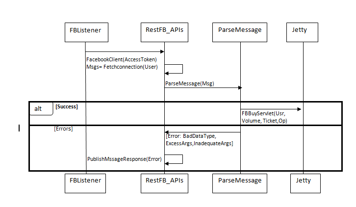
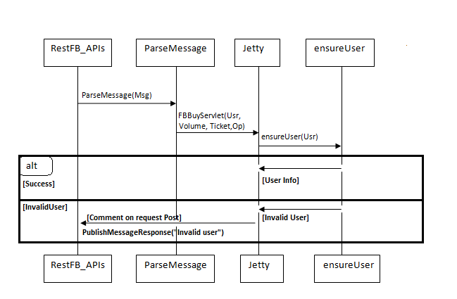
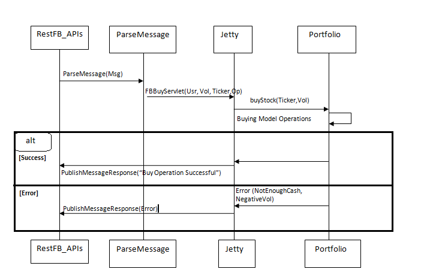

.. raw:: latex

	\begin{titlepage}
	\centering
	\singlespacing

	\vspace*{2in}

	\begin{center}
		\Huge PitFail Report 2 \\
		\Large An Online Financial Engineering Game
	\end{center}

	\vspace*{2in}

	\large
	November 4, 2011 \\

	\vspace*{0.5in}

	Software Engineering I, Group 3 \\
	\href{https://github.com/pitfail/pitfail-reports/wiki}{https://github.com/pitfail/pitfail-reports/wiki} \\

	\vspace*{0.5in}

	Michael Koval, Cody Schafer, \\
	Owen Healy, Brian Goodacre \\
	Roma Mehta, Sonu Iqbal \\
	Avanti Kulkarni \\
	\end{titlepage}

.. sectnum::

.. contents:: Table of Contents

.. raw:: latex

	\pagebreak

Interaction Diagrams
====================

Performing actions (Buy/Sell/...) via the Web frontend
------------------------------------------------------

Suppose the user has filled out a form like this one:


and presses "Buy".

In order to process that request, the following must happen:

1. An HTTP post is sent from the browser to the server (Jetty).
2. Jetty delegates the request to the web framework, Lift.
3. Form data is parsed and processed.
4. A call is made to the model to perform the operation.

These steps are described in more detail below.

When Lift gets an HTTP POST
...........................

.. image:: sequence-diagrams/diagrams/form-submission.pdf
    :width: 90%

PitFail is currently using jQuery to submit forms. Ideally we'd like our forms
to work using either jQuery or traditional HTML forms, but we got this working
first so it's what we're using for now.

When the user hits "Buy", JavaScript in the page generates an HTTP POST
directed at PitFail's server. The server Jetty receives the POST, and calls
LiftServlet.doPost() (actually there are some other steps involved because
LiftFilter must first filter the requests but these are all internal to Lift).
LiftServlet passes the request on to LiftRules to dispatch it.

LiftRules recognizes that this is an Ajax request coming from an HTML form, and
extracts the form fields out of it. LiftRules keeps a table of onSubmit
callbacks indexed by field name. For all the incoming fields, Lift calls the
onSubmit callback, and then finally the onSubmit callback for the submit button
-- that way, by the time the submit button's callback is invoked, all the
fields will have been invoked first.

We are not sure why Lift handles forms this way -- in particular why it uses an
onSubmit callback for things like text fields (that don't have an action
associated with them) rather than just gathering all the data together into a
single Map. This means that the only thing we use these onSubmit callbacks for
is to save a single value which will be used later. We ended up writing a good
deal of abstraction over Lift forms, because what we really want is to get all
the data together as a single object.

Checking for Consistency
........................

Scala is a statically typed functional language that has a lot in common with
ML, where the philosphy is that you should use the type system to prove the
consistency of your data at compile-time, eliminating the need for run-time
checks.

Unfortunately, this is web programming, where your data is regularly sent to
domains outside of your control. It appears that a strong type system relies a
good deal on trust, which you simply can't do when half your program lives in a
web browser. We found most of our work was spent meticulously pulling untrusted
data back into a strongly typed format, only to have it be clobbered again at
the next page reload.

When a form is submitted, we have to do 2 things with the data:

1. Convert the user's loosely structured input into a strongly-typed internal
   representation.

2. Perform the action requested.

At either stage something can go wrong; we call errors in the first stage
"input errors" and errors in the second stage "processing errors". The only
real difference between the two is where in the code they occur -- either in
the View or in the Model.

The process of structuring data and checking for input errors looks like this:

.. image:: sequence-diagrams/diagrams/input-errors.pdf
    :width: 90%

The Submit handler calls process() on the enclosing Form, which calls process()
on all of its fields, which either succeed with Some[Result] or fail with
Nothing (This is Scala's Option monad). The Options are then sequenced together
into a single success or failure.

If the data makes it past input checking, a model operation must then be
performed. It can be quite tricky to come up with an interface to model
operations that

1. Is DRY (doesn't duplicate logic (especially checking) between the View and
   the Model).

2. Respects MVC by not requiring the View to make assumptions about the logic
   that goes on in the Model.

Our code succeeds OKish at these points. Places where that could be improved
are described later (See for example `Sell Stock`_). A typical model operation looks like:

.. image:: sequence-diagrams/diagrams/typical-model-op.pdf
    :width: 60%

That is, the View requests a single, atomic, high-level operation, which either
succeeds entirely or fails with one of a collection of possible errors. The
View is then responsible for turning the error into a human-readable message.

To get error messages back to the user, all calls into the model are wrapped in
an additional error handler in a trait called BasicErrors:

.. image:: sequence-diagrams/diagrams/processing-errors.pdf
    :width: 70%

This captures errors to be returned to the user displayed on the page.

The actual operations
.....................

Compared to the above framework, the actual trading operations are
comparatively simple. Unfortunately part of the reason for that is that they
are comparatively incomplete.

The operations below are shown only from the side of the View; they also have
corresponding Model operations, but because these are common to all frontends
they are shown later.

Buy Stock
`````````

The web front-end side of the Buy operation looks like:

.. image:: sequence-diagrams/diagrams/buy-stock-web.pdf
    :width: 90%

Sell Stock
``````````

The web front-end side of the Sell operation looks like:

.. figure:: sequence-diagrams/diagrams/sell-stock-web.pdf
    :width: 90%

That last error might seem a little puzzling if you've seen the website:

.. image:: sequence-diagrams/images/portfolio.pdf
    :width: 60%

We only let the user sell stocks they own; how can we possibly fail with
DontOwnStock? There are two reasons:

1. The model has no way of knowing that we have already performed this check in
   the view.

2. After the page is rendered but before the user hits "Sell", there is a delay
   during which other asynchronous requests can come in and change the model.

We cannot see a way to avoid this redundancy, but it is slightly concerning
because it violates the two principles we are basing the model API on:

1. The "check" is performed in two places, implemented separately.
   
2. The View takes on some of the role of the Model in deciding which stocks it
   is possible for a user to sell.

It has not been a huge problem yet, but it does raise a question: which parts
of the code are responsible for deciding what a user is permitted to do?
Ideally that should be decided in the Model, but as we see here we limit the
user's choices simply by how we present the information to them, and that is
decided in the View.

Rendering Pages
---------------

Pages don't perform actions and so they are accessed over HTTP GET. Lift
handles GET like this:

.. image:: sequence-diagrams/diagrams/http-get.pdf
    :width: 80%

That is, the request is delegated to a Snippet object's render() method, which
returns the HTML for the generated page. The selection of which snippet to use
is done based on a mapping stored in LiftRules.

View Portfolio
..............

Viewing a portfolio is essentially a task of pulling information out of the
model and converting it to HTML:

.. image:: sequence-diagrams/diagrams/view-portfolio-web.pdf
    :width: 90%


Buy/Sell Operations via FaceBook Interface
------------------------------------------

If a player wants to access PitFail via Facebook, he or she can post the request on PitFail’s wall.

The request has to be in format:
Username: Operation(Buy/Sell):[volume]:Ticker

Currently FaceBook interface only supports two operations – Buy or Sell securities.

To process this request :
1)	This request should be listened to and FB app should be notified of the wall post
2)	The wall post should be read and parsed.
3)	The request should  invoke appropriate module from server to get the operation done
4)	The player should be notified of the status of the request (successful/failed)
Here is a description in detail:
ParseMessage:
-------------
The first step is to read the wall post and parse it to a request that a server can handle.



FBListener listens to the wall post of our account and notifies pitFail FB app of any new wall post.  We use RestFB APIs  that access Facebook account of PitFail using the unique access token provided by FaceBook.  API fetchConnection(User) reads the new wall post and passes it to ParseMessage module. ParseMessage processes the wall post, extracts the information required to process the request. It also checks for the right number of arguments and the data type (e.g. Volume has to be a number).
If the message is good enough to be processed (no errors), the parsed request is sent to server , otherwise the player is notified of the error by commenting on player’s wall post. 
EnsureUser:
-----------

Now that the message is parsed, we need to check the authenticity of the user. Facebook interface of PitFail does not (for now) support registration.  The player has to be already registered to the system to play the game via FB interface.



ensureUser ensures the existence of a user before the user’s request tries to access portfolio. 
If the user exists, the request is processed further otherwise the player is notified of the error occurred by posting a comment on his wall post.

The Operations (Buy/Sell):
--------------------------
Once the wall post is parsed into a trade request  and the existence of user is checked, the actual operation takes place.
Buy operation:
--------------


Sell operation:
---------------

.. image:: sequence-diagrams/FB/sell.png
    :width: 90%

The  working of a server is explained in detail in website section.
When the server receives a valid request from a legitimate user, it accesses the portfolio of the user to perform the operation.  Based on the value returned by user, FB App posts comment on the player’s wall post saying “Successful” or “failed <reason>”


Class Diagram and Interface Specification
=========================================

Class Diagram
-------------

Data Types and Operation Signatures
-----------------------------------

System Architecutre and System Design
=====================================

Architectural Styles
--------------------

Identifying Subsystems
----------------------

Mapping Subsystems to Hardware
------------------------------

Persistent Data Storage
-----------------------

Network Protocol
----------------

Global Control Flow
-------------------

Requests can come into PitFail at any time from Twitter, Facebook, Android, and
the Website. This version of PitFail gives essentially no thought to how we
would like performance to degrade under heavy load, except for two limited
areas:

1. Stock prices retrieved from Yahoo are cached for 5 minutes, which, if no
   *new* stocks are introduced, will limit the total rate of requests to Yahoo
   to {number of unique ticker symbols} / {5 minutes}. But if new ticker
   symbols are introduced, there is no limit to how many requests PitFail will
   attempt (and likely fail) to make to Yahoo.
   
2. The framework PitFail is built on already has some flow-control features:
   HTTP requests are handled by a thread pool, as are some of the internal
   messages in the system (via Lift Actors).

To see whether one client making requests in rapid succession to PitFail would
starve out another client we timed how long it took the server to respond to
isolated requests with and without background spam. The results (in seconds):

====== === === ===
Load   Q1  Med Q3
====== === === ===
Quiet  .15 .17 .23
Spammy .11 .13 .23
====== === === ===

Apparently the not-spamming client does not starve, not even the least bit, so
Lift must be performing some flow control, but we do not know what. We are very
impressed with Lift; this performance has certainly nothing to do with our
design.

Hardware Requirements
---------------------

Algorithms and Data Structures
==============================

Algorithms
----------

Data Structures
---------------

User Interface Design and Implementation
========================================
Pitfail's overall user interface closely resembles the interface depicted in
its mockups: most of the changes were merely cosmetic. Most of the functional
changes are because the current implementation of Pitfail is missing features
that were included in the mockup: e.g. companies, leagues, and social
interaction. These changes are grouped into general categories, described in
detail, and justified in the following sections.

Welcome Page for New User
-------------------------
Pitfail was originally described as having a "guided registration" process
where the user registers as part of purchasing his or her first stock. While
the user can still explore the stock purchasing interface before logging in,
the current implementation of Pitfail does not support this "zero effort"
registration because of a technical limitation. As such, guided messages no
longer are displayed next to each step in the purchasing pipeline:

.. raw:: latex

    \begin{figure}[H]
        \centering
        \includegraphics[height=1.5in]{ui/ui-welcome2}
        \includegraphics[height=1.5in]{ui/actual-welcome}
    \end{figure}

Note that the list of steps is not visible and the current step is not
indicated with an arrow. Some form of guided registration will be implemented
in the next version of Pitfail. Thankfully, this doesn't change user effort:
the user simply must login *before* selecting a stock instead of *after*
selecting a stock.

Portfolio Management
--------------------
Perhaps the largest change from the original mockups to the current
implementation is the user's portfolio. This was planned to be displayed as a
single large table containing the all of the user's assets: a combination of
cash, stocks, and derivatives. This design made it difficult to visually
differentiate between types of assets and to locate an asset of interest.

Instead, the portfolio displayed as a "T"-chart, splitting assets and
liabilities into two separate columns. The assets column is further subdivided
by the type of asset: cash, stocks, and derivatives. These subdivisions allow
the user to quickly locate an asset of interest, for example, when selling a
stock. Each column is summarized with a "total" row that estimates the current
value of his or her portfolio by approximating the value of derivatives as if
they were immediately executed. While none of these changes dramatically alter
user effort relative to the mockup, reformatting the portfolio as a "T"-chart
and adding this additional information makes it much easier for a user to view
his or her current assets at a glance:

.. raw:: latex

    \begin{figure}[H]
        \centering
        \includegraphics[width=3in]{ui/ui-portfolio}
        \includegraphics[width=3in]{ui/actual-portfolio}
    \end{figure}

Besides the changes to the table of assets, there are clearly several features
missing from the implementation: (1) historic portfolio performance, (2)
multiple portfolios, and (3) league navigation. These missing interface
elements will be restored after companies, leagues, and logging of historic
prices are implemented in the next iteration of Pitfail.

Buying Stocks
-------------
Purchasing stocks is one of the fundamental activities on Pitfail. The
interface for buying stocks is very similar to the interface shown in the
original mockups: when the user enters a valid ticker symbol in the large
search bar, a small stock quote expands below the search bar. This quote
includes a few statistics about the stock's daily performance and a graph of
the stock's performance over time.

.. raw:: latex

    \begin{figure}[H]
        \centering
        \includegraphics[width=3in]{ui/ui-buy}
        \includegraphics[width=3in]{ui/actual-buy}
    \end{figure}

Unlike the original mockup, the options for interacting with the stock are not
embedded in the stock quote. Instead, they are displayed in a dedicated section
of the webpage. This extra space is used to display a short description of
stock trading and helps guide new users through the process: something that
will be even more important once options are supported. While the original
mockups allowed the user to enter an amount in either shares or dollars, this
was found to be confusing and was removed in the current version of the user
interface.

Neither of these changes do not considerably effect user effort.

Trading Derivatives
-------------------
If the user clicks the "add to derivative" button instead of the "buy stock"
button, he or she is presented with the derivative offering page. In the
original mockups this was shown as a prose-like description of a derivative
with a number of blanks. Originally intended to guide the user through the
derivative creation process, this was found to be infeasible with the number of
derivative configuration options supported in Pitfail. As such, this was
redesigned to resemble a traditional form: a prose description followed by a
table of input fields.

.. raw:: latex

    \begin{figure}[H]
        \centering
        \includegraphics[width=3in]{ui/ui-derivative}
        \includegraphics[width=3in]{ui/actual-derivative}
    \end{figure}

Once the derivative has been created it can either be offered to a specific
user or to a public auction. If a buyer is specified, that user is prompted to
accept or decline the offer using a special form in his or her portfolio. If
the derivative is offered to a public auction, a link to the auction page is
added to the sidebar and other users have an opportunity to bid. These features
were not included in the mockups, so see the User Effort Estimation section
below for a detailed usability analysis.

Social Features
---------------
Pitfail's original mockups included a real-time newsfeed at the bottom of every
page. This newsfeed was a log of trading history and served as a hub for social
interaction between users. A limited implementation of this newsfeed is
included in the current version of Pitfail. Unlike the mockup, the newsfeed is
included in every page's sidebar instead of the footer. This is similar to the
real-time feed that was recently added to Facebook and will be familiar to the
majority of Pitfail's users.

.. raw:: latex

    \begin{figure}[H]
        \centering
        \includegraphics[height=2in]{ui/ui-newsfeed}
        \includegraphics[height=2in]{ui/actual-newsfeed}
    \end{figure}

Besides the different location, much of the functionality displayed in the
mockups has not yet been implemented. Notably, this includes: (1) user-specific
newsfeeds, (2) voting, (3) commenting, (4) messages for derivative trades, and
(5) messages for a users going broke. These features will be implemented in the
next version of Pitfail and do not effect user effort.

User Effort Estimation
----------------------
Several of the most common usage scenarios for the PitFail website are
evaluated below. In particular, note that common scenarios (e.g. buying a
stock) are much easier to perform than rare scenarios (e.g. creating a new
league):

====================================  ======  ==========
Usage Scenario                        Clicks  Keystrokes
====================================  ======  ==========
purchase a stock                      3       7
create a derivative                   4       27
act on a pending derivative offer*    1       1
bid on a derivative auction*          4       5
close a derivative auction*           1       1
sell a stock                          3       2
create a new league                   n/a     n/a
modify an existing league             n/a     n/a
invite a user to a league             n/a     n/a
====================================  ======  ==========

Features that are not currently implemented are shown as empty rows and actions
that have been added since the original mockups are marked with asterisks. Both
these new usage scenarios and existing usage scenarios that were modified are
analyzed in detail below. This includes buying and selling stocks because of
the lack of league support in the current version of Pitfail.

Purchase a Stock
................
Assume the user wishes to purchase 10 shares of Google stock. The user must:

- **Navigation:** total of one click, as follows

 1. Click on "login".

- **Data Entry:** total of two clicks and seven keystrokes, as follows

 1. Click on the "enter a ticker symbol" text field.
 2. Press the keys "G", "O", "O", and "G".
 3. Press "enter" to load the quote.
 4. Press the keys "1" and "0" to specify 10 shares.
 5. Click the "buy" button to confirm the purchase.

Note that the user could press "enter" instead of clicking the "buy" button.

Creating a Derivative
.....................
Assume the user wishes to offer a call option to Bucky that includes 10 shares
of Google stock and expires on December 25, 2011. This option costs $1000 to
begin active and one can buy the shares for $10,000 if and only if the market
rate for Google stock is greater than $1000 per share. The user must:

- **Navigation:** total of one click, as follows

 1. Click on "login".

- **Data Entry:** total of 3 clicks and 27 keystrokes, as follows

 1. Click on the "enter a ticker symbol" text field.
 2. Press the keys "G", "O", "O", and "G".
 3. Press the "enter" key to load the quote.
 4. Press the keys "1" and "0" to specify 10 shares.
 5. Click the "add" button to begin creating a derivative.
 6. Press the "B", "u", "c", "k", and "y" keys to enter the recipient's name.
 7. Press "tab" to move to the "premium" field.
 8. Press the keys "1", "0", "0", and "0" to enter $1000.
 9. Press "tab" to move to the "expiration date" field.
 10. Press the "1", "2", "/", "2", and "5" keys to select December 25th of the current year.
 11. Press "tab" to move to the "strike price" field.
 12. Press the "1", "0", "0", "0", and "0" keys to enter $10000.
 13. Click on the "Propose Contract" button to complete the transaction.

Sell a Stock
............
Assume the user wishes to sell 10 shares of Google stock from his or her Global
League. The user must:

- **Navigation:** total of one clicks, as follows

 1. Click on "login".

- **Data Entry:** total of two clicks and two keystrokes, as follows

 1. Click on the text input in the row corresponding to Google.
 2. Press the keys "1" and "0" to specify 10 shares.
 3. Click the "sell" button to confirm the purchase.

Note that the user could press "enter" instead of clicking the "sell" button.


Act on Derivative Offer
.......................
Assume the user wishes to accept a derivative that was directly offered to him
or her:

- **Navigation:** total of one click, as follows

 1. Click on "login".

- **Data Entry:** total of one click, as follows

 1. Click on the "accept" button next to the correct derivative.

Bid on Derivative
.................
Assume the user wishes to bid $50,000 on a derivative that is being sold in a
public auction:

- **Navigation:** total of two clicks, as follows

 1. Click on "login".
 2. Click on the correct derivative link in the sidebar.

- **Data Entry:** total of two clicks and five keystrokes, as follows

 1. Click on the "your bid" field.
 2. Press the keys "5", "0", "0", 0", and "0".
 3. Click the "Cast Bid" button.

Close Derivative Auction
........................
Assume the user wishes to close an auction that he or she posted:

- **Navigation:** total of one click, as follows

 1. Click on "login".

- **Data Entry:** total of one click, as follows

 1. Click on the "close" button next to the correct auction.

Progress Report and Plan of Work
================================

Progress Report
---------------

All use cases still need more implementation to allow for increased functionality. In 
particular, Leagues and Teams need to be implemented while the actual interactions with the 
stock exchange need to expand to address exceptions usability requirements. 

======  ======================  ============  ================================================
UC#     Use Case Short Name      % Completed   Comments
======  ======================  ============  ================================================
UC-1    Buy                     50%           Functionality needs to be increased and made
                                              uniform across varying interfaces. Smaller 
                                              details like after hours buying, orders, and 
                                              brokerage fees need to be added.
UC-2    Sell                    50%           Functionality needs to be increased and made
                                              uniform across varying interfaces. Smaller 
                                              details like after hours selling, orders, and 
                                              brokerage fees need to be added.
UC-3    Join League             0%            Leagues have not been implemented yet.
UC-4    View Portfolio          75%           Current portfolios can be viewed, but this use 
                                              case will be expanded when a portfolio will need 
                                              to hold more items.
UC-5    Get Security            50%           Needs more functionality, like Buy and Sell.
UC-6    View League Stats       0%            Leagues have not been implemented yet.
UC-7    Buy via Twitter         60%           Users can buy only stocks according to a strict 
                                              input guidelines. There are some bugs that need 
                                              to be fixed.
UC-8    Sell via Twitter        60%           Users can sell only stocks according to a strict 
                                              input guidelines. There are some bugs that need 
                                              to be fixed.
UC-9    Portfolio Info          75%           Users can see other user's portfolios, but 
                                              additional information should be displayed, e.g. 
                                              graphs, creation date, percent increased...
UC-10   Change Default          0%            Leagues have not been implemented yet.
UC-11   Make League             0%            Leagues have not been implemented yet.
UC-12   League Settings         0%            Leagues have not been implemented yet.
UC-13   Add Coordinator         0%            Leagues have not been implemented yet.
UC-14   Remove Coordinator      0%            Leagues have not been implemented yet.
UC-15   Delete League           0%            Leagues have not been implemented yet.
UC-16   Manage League           0%            Leagues have not been implemented yet.
UC-17   Invite to League        0%            Leagues have not been implemented yet.
UC-18   Authentication          75%           Currently done through Twitter, will need to be 
                                              increased for additional logins.
UC-19   Create User             75%           Users can be created only if they have a Twitter 
                                              account.
UC-20   Vote                    0%            Voting has not been implemented yet.
UC-21   Vote by Tweet           0%            Voting has not been implemented yet.
UC-22   Derivative Designer     25%           Partially implemented, but not lacks important 
                                              functionalities and an intuitive design.
UC-23   Accept derivative       75%           Basic functionality is present. Need to expand to
                                              allow counter-offers and to be updated for newer
                                              versions of the implemented derivatives.
======  ======================  ============  ================================================

Plan of Work
------------
.. image:: Plan_of_Work/Plan_of_Work__Report2.pdf

Breakdown of Responsibilities
-----------------------------

=====================  ======================  
Modules                Owner                   
=====================  ======================  
Website                Michael, Owen           
Android                Roma, Sonu              
Facebook               Avanti                  
Twitter                Cody                    
Database               Brian                   
Back-end Functions     Michael, Owen, Brian    
=====================  ======================  

The integration of the system and testing will not require a primary coordinator. 
Since each module relies on only the database and back-end functions and is independent 
of the other modules, the chances of one module affecting the others are low. Each 
auxiliary module developer is responsible for communicating with the database and 
back-end functions developers to ensure their code is using the database and back-end 
functions correctly. During team meetings, the features being employed on each 
auxiliary module will be discussed to ensure that common features are being deployed 
across all systems. Testing will be the responsibility of each module developer. 


References
==========

