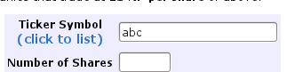
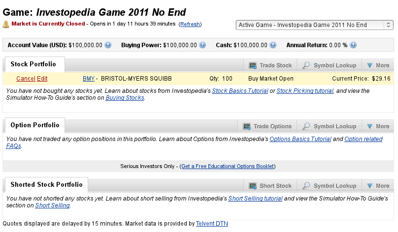
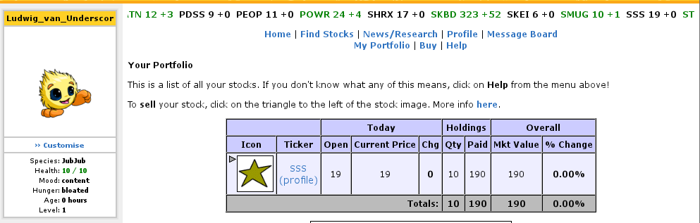
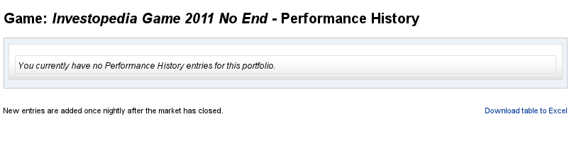
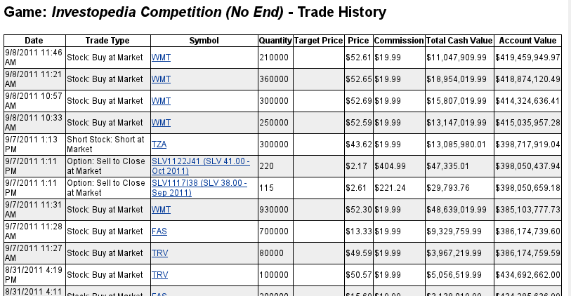
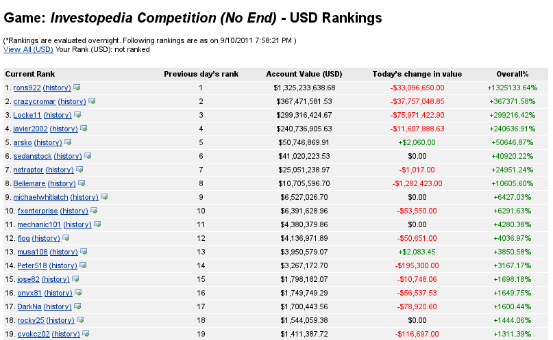
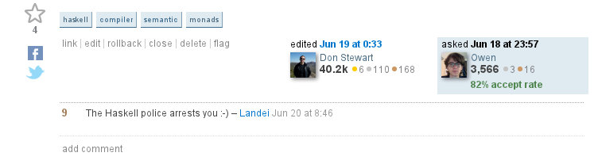
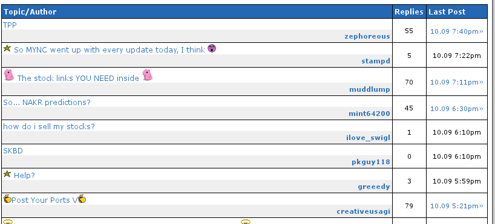
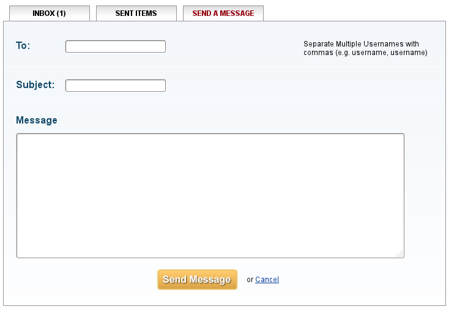
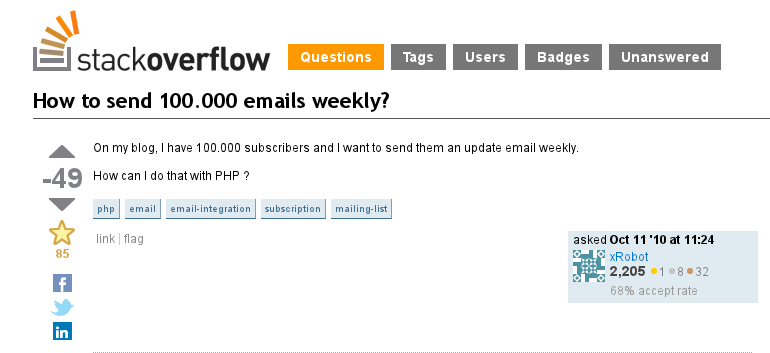

Pitfail Project Proposal
########################

:Author: Software Engineering I, Group 3
:Contact: pitfail.group@gmail.com

.. sectnum::

.. contents::
    :local:

Team Information
================
Title:
  Pitfail: An Online Finance Game

Website:
  https://github.com/pitfail/pitfail-reports/wiki

Team Profile
============
Michael Koval
  mkoval@eden.rutgers.edu

- *Languages:* C, C++, C#, Java, Python, Scheme, Matlab
- *Experience:* Microsoft, U.S. Department of Defense
- *Skills:* design, organization, programming

Cody Schafer
  cschafer@eden.rutgers.edu

- *Languages:* C, C++, Java, Python, Forth
- *Experience:* IBM, ICAP
- *Skills:* design, organization, programming

Owen Healy
  owenh@eden.rutgers.edu

- *Languages:* Haskell, Scheme, Scala, R, Prolog, category theory, C, Python
- *Experience:* technology startups, developer
- *Skills:* design, programming
  
Brian Goodacre
  bgoodacr@eden.rutgers.edu

- *Languages:* Java, MySQL, Apache
- *Experience:* AT&T
- *Skills:* leadership, data modeling, database development, UML, software engineering

Roma Mehta
  romameht@cs.rutgers.edu

- *Languages:* Java, Javascript, ExtJS, Android
- *Experience:* Goldman Sachs, C-Sam (India)
- *Skills:* screen design and layout, Android, Java servers

Sonu Iqbal
  sonui@cs.rutgers.edu

- *Languages:* C, C++, JSP, Perl, MySQL
- *Experience:* Bank of America Merrill Lynch, LinsysSoft Technologies (India), Izel Technologies (India)

Avanti Kulkarni
  avantik@cs.rutgers.edu

- *Languages:* C, C++, MySQL, JSP, C#.Net
- *Experience:* Barclays Capital, Cisco Systems

Proposed Project
================
Pitfail is a financial engineering simulation in which users can buy and sell
securities. This includes buying and selling stock from the exchange, trading
between users, and designing new derivatives. Users "compete" with one another
by growing their portfolios and attempting to attain the highest net worth.

Unlike existing trading simulations, Pitfail is less focused on *simulation*
than on *playing a game*. These existing simulations mimic the inconveniences
of trading stock on real markets; while this is nice for future traders hoping
to practice it is out of place and confusing to the vast majority of users. In
contrast with the existing alternatives, Pitfail offers the following
differentiating features:

- Zero-setup accounts
- Trading over Twitter
- Designing custom derivatives
- Playing on teams with a shared portfolio

These features act in combination to lower the barrier-to-entry for new members
and attract new members through viral marketing on Twitter.

Expected Audience
~~~~~~~~~~~~~~~~~
Existing financial engineering simulations appear to be targetted primarily at
students. Pitfail aims to make things easier for the casual user without
compromising its usefulness to students and teachers. As such, the expected
audience for Pitfail consists of:

- Teachers and students in economics classes
- Curious individuals who want to try trading with no personal no-risk.

All of the features and design decisions described below were chosen with both
of these target groups in mind, with a special emphasis on making the
simulation approachable for casual users.

Accessing Pitfail
~~~~~~~~~~~~~~~~~
There are two ways to access Pitfail: through a dedicated website or by
interacting with the Pitfail Twitter account. Each of these methods targeted
for its own purposes:

Website
  *Audience:* teachers and students

  *Purpose:* plots, graphs, consolidated information, ad revenue

Twitter
  *Audience*: casual users, Twitter users

  *Purpose*: low barrier-to-entry, easy to use, ubiquitous, familiar interface

Playing on Twitter
~~~~~~~~~~~~~~~~~~
While accessing most software through Twitter would be unruly, financial trades
are sufficiently atomic and compact that they can be expressed naturally
through small messages.

The software has a Twitter account tentatively called ``pitfail``. Users direct
their tweets to ``@pitfail``, e.g.::

    @pitfail #buy $100 of ABC

Critically, *there is no setup needed*. When a user with an unrecognized
Twitter account sends a tweet to ``@pitfail``, an account is created for them
with a default configuration, and Pitfail remembers their account for the next
time they tweet.  This feature is crucial to Pitfail's viability: such a large
number of financial trading simulations already exist that it is
near-impossible for users to differentiate between them. Because Pitfail
requires essentially no commitment it is easy for users to try it out.

Compare this account creation mechanism with, for example, `Economics Wisconsin
<http://www.wisconsinsms.com/>`_ which requires you not only to create an
account to start using their site

But also to join a particular "challenge":

Alternatively, consider the labrynthine registration procedures such as with
the the `Stock Market Game
<http://www.smgww.org/cgi-bin/haipage/page.html?tpl=coordinator/index>`_ that
involve filling several pages of form fields after being redirected multiple
times.

Playing on the Website
~~~~~~~~~~~~~~~~~~~~~~
Twitter is ideal for attracting new users, but does not generate any
advertising revenue. Therefore, it is desirable to attract users to the
Pitfail website by offering features that are not possible via Twitter,
such as social portfolio listings and historical graphs.

In addition to all of the functionality provided by the Twitter interface, the
Pitfail website offers an additional set of features: view their portfolio,
design custom securities, social interaction with other users, and play against
cooperation and competition with other users. Each of these differentiating
features is described in detail below.

Trading
-------
As a full-featured alternative to Twitter, the Pitfail website is an
alternative interface for making trades. When making a trade, the user is
presented with the following information:

1. Market price
2. Amount of available cash

Most sites allow you to buy a certain number of "shares", but this is an extra
detail and not relevant to managing a portfolio -- what a user cares about is
how many dollars of a stock they are buying. Users may not know the ticker
symbol of the stock they want to purchase, so , something similar to NeoPets "click to
list":

Though more along the lines of "search" than list, since there are more
real-world companies than companies in Neopia.

Portfolio View 
--------------
Users can view their entire their portfolio on the Pitfail website. This
primarily consists of a list of the securities a user owns, including stocks
and derivitives. This is similar to the existing portfolio overviews offered
by Investopedia and NeoPets:

In addition to the stocks currently owned by the user, the user is able to view
his or her historical performance as measure by net worth. Much like the portfolio,
this feature is already present on Investopedia:

Unfortunately, graphing historical net worth is not possible in Pitfail. Custom
derivatives are not liquid enough to have a market price that Pitfail can
compute. Therefore, all historical graphs will instead be the total value of
the user's cash and stocks, combined to form his or her total "liquid assets"
that is plotted over time to show users how his or her wealth is progressing.

Social Interaction
------------------
As a game, Pitfail thrives on friendly competition. Users can monitor
eachother's progress by viewing a feed of recent activity and browsing
leaderboards. These features are similar to the ability to browse leaderboards
and user-specific activity feeds on Investopedia:

Unlike Investopedia, Pitfail will offer aggregate feeds of recent activity in
addition to user-specific feeds. This allows a group of people to keep abreast
of their friends' or enemies' activities and add a flavor of competition.

When browsing recent activity or viewing another user's portfolio users are
able to comment on trades. These comments make users feel involved and part of
a larger community, similar to the comment system on StackOverflow:

Investopedia and NeoPets both offer differing levels of social interaction, but
both lack the ability to comment on specific trades. NeoPets uses a dedicated
message board and Investopedia only supports private messages:

Social Voting
-------------
In addition to commenting on trades, users can "upvote" and "downvote" trades
based on their opinion of trade. Votes are anonomous, but an aggregrate score
is computed from the votes and is displayed next to each trade. This gives
users an opportunity to interact with Pitfail similar to the voting system on
StackOverflow and "Like" on Facebook:

Unlike StackOverflow and Facebook, Pitfail gives users a stake in their votes.
As an example, say Alice sells security ABC to Bob for $100. When they make the
trade, each of Alice and Bob set aside a small part (say $0.50 worth) into two
pools, the up-voter pool and the down-voter pool. Voters then purchase a small
portion of the pools with their votes.

Backing votes with a small amount of money has a few important consequences:

1. Encourages users to vote
2. Incentive to voting intelligently, based on the user's opinion of the trade
3. Performance of individual users can be measured by their earnings from voting

Using the voting data, Pitfail could rank users and assign status symbols (e.g.
badges) to users with the strongest ability to vote predictively. This type of
ranking appears to be unique to Pitfail.

Designing Securities
~~~~~~~~~~~~~~~~~~~~
Many trading games allow players to trade securities other than stocks, such as
options and futures. One way to look at this is that these securities are just
*other things with value*, and can be traded exactly like stocks. This
representation is closest to how these securities are traded in the real world.

While realistic, this type of security but it's not terribly interesting for a
game. Options, however, have an underlying contract and can become very
interesting. Pitfail allows users to design their *design their own contracts*,
thus creating new financial products. As an online game, these contracts are
subject to a few artificial restrictions:

- Simple enough for users to be comfortable using them, and into the gam
- Restricted to contracts can be programmatically enforced

Even without a court system to enforce complex contracts, custom securties
allow Pitfail's users to a new financial environment. Creating custom securities
and derivatives appears to be unique to Pitfail.
We are not aware of any existing websites that implement this feature.

Teams + Leagues
~~~~~~~~~~~~~~~
Although there is a global "Pitfail Universe", some users are going to want to
play in smaller groups. To this end we introduce Teams and Leagues.

Teams
-----
A team is a group of users who share a portfolio, and all are free to trade
using this portfolio. There is no "leader" and no set decision making process.

Leagues
-------
A league is a group of users who compete together. Typically a league will be
created for a particular game session, then users will join, each starting with
the same portfolio. There will be rankings and winners within a League.

