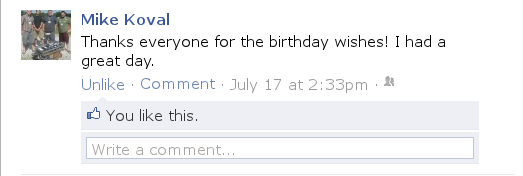

.. Cover Page
.. http://www.ece.rutgers.edu/~marsic/Teaching/SE1/projects.html#TEAMS

**Project Proposal**

Software Engineering

Group PitFail

PitFail: An Online Finance Game

https://github.com/pitfail/pitfail-reports/wiki

9/14/2011

Brian Goodacre, Michael Koval, Owen Healy, Cody Schafer

.. raw:: pdf

    PageBreak

Project Proposal for PitFail
############################

.. contents::
    :local:

Project Title
=============

PitFail: An Online Finance Game

Project Website
===============

https://github.com/pitfail/pitfail-reports/wiki

Team Members
============

- Michael Koval mkoval@eden.rutgers.edu

- Owen Healy owenh@eden.rutgers.edu

- Cody Schafer cschafer@eden.rutgers.edu

- Brian Goodacre bgoodacr@eden.rutgers.edu

Team Profile
============

Individual Strengths
====================

Michael Koval
~~~~~~~~~~~~~

Web design, CSS, data structures, Java, C#, Python, C++, algorithms. Experience
working at Microsoft and DoD.

Cody Schafer
~~~~~~~~~~~~

Microcontroller programming, enterprise software development with IBM, Forth,
C, C++, Python, Java

Brian Goodacre
~~~~~~~~~~~~~~

Data modeling, database development, UML diagrams, software engineering
process, Java, MySQL, Apache, Leadership.

Owen Healy
~~~~~~~~~~

Haskell, Scheme, Scala, R, Prolog, category theory, C, Python, UML, experience
at small tech startups.

Differentiating Features
========================

- Zero-setup interface

- Trading over Twitter

- Designing derivatives

- Teams can play with common portfolio

PitFail is less focused on *simulation* than on *playing a game*. Existing
trading simulations mimic the inconveniences of trading stock on real markets;
while this is nice for future traders hoping to practice it is out of place and
confusing to the vast majority of users.

Proposed Project
================

The proposed project is a simulation of financial trading and financial
engineering. Users can buy and sell stocks and other "standard" products from
an exchange, as well as trade with each other and design new derivatives.

Expected audience
~~~~~~~~~~~~~~~~~

We imagine the software will be used by

- Teachers and their students in economics classes

- Curious people who want to try out trading in a simulated environment.

The features are designed with those groups in mind. Most trading simulation
websites appear to be targeted primarily at students. PitFail aims to make
things easier for the casual user.

Accessing the software
~~~~~~~~~~~~~~~~~~~~~~

There are two ways to access the software:

- A dedicated website

- Through Twitter

Each is targeted for its own purposes:

Web
---

- **Audience**: Teachers and students

- **Purpose**: Plots, graphs, consolidated information, ad revenue

Twitter
-------

- **Audience**: Casual users, people who already use Twitter

- **Purpose**: Very low barrier to start using, lets you play around, familiar
  UI, integrated with everything

Trading through Twitter
~~~~~~~~~~~~~~~~~~~~~~~

While accessing some software through Twitter would be unruly, financial trades
are atomized and compact enough that they can be expressed naturally through
small messages.

The software has a Twitter account tentatively called ``pitfail``. Users direct
their tweets to ``@pitfail``, e.g.::

    @pitfail #buy $100 of ABC

Critically, **there is no setup needed**. The instant a user sends a tweet to
``@pitfail``, an account is created for them with a default setup, and PitFail
remembers them next time they talk. This feature is crucial to PitFail's
viability: such a large number of financial trading simulations already exist,
that it is near-impossible for users to differentiate between them. Because
PitFail requires essentially no commitment it is easy for users to try it out.

Compare, for example, `Economics Wisconsin <http://www.wisconsinsms.com/>`_
which requires you not only to create an account to start using their site:

But also to join a particular "challenge":

And because there are *no steps*, uses won't get lost in `labyrinths like this
one (The Stock Market Game)
<http://www.smgww.org/cgi-bin/haipage/page.html?tpl=coordinator/index>`_.

For reasons of advertising revenue, however, it is desirable to draw users to
the PitFail site, and so links can be provided to features such as portfolio
listings and graphs.

The PitFail Website
~~~~~~~~~~~~~~~~~~~

Through the PitFail website users can

.. contents::
    :local:

View their portfolio
--------------------

Such as on Investopedia:

Or NeoPets:

.. image:: neo-portfolio.png
    :width: 5 in

View the historical value of their portfolio
--------------------------------------------
  
To some extent, this may be impossible. User-created derivatives are not liquid
enough to have a market price that the game can reference. But the value of
stocks and cash can be added up to create a total of "liquid assets", which can
be plotted over time to show users how their wealth is progressing.

Investopedia has this feature:

.. image:: ip-history.png
    :width: 5 in

Make a trade
------------

When making a trade, the user should be able to see

- The current price

- Their own current level of cash

Most sites allow you to buy a certain number of "shares", but this is an extra
detail and not relevant to managing a portfolio -- what a user cares about is
how many dollars of a stock they are buying.

Because users may not know the ticker of the stock they want to buy, something
similar to NeoPets "click to list":

Though more along the lines of "search" than list, since there are more
real-world companies than companies in Neopia.

See recent activity by other users
----------------------------------

In Investopedia this can be shown individually:

.. image:: ip-trades.png
    :width: 5 in

though there does not seem to be a way to view all trades in aggregate.

See rankings of portfolios
--------------------------

Users can see the top players, such as in Investopedia:

.. image:: ip-rankings.png
    :width: 5 in

This should add a flavor of competition.

Comment on other users' trades
------------------------------

Comments make users feel involved and part of a community. Such as at
StackOverflow:

Neopets has a message board, but this is not as immediately interactive:

.. image:: neo-messages.png
    :width: 3 in

And Investopedia has private messages, but this is still not the same thing:

.. image:: ip-messages.png
    :width: 3 in

And Investopedia also shows trades by other users, but there is no way to
comment:

.. image:: ip-trades.png
    :width: 5 in

Rate other users' trades
------------------------

*Social Voting*

Both over Twitter and on the PitFail website users can rate other users trades
with an up or down vote. Votes are anonymous but a score is displayed next to
the trade on the main site.

This is similar to features of other websites, such as

Stack Overflow:

Facebook:

Designing Securities
~~~~~~~~~~~~~~~~~~~~

Many trading games allow players to trade securities other than stocks, such as
options and futures. One way to look at this is that these securities are just
*other things with value*, and can be traded exactly like stocks. This is
closest to how these securities are traded in the real world.

This is realistic, but it's not terribly interesting for a game. An option has
a contract underneath it, and the nature of that contract can become
interesting in a real market. PitFail therefore allows users to *design their
own contracts*, i.e. create new financial products.

This ability essentially allows users to create a new financial environment.
There are a few key aspects:

- In the real world there are courts to enforce contracts, so they can be
  creative. In PitFail contracts must be simple enough that the software can
  enforce them.

- Contracts need to be simple enough for users to be comfortable using them,
  and also fit well into an online game.

We are not aware of any existing websites that implement this feature.

Prediction Market Voting
~~~~~~~~~~~~~~~~~~~~~~~~

One option for making voting "count" more, would be to give users a stake in
their votes.

As an example, say Alice sells security ABC to Bob for $100. When they make the
trade, each of Alice and Bob set aside a small part (say $0.50 worth) into two
pools, the up-voter pool and the down-voter pool. Voters then purchase a small
portion of the pools with their votes.

This has a few consequences:

- It becomes possible to rate the accuracy of a user's votes based on how much
  cash they make from voting. This can act as a status symbol.

- It gives users an incentive to vote.

We are not aware of any existing websites that implement this feature.

Teams + Leagues
~~~~~~~~~~~~~~~

Although there is a global "PitFail Universe", some users are going to want to
play in smaller groups. To this end we introduce Teams and Leagues.

Teams
-----

A team is a group of users who share a portfolio, and all are free to trade
using this portfolio. There is no "leader" and no set decision making process.

Leagues
-------

A league is a group of users who compete together. Typically a league will be
created for a particular game session, then users will join, each starting with
the same portfolio. There will be rankings and winners within a League.

