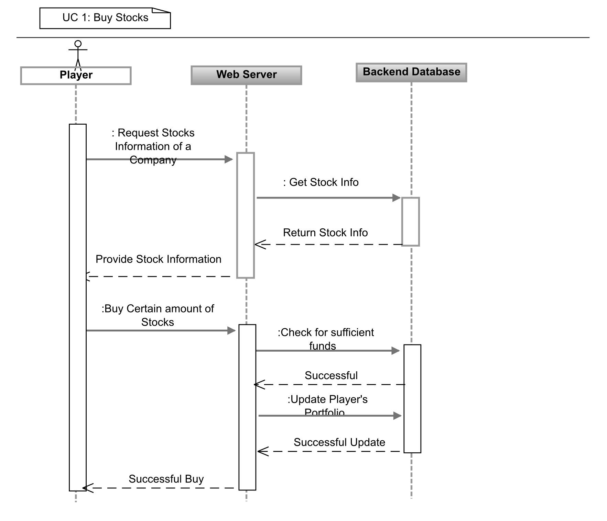
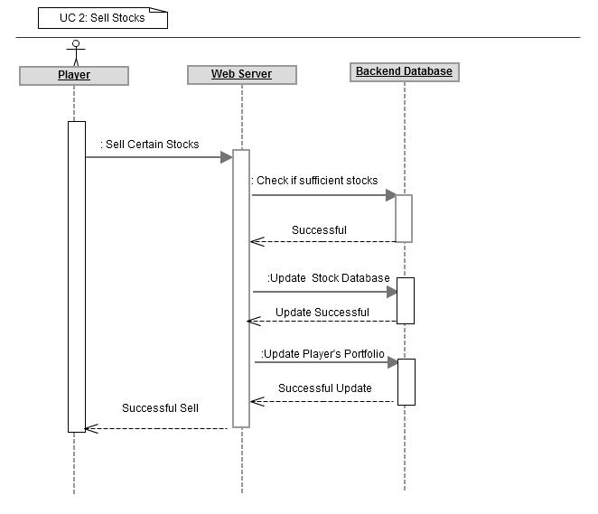
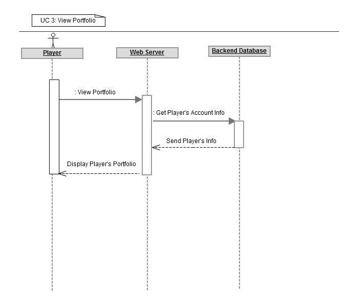
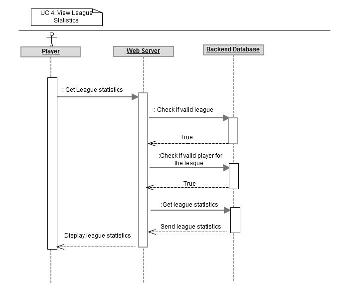
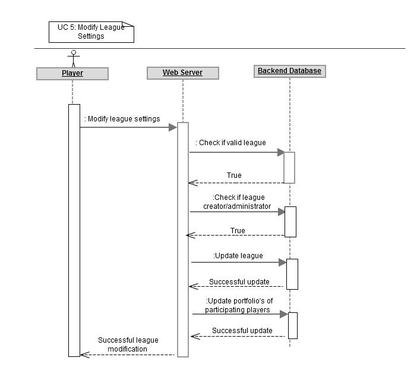

.. raw:: latex

	\begin{titlepage}
	\centering
	\singlespacing

	\vspace*{2in}

	\begin{center}
		\Huge Pitfail Report 1 \\
		\Large An Online Financial Engineering Game
	\end{center}

	\vspace*{2in}

	\large
	September 30, 2011 \\

	\vspace*{0.5in}

	Software Engineering I, Group 3 \\
	\href{https://github.com/pitfail/pitfail-reports/wiki}{https://github.com/pitfail/pitfail-reports/wiki} \\

	\vspace*{0.5in}

	Michael Koval, Cody Schafer, \\
	Owen Healy, Brian Goodacre \\
	Roma Mehta, Sonu Iqbal \\
	Avanti Kulkarni \\
	\end{titlepage}

.. sectnum::

.. contents:: Table of Contents

.. raw:: latex

	\pagebreak

Individual Contributions
========================

.. raw:: latex

	\begin{center}
	\small

.. csv-table::
	:header: "Responsibility", "Michal Koval", "Cody Schafer", "Owen Healy", "Brian Good-acre", "Roma Mehta", "Sonu Iqbal", "Avanti Kulkarni"
	:widths: 15, 6, 6, 6, 6, 6, 6, 6

	Project Manage. (10),           15%,  15%,  14%,  14%,  14%,  14%,  14%
	Customer Reqs. (6),                ,     ,     ,     ,     ,     , 100%
	Glossary of Terms (4),          40%,  10%,  10%,  10%,  10%,  10%,  10%
	Functional Reqs. (37),             ,     ,     ,     ,     ,     ,
	→ Stakeholders (2),                , 100%,     ,     ,     ,     ,
	→ Goals (4),                       , 100%,     ,     ,     ,     ,
	→ Casual UC (5),                   , 100%,     ,     ,     ,     ,
	→ Dressed UC (11),              40%,  20%,     ,  40%,     ,     ,
	→ UC Diagram (4),                  ,     ,     ,     ,     ,     ,
	Seq. Diagrams (9),                 ,     ,     ,     ,     , 100%,
	Nonfunc. Reqs. (6),                ,     ,     ,     ,     , 100%,
	Domain Analysis (25),              ,     , 100%,     ,     ,     ,
	→ Concepts (12),                   ,     , 100%,     ,     ,     ,
	→ Associations (4),                ,     , 100%,     ,     ,     ,
	→ Attributes (3),                  ,     , 100%,     ,     ,     ,
	Contracts (6),                     ,     ,     ,     , 100%,     ,
	User Interface (8),            100%,     ,     ,     ,     ,     ,
	Plan of Work (3),                  ,     ,     , 100%,     ,     ,
	References (1),                 14%,  14%,  14%,  14%,  15%,  15%,  14%

.. raw:: latex

	\end{center}

Customer Statement of Requirements
==================================
Investors today are seeking more effective financial tools that not only
motivates them to invest in the stock market and improve their decision making
skills but also an application that is interesting enough to keep using. Our
goal is to build a systems that is less focused on simulation than on playing a
game. Existing simulations mimic the inconveniences of trading stock on real
markets; While this can be a good option for future traders to practice , but
confuses the the vast majority of users. In contrast with the existing
alternatives, Pitfail offers number of differentiating features: Pitfail is an
financial engineering simulation which will allow investor players to virtually
invest money in real-world stocks. The basic features include buying and
selling stocks/securities from the exchange, trading between players, and
designing new derivatives. Pitfail can also be accessed using Twitter, Facebook
and Android interface.

Pitfail simulates a virtual stock world, creating a network of stock investors,
through which they trade real-world stocks without the risk of losing real
money. Unlike existing trading simulations, Pitfail does not require the
players to go through a time consuming registration process. Players can login
to the system  using their existing e-mail addresses and the system remembers
the players for their next use. As Pitfail requires essentially no commitment
it is easy for players to try it out.  Initially, the player is given a fixed
amount of startup funds. The player uses these funds to virtually buy the
stocks.

There are many options for a player to choose from once he/she logs in:

1. Player can join a team (a small group of already registered players). Once
   player joins a team ,the player will buy/sell/compete with other players/teams
   using collective portfolio of the team.

2. Player can  join a league (a small group of already registered players)
   where the members of a league compete with each other using their individual
   portfolio.

3. Player can play with 'Pitfail Universe' which includes all players.

When the player trades and builds a portfolio , the system should have access
to real-time stock information and should adjust the value of a player's
investments based on this real time stock info. Pitfail retrieves actual stock
prices from a third-party source Yahoo! that monitors stock exchanges and
maintains up-to-date stock prices.if the corresponding actual stock loses value
on a real-world stock exchange, the player's virtual investment loses value
equally.  Likewise, if the corresponding  actual stock gains value, the
player's virtual investment grows equally.

As a game, a crucial part of application is maintaining player portfolio. The
application  provides every player with portfolio to view/modify his/her
history i.e. list of securities owned(stocks/derivatives). In addition to the
securities currently owned by the player, the player is able to view his or her
historical performance as measure by net worth. To add  a flavor of a game,
players can monitor each other's progress by viewing a feed of recent activity
and browsing leader boards. Pitfail also offers aggregate feeds of recent
activity. This allows a group of people to keep abreast of their friends' or
enemies' activities. Pitfail provides the players with the ability to comments
on other's trades when browsing recent activity or viewing another user's
portfolio. These comments make players feel involved and part of a larger
community. One additional feature Pitfail provides is the ability for players
to "upvote" and "downvote" trades based on their opinion of trade. Pitfail can
then rank users and assign status symbols (e.g. badges) to users with the
strongest ability to vote predictively. This type of ranking appears to be
unique to Pitfail. Another feature that appears to be unique to Pitfail is that
it allows users to design their own securities (i.e futures or options) , thus
creating new financial products.Even without a court system to enforce complex
contracts, custom securities allow Pitfail's users to a new financial
environment.

As mentioned, Pitfail can be accessed via a website, twitter , Facebook and
android interface. Each of these methods have their own purposes. As financial
trades are compact and atomic and that they can be expressed through small
messages, Pitfail provides a twitter and Facebook interfaces where players can
buy/sell securities by tweeting to a particular account/ writing post on
Facebook account wall .  Twitter and Facebook  provide a familiar interfaces to
use the system. Also, as no registration  is required which makes it easy to
use.  Pitfail can also be accessed via a website that offers additional set of
features (In addition to all of the functionality provided by the Twitter
interfaces): like view portfolio, design custom securities, interact socially
with other users and play against or in co-operation (teams/leagues)  with
other users. Also, website helps to generate some advertising revenue.
Therefore making it desirable to attract users to the Pitfail website by
offering features that are not possible via Twitter/Facebook.  Android
interface provides features that are similar to that of the website, with the
addition of notifications to the user when some event occurs within Pitfail.

Below is the list of customer requirements:

1.  **REQ-1** Stock Market Simulator Website: Investors are looking for a effective
    tool that allows users to invest and learn without  having to invest real money
    and also allows them to interact with other users more effectively to make the
    game really enjoyable.

2.  **REQ-2** Android Application: Mobile users who like having native applications
    can use such system with quick access very easily.

3.  **REQ-3** Access via Twitter/Facebook: Users who heavily use social networks
    like Facebook/Twitter can connect to Pitfail easily.

4.  **REQ-4** Simple User Interface: Users are looking for simple interface that
    welcomes new users and guides the new user through portfolio management.

5.  **REQ-5** Updated Stock Information: Application should present stock
    symbols, company names, stock history, updated stock values and prices amongst
    other details.

6.  **REQ-6** Player Portfolio: Each player must have separate portfolio that gives
    him/her option to buy/sell new securities, view currently owned securities.

7.  **REQ-7** Evaluate Portfolios: Securities owned by each player should be periodically
    evaluated and should be updated to their current value.

8.  **REQ-8** Advertisements: The website must contain appropriate and interesting
    advertisements relating to finance and stock

9)  **REQ-9** Administrators for help/supervision: An administrator must be available to
    answer questions and to supervise the game.

Glossary of Terms
=================
Asset
  These show up on a users balance sheet, as things that they own. An asset is
  anything which may someday be converted co cash.

Coordinator
  Pitfail user responsible for administering a \textit{league}. See `Actors and
  Goals`_ for more information.

Game
  The trading of securities given a particular set of rules with the object to
  increase the value of one's portfolio.

Invite-Only League
  Restricted league where becoming a *member* requires approval by a
  *coordinator*.

League
  An instance of the *game* having particular rules associated with it. A
  *coordinator* may create a league for *players* to join.

Member
  *Player* who has a portfolio associated with a specific league. Members of a
  league compete against each other.

OAuth
  Protocol used for authenticating users and sharing information with Pitfail
  on their behalf. See (http://oauth.net/).

OpenID
  Protocol used for authenticating users using their existing accounts. See
  (http://openid.net/).

OpenID Provider
  Third-party service that provides an OpenID identity for users; e.g. Google.

Player
  Pitfail user participating in one or more *leagues*. See `Actors and
  Goals`_ for more information.

Portfolio
  Collection of *securities* associated with a specific user and league. Each
  user aims to maximize the value of his or her own portfolio.

Public League
  Open league where users can choose to become *members* with no approval.

Security
  Financial asset having a cash value. This includes *stocks*, bonds, and
  *derivatives*.

Stock
  Claim on the earnings of a company. To Pitfail players, a stock is an opaque
  asset with fluctuating value.

Ticker
  Short string which uniquely identifies a stock.

Functional Requirements Specification
=====================================

Stakeholders
------------

- *Advertisers* who purchase ads on the website
- *Spectators* interested in finance who do not wish to invest in the real market
- *Teachers* of economics courses and their *students*

Actors and Goals
----------------

- A *Player* is one who participates by buying and selling securities.

  - Wants to increase the value of their portfolio, thereby proving competency
    at security trading.

- A *Web Player* is a *player* who is interacting with the *game* via the web
  browser interface. This actor contains all use cases of the *player*. It also
  shares the goal of the *player*.
- A *Twitter Player* is a *player* who is interacting with the *game* via the
  twitter interface. This actor contains all use cases of the *player*. It also
  shares the goal of the *player*.
- A *Coordinator* is responsible for administering a *league*.

  - Wants to effectively administer the tournament to provide either a learning
    experience to the *players*, or, alternately, an enjoyable experience to
    the players.
  - Desires a construct in which to effectively challenge others interested in
    security trading.

- The *database* is the store for all persistent data on iteractions with the
  *system*. It stores data regarding all user portfolios and the association of
  authentications with users.

- A *Stock Price Source* is a supplier of stock pricing data for the present
  (within the margin of some minutes). They are queried for all data regarding
  actual market numbers. Currently, *Yahoo* is the *stock srice source*.

- *Authentication Providers* allow us to uniquely identify users and associate
  some stored state with their unique identification.

- *Twitter* is utilized both as a authentication provider (for all *players* as
  well as a portion of the interface to the service.

- *Yahoo* is the source for all real market data which determines the actual
  effect of purchasing and selling securities.

Casual Use-Case Description
---------------------------
The system is designed such that customization and setup by a *player* is
minimized. As such, league joining is unneeded by new players. In fact, to be a
new *twitter player*, one can simply send a *commanding tweet* and the Pitfail
system will automatically initialize the required backing data.

Account creation is omitted from the use case listing because account creation
is always accomplished implicitly. Third party services are used for
authorization, and all other setup is accomplished with defaults that may be
changed at another point it time by the *player* as requested (UC-7).

=============  ===================================================  ==================  =====
Actor          Description                                          Short Name           UC#
=============  ===================================================  ==================  =====
Player         Purchases a security from the market at the price    Buy                 UC-1
               the *stock price source* indicates is the market
               price for that security.
Player         Sells a held security at the price indicated by the  Sell                UC-2
               *stock price source*.
Player         Indicates that they wish to begin participating in   Join League         UC-3
               a particular league. Does not remove them from any
               league. Also note that leaveing a league is omitted
               to prevent people from gaming the system by
               joining a league, doing poorly, and leaving to
               essentially have a "clean record".
WebPlayer      Examine the contrents of his or her portfolio,       View Portfolio      UC-4
               displaying information regarding their current
               assets and liabilities as well as how they have
               been progressing over time
WebPlayer      Examines details of a particular security.           Get Security        UC-5
                                                                    Details
WebPlayer      Checks league statistics. Provide a clear view of    View League Stats   UC-6
               the leaderboard as well as changes over time.
WebPlayer      Changes some settings regarding their Player         Player Settings     UC-7
WebPlayer      Changes some settings regarding a portfolio/league   Portfolio Settings  UC-8
               they are a member of.
TwitterPlayer  Query portfolio value & other details.               Portfolio Info      UC-9
TwitterPlayer  Changes his or her current (default) league.         Change Default      UC-10
               The default league is the league which UC-1(Buy)     League
               and UC-2(Sell) requests are sent to when a league
               is not specified in the command string.
Coordinator    Creates a league.                                    Make League         UC-11
Coordinator    Modifies a league's settings. A coordinator will     League Settings     UC-12
               need to manage a league via changing settings
               regarding the league.
Coordinator    Add an additional Coordinator to a league.           Add Coordinator     UC-13
Coordinator    Remove a coordinator from the league.                Remove Coordinator  UC-14
Coordinator    Delete a league.                                     Delete League       UC-15
Coordinator    Accept or decline requests to join a league.         Manage League       UC-16
Coordinator    Invite players to a league.                          Invite to League    UC-17
Player         Authenticates with the system.                       Authentication      UC-18
Player         Has their initial account (portfolio tracking)       Create User         UC-19
               created.
=============  ===================================================  ==================  =====
 
Fully Dressed Use Cases
-----------------------

UC-1: Buy
.........
Related Requirements:
        - REQ1: Stock Market Simulator Website
        - REQ2: Android Application
        - REQ3: Access via Twitter/Facebook
        - REQ5: Updated Stock Information
        - REQ6: Player Portfolio

Initiating Actor:
        Any of: Player, Webplayer, TwitterPlayer

Actor's Goal:
        To purchase a security from the market, to add it to his portfolio, and
        see his updated portfolio.

Participating Actors:
        Database, Securities, Stock Price Source, Yahoo!

Preconditions:
        The user should have created an account, be in a league  with settings
        that allows the "BUY", and have enough money to perform the BUY of the
        security. 

Postconditions:
        The user needs to be able to see his purchased security in his
        portfolio and track the progress of the security in his portfolio until
        he "SELLS" it. 

Flow of Events for Successful Buy:
        1. → The *Player, Webplayer, or TwitterPlayer* determines a *Security* and how much of it to "BUY".
        2. ← *System* signals the *Stock Price Source* for the price of the security.
        3. ← *Stock Price Source* sends the price of the *Security* to the *System.*
        4. ← *System* signals the *Database* for the amount of money the *Player* has.
        5. ← *Database* sends the amount of money for the *Player* to the System.
        6. ← *System* checks that there is enough money for compelete the transcation.
        7. ← *System* signals the *Database* to complete the transcation for a *Player*, *Security*, and the quantity. 
        8. ← *Database* signals the *System* the transcation is complete.
        9. ← *System* signals to the *Player* "Transcation Completed." 

Flow of Events for Unsuccessful Buy:
        1. → The *Player, Webplayer, or TwitterPlayer* determines a *Security* and how much of it to "BUY".
        2. ← *System* signals the *Stock Price Source* for the price of the security.
        3. ← *Stock Price Source* sends the price of the *Security* to the *System.*
        4. ← *System* signals the *Database* for the amount of money the *Player* has.
        5. ← *Database* sends the amount of money for the *Player* to the System.
        6. ← *System* checks that there is enough money for compelete the transcation.
        7. ← There is not enough money. *System* signals to the *Player* "Transcation Not Completed: Insufficient Funds." 

UC-2: Sell
..........
Related Requirements:
        - REQ1: Stock Market Simulator Website
        - REQ2: Android Application
        - REQ3: Access via Twitter/Facebook
        - REQ5: Updated Stock Information
        - REQ6: Player Portfolio

Initiating Actor:
        Any of: Player, Webplayer, TwitterPlayer

Actor's Goal:
        To purchase a security from the market, to add it to his portfolio, and
        see the updated portfolio

Participating Actors:
        Database, Securities, Stock Price Source, Yahoo!

Preconditions:
        - User is logged in
        - Contain in his portfolio at least the quantity of securities his is requesting to sell.

Postconditions:
        - The user's portfolio will reflect the quantity of securities sold.

Flow of Events for Successful Sell:
        1. → The *Player, Webplayer, or TwitterPlayer* determines a *Security* and how much of it to "SELL".
        2. ←  *System* signals the *Stock Price Source* for the price of the security.
        3. ←  *Stock Price Source* sends the price of the *Security* to the *System.*
        4. ←  *System* signals the *Database* for the amount of the *Security* the *Player* has.
        5. ←  *Database* sends the amount of the *Security* the *Player* has to the System.
        6. ←  *System* checks that there is enough *Securities* to complete the transaction.
        7. ←  *System* signals the *Database* to complete the transcation for a *Player*, *Security*, and the quantity. 
        8. ←  *Database* signals the *System* the transaction is complete.
        9. ←  *System* signals to the *Player* "Transaction Completed." 

Flow of Events for Unsuccessful Sell:
        1. → The *Player, Webplayer, or TwitterPlayer* determines a *Security* and how much of it to "SELL".
        2. ←  *System* signals the *Stock Price Source* for the price of the security.
        3. ←  *Stock Price Source* sends the price of the *Security* to the *System.*
        4. ←  *System* signals the *Database* for the amount of the *Security* the *Player* has.
        5. ←  *Database* sends the amount of the *Security* the *Player* has to the System.
        6. ←  *System* checks that there is enough *Securities* to complete the transaction. There is not.
        7. ←  *System* signals to the *Player* "Transaction Not Completed: Insufficient Securities."  

UC-4: View Portfolio
....................
Related Requrements:
        REQ-1, REQ-4, REQ-5, REQ-6

Initiating Actor:
        Only *WebPlayer*, the similar UC-9 is provided for the *twitter player*.

Actor's Goal:
        To view information regarding their portfolio. This information
        includes the currently owned securities, minimal statistics regarding
        those securities (as they relate to the current and past value of the
        portfolio), current avaliable capital (and similar minimal information
        regarding its change), and the overall value of the portfolio (also
        with some statistical information regarding changes over time). The
        actor desires this information to make decisions regarding what their
        next interaction with the system should be. They use this info to
        decide to sell stock they have or buy an increased number of shares of
        stock they have).

Participating Actors:
        *Stock information provider*, *Database*

Preconditions:
        None, note that authentication & account creation are handled within
        this use case.

Postcondions:
        None, this is a stateless action. Information is displayed to the user
        but no internal actions are taken.

Flow of Events for Main Success Scenario:
        1. → *Web player* browses to a page which will display his portfolio.
        2. ← *System* checks for authentication and when it does not exsist (a)
           runs the authentication (UC-18). Checks for a associated *user* in
           the system and when there is none runs (b) user creation (UC-19).
        3. ← *System* requests the information about the user's portfolio for
           this particular league from the *Database*.
        4. → *Database* returns the information regarding the portfolio.
        5. ← *System* forms a query regarding all the currently held securities
           within the portfolio and dispatches it to the *stock info provider*.
        6. → *Stock info provider* returns the requested data.
        7. ← *System* forms a web view of the portfolio information and returns
           it to the *web player*

Additional Notes:
        When this use case is running the other contained use cases (UC-18 and
        UC-19), each of these perform their own sequence of interactions with
        the user. In the case of a failure in one of the included use cases,
        the users remains in the control of that included use case until the
        failure is resolved or another use case is initiated.

UC-5: View League Statistics
.............................
Related Requirements:
        - REQ-1: Shock Market Simulator Website

Initiating Actor:
        WebPlayer

Actor's Goal:
        To view the performance of his or her portfolio relative to other
        league members. For a teacher, this may also be used to verify that his
        or her students are actively participating in the game.

Participating Actors:
        Database

Preconditions:
        - League that is being viewed exists
        - League is either public or the user is a member

Postconditions:
        None; this is a stateless action.

Flow of Events for Main Success Scenario:
        1. → Requests to view league performance
        2. ← Authenticates the user's the user's ability to view the statistics
        3. ← Return a leaderboard of all league members

Flow of Events for Extensions:

        - League does not exist
          
                1. → Requests the league statistics page.
                2. ← Return "page not found" error
                   
        - League is invite-only and the user is not a member
          
                1. → Requests the league settings page
                2. ← Authenticates the user's credentials against the database
                3. ← Return "access denied" error

UC-6: Modify League Settings
............................
Related Requirements:
        - REQ-1: Stock Market Simulator Website
        - REQ-9: Coordinators for Supervision

Initiating Actor:
        Coordinator

Actor's Goal:
        To modify settings for the coordinator's league. This includes modifying
        the league's name, nickname, starting funds, and security settings.

Participating Actors:
        Database

Preconditions:
        - League that is being modified exists
        - Initiating actor is a coordinator of the league that he or she is modifying

Postconditions:
        - League name is still unique
        - League nickname is still unique
        - Starting funds is positive

Flow of Events for Main Success Scenario:
        1. → Requests the league settings page
        2. ← Authenticates the user's credentials against the database
        3. ← Return a settings page populated with the current settings
        4. → Submits updated league settings
        5. ← Validate new league settings
        6. ← Store updated settings in the database

Flow of Events for Extensions:

        - League does not exist
          
                1. → Requests the league settings page
                2. ← Return "page not found" error
                   
        - User is not a coordinator of the league
          
                1. → Requests the league settings page
                2. ← Authenticates the user's credentials against the database
                3. ← Return "access denied" error

Use Case Diagram
----------------
.. TODO

Use Case Tracability Matrix
---------------------------
.. TODO

System Sequence Diagrams
------------------------
UC-1:
Buy Stocks (Scenario: Successful operation)

UC-2:
Sell Stocks (Scenario: Successful Operation)

UC-3:
View Portfolio (Scenario: Successful Operation)

UC-4
View League Statistics (Scenario: Successful Operation)

UC-5
Modify League settings (Scenario: Successful Operation)

Nonfunctional Requirements
==========================

Usability
---------
The website should be easy to navigate irrespective of the type of user.  It
should have an appealing user interface which is pleasant to the eyes.  A
through consideration should be given for its aesthetic design in order to make
it easily navigable and to have a good readability. The key focus should be on
making the user interface as interactive as possible.

Performance
-----------
In order to have a great performance, the website should be as lightweight as
possible by keeping minimum hardware demands. For it to be efficient, any task
initiated by the user should be completed in a timely manner.  The web server
should be able to serve multiple requests and when a large number of users are
logged in.

Reliability
-----------
In case of Internet failure, the user's portfolios should be brought back to a
consistent state when user logs in the system again after the failed internet
connection. The system should keep a backup of user's data in case of server
failure. A proper care should be taken to handle a situation where a particular
stock source is not available (i.e. Yahoo).

Security
--------
The system should be secure enough such that user's privacy is maintained.  The
system should have a login process irrespective of the application i.e via
Website, Mobile or twitter interface.

Supportability/Extensibility
----------------------------
It should be feasible to extend any server components and include improved
versions of modules which can be installed only by administrators. For future
purposes of handling the load, it should be easier to include more number of
servers to achieve load balancing. The system should be platform independent so
that it is easy to move to newer technologies or the next versions of web
server.

Maintainability
---------------
The system should be easy to maintain for the administrator. The administrator
should be provided with an interface to interact with the entire system to make
changes and to recover from any failure manually as well. The interface should
give the administrator enough capability to perform future maintenance.

Testability
-----------
The system should be flexible enough to allow creating test databases and fake
players so that feature test does not need to manipulate the actual database.
This would ensure that it has great testability which can be used to build a
more robust

Consistency
-----------
It should be ensured that the application is consistent throughout irrespective
of what interface the player is using i.e whether website, mobile application
or twitter interface. Functionality might be limited on these different
interfaces but it should not difficult for the user to shift from one
application to another to access the system. Buzz words used should be same
throughout and on all the interfaces to avoid confusion.

Documentation
-------------
The website should have enough material in the form of tutorial which can help
the user to understand the rules and policies of the Stock fantasy league game
and how it works.

Domain Analysis
===============

Domain Model
------------
A sparse overview of the Domain Model looks like

.. figure:: domain-analysis/Overview.pdf
    :width: 100%

We can zoom in on the various parts to add attributes and associations:

The Model is the backend persistent storage:

.. figure:: domain-analysis/Model.pdf
    :width: 50%

The Price Fetcher:

.. figure:: domain-analysis/PriceFetching.pdf
    :width: 50%

The Web trading front-end:

.. figure:: domain-analysis/WebTrading.pdf
    :width: 50%

The Twitter trading front-end:

.. figure:: domain-analysis/TwitterTrading.pdf
    :width: 50%

And the login process:

.. figure:: domain-analysis/Login.pdf
    :width: 50%

Concept Definitions
...................

The concepts from the model are:

**User**

*Definition*: A human being playing the Pitfail game.

**Web Browser**

*Definition*: The User's browser, running on the User's computer.

*Responsibilities*:

 - Take input from User
 - Send requests to Web Server
 - Receive responses from Web Server
 - Render page content

**Android Client**

*Definition*: The Android application: Pitfail, running on the User's Android phone.

*Responsibilities*:

 - Listen to user input via touch
 - Send request to Web Server, receive response from web server
 - Display appropriate screen with response action

**Web Server**

*Definition*: HTTP web server, running on Pitfail's server.

*Responsibilities*

 - Receive requests from Web Browser
 - Delegate requests to Web Framework
 - Receive responses from Web Framework
 - Send Responses to Web Browser

**Web Framework**

*Definition*: Web framework APIs.

*Responsibilities*

 - Receive requests from Web Server
 - Convert requests to structured data and delegate to appropriate handlers
 - Receive rendered pages in the form of structured data and convert to markup
 - Send responses to Web Server

**Page Renderer**

*Definition*: Creates a presentation aimed at the User in the form of
structured data.

*Responsibilities*:

 - Decide what information should be rendered
 - Convert prices/balance sheets/news to human-readable form
 - Send rendered pages to the Web Framework

**OAuthConsumer**

*Definition*: Takes the role of the "consumer" in the OAuth protocol.

*Responsibilities*:

 - Receive requests from Web Framework
 - Send requests for authentication to twitter.com
 - Receive + store session secrets from twitter.com
 - Inform Login Manager of new logins

**Stock Trader**

*Definition*: Is in change of the logic of making trades.

*Responsibilities*:

 - Receive requests from Web Framework
 - Interpret requests and translate them into operations on the Model
 - Decide of a request makes sense and is legal for the current user
 - Inform the Page Renderer of recent actions so that they may be report to the user
 - Manipulate the Model to reflect the result of trades

**Price Fetcher**

*Definition*: Gets real-world stock prices.

*Responsibilities*:

 - Receive requests for price information from various components
 - Request new price information from yahoo.com
 - Receive price information from yahoo.com
 - Maintain a cache of recent price quotes

**Login Manager**

*Definition*: Handles the current user login.

*Responsibilities*:

 - Receive new login information from OAuthConsumer
 - Store current login information for the session
 - Query the Model to check for existing user information
 - Update the Model to reflect new user information

**Twitter Listener**

*Definition*: Provides an interface for users to play Pitfail via Twitter.

*Responsibilities*:

 - Maintains a connection with twitter.com and listens for tweets
 - Delegates tweets to the Interpreter
 - Receives responses from the interpreter and sends them as tweets

**Facebook Listener**

*Definition*: Provides an interface for users to interact with Pitfail via Facebook.

*Responsibilities:*

 - Listens to wall posts on Pitfail Page and maintains a connection with Facebook.com
 - Delegates the wall posts with requests to buy/sell to the interpreter
 - Receives responses from the interpreter and sends them as a response to the Wall posts as comments.

**Interpreter**

*Definition*: Interprets text-based trading commands.

*Responsibilities*:

 - Receive text commands from Twitter Listener and Facebook Listener
 - Delegate commands to the Parser and receive a structured representation
 - Send structured commands to the Stock Trader and receive a response
 - Convert response to text and send back to the corresponding Listener

**Parser**

*Definition*: Converts human-entered text to structured trading commands.

*Responsibilities*:

 - Receive text commands from the Interpreter
 - Convert commands to structured from

**Model**

*Definition*: Handles persistent data.

*Responsibilities*:

 - Create and maintain a database handle
 - Convert high-level model operations to database queries

Attribute Definitions
.....................

Because it is primarily web-based, the Pitfail program is mostly stateless.
Persistent data is almost entirely stored in a database, the schema for which
is described later.

A few attributes related to sessions and volatile information are stored within
the program itself. These are described here.

=============  ===============  =======================================================
Concept        Attribute        Meaning
=============  ===============  =======================================================
Model          database handle    Allows communication with the database.
Database       tables           Relational tables. Schema described elsewhere.
Price Fetcher  cached prices    Stores recently retrieved prices to avoid DOSing yahoo
OAuthConsumer  session secrets  OAuth authentication secrets
OAuthConsumer  auth status      Whether authenticated, and if so as whom
Login Manager  current login    Currently logged in user
=============  ===============  =======================================================

Association Definitions
.......................

=================  ==================  ================  ===================================================
Subject            Verb                Object            Meaning
=================  ==================  ================  ===================================================
Browser            sends request to    Web Server        The user has followed a link or performed at action

Login Manager      informs             Page Renderer     Reports login status so it can be displayed on page
Login Manager      manipulates         Model             When a new user logs in, remember them in database
Model              informs             Login Manager     Tells is this a new user and who are they
OAuth Consumer     informs             Login Manager     Tells about new authentications

Model              sends query         JODBC             Sends SQL to be performed on the database
JODBC              returns strc. data  Model             Results of query

Stock Trader       requests            Price Fetcher     Requests price data for a ticker symbol
Price Fetcher      informs             Stock Trader      Returns requested data
Price Fetcher      requests            yahoo.com         Requests price for ticker
yahoo.com          informs             Price Fetcher     Tells price for ticker

Stock Trader       manipulates         Model             To perform a trade
Model              informs             Stock Trader      Current status of portfolios

Interpreter        sends text          Parser            Human-written command to be parsed
Parser             sends structure     Interpreter       Interpretation (or failure)
Interpreter        sends operation     Stock Trader      Trade to be performed
Stock Trader       sends status        Interpreter       did it perform correctly

twitter.com        sends tweets        Twitter Listener  Live stream of user's tweets
Twitter Listener   sends tweets        twitter.com       Response to users

Web Framework      delegates request   Stock Trader      User performed a trade in browser
Stock Trader       informs             Page Renderer     Reports status of trade back to user
Page Renderer      informs             Web Framework     How to render the new page
Model              informs             Page Renderer     Current status of portfolios
=================  ==================  ================  ===================================================

Attributes Stored Persistently in Database
..........................................

Because this constitutes the majority of the state of PitFail, it is worth
giving a rough schema for the database, even though this will never be visible
to the user, because it indicates what data is expected to persist across
sessions.

.. image:: domain-analysis/Schema.pdf
    :width: 90%

System Operation Contracts
--------------------------

UC 1: Buy Security
..................
*Preconditions*:

 - Verify user entry into the system
 - Verify funds of the user
 - Verify availability of security in desired quantity (or even more)

*Post conditions*:

 - Update user portfolio
 - Update database of system with the latest value of available security

UC 2: Sell Security
...................
*Preconditions*:

 - Verify the number of securities with the user (should be sufficient enough to sell security)

*Post conditions*:

 - Update database with an increase in the number of available securities
 - Update user profile

UC 3: View Portfolio
....................
*Pre conditions*:

 - Valid and updated values of user's account

*Post conditions*:

 - Display of information is in a format readable and understandable by the requester

UC 4: View League Statistics
............................
*Pre conditions*:

 - Existence of Valid League
 - Participation of valid users into the league

*Post conditions*:

 - Display of information is in a format readable and understandable by the requester
 - Display of statistics should be according to the access rights of the requester

UC 5: Modify League Settings
............................
*Pre conditions*:

 - Existence of Valid League
 - Access of the League to its issuer

*Post conditions*:

 - Update the League information according to the new changes
 - Reflect the changes to the users participating in the league

.. We don't have one of these, as far as I know
.. Mathematical Model
.. ------------------

User Interface Design
=====================
Pitfail's website satisfies the requirements that the other interfaces cannot:
enabling social interaction, providing a rich user interface, and coordinating
leagues. Providing a rich set of features above what is available via Twitter
is crucial for drawing existing users to the website. On balance, the website
must have a simple interface that welcomes new users and guides the new user
through the registration process. This starkly contrasts with many exiting
trading simulations, such as the Stock Market Game's seven page registration
procedure that requires a large amount of personal information.

Preliminary Design
------------------
Simplifying the registration procedure starts with the welcome page. Instead of
welcomes the logged-out user with a registration page, Pitfail presents him or
her with a simple four-step guide to purchasing his or her first stock.
Existing users can bypass this guided process at any time by following the
"login" link that is in the top-right corner of ever page. This intentionally
mimics the login method on popular websites such as Facebook, Google, and
Reddit.

Welcome Page for New User
.........................
If the user is logged out, he or she is assumed to be a new user and is
presented with a guided login process.  Existing users can skip the account
registration by using the OpenID "login" link in the upper-right corner of the
page. This design intentionally designed to mimic the behavior of popular
websites such as Facebook, Google, and Reddit.

New users, on the other hand, are guided through the process of purchasing
their first security. Guiding new users through their first purchase helps the
new users gain familiarity with Pitfail's user interface before confronting
the full complexity of portfolio management.

First, the user is asked to enter a stock ticker symbol into the search box to
request a quote:

.. figure:: ui-mockups/ui-welcome1
	:scale: 50%

Assuming the ticker symbol exists, the Pitfail slogan is replaced with a stock
quote that indicates the stock's market value. The user then chooses how many
shares he or she wishes to purchase and clicks the "buy" button to confirm the
purchase (this process of purchasing a stock is described in more detail when
discussing the portfolio page):

.. figure:: ui-mockups/ui-welcome2
	:scale: 50%

After the user clicks "buy" he or she is prompted to login using OAuth, OpenID,
or Facebook Connect. Single-click login buttons are provided for most common
providers, such as Facebook, Google, and Twitter:

.. figure:: ui-mockups/ui-welcome3
	:scale: 50%

Once authentication is complete the user's Pitfail account has been initialized
and the stock has been purchased. This account creation is completely
transparent to the user and no personal information is required to complete the
login process. From this point forward, new users and returning users are treated
identically.

Portfolio Management
....................
Now logged in, the user is redirected to his or her Global League portfolio
page. The portfolio page is the heart of the Pitfail website and serves as a
portal to the rest of the website and is split into three sections: (1)
controls to buy/sell securities, (2) league controls, and (3) an overview of
the securities in the current portfolio:

.. figure:: ui-mockups/ui-portfolio
	:scale: 50%

Much like when completing the guided account creation process, users can
purchase shares of a stock at market price by entering a ticker symbol in the
large search box near the top of the page. This displays a stock quote for the
requested company and displays the fields necessary to purchase the stock:

.. figure:: ui-mockups/ui-buy
	:scale: 50%

The user completes the purchase by entering a number of shares or dollar amount
into the text field and clicking the "buy" button. Similarly, the user can sell
shares at market price by using the same input technique in the table row that
corresponds to the stock that he or she wishes to sell (not pictured due to
space constraints).

Users that are members of multiple portfolios (e.g. students, teachers) can
switch between their portfolios using the tabs near the top of the page. All
actions, including buying/selling securities, only apply to the currently
selected portfolio. Besides managing his or her own portfolio, each user can
also view the current league's leader board:

.. figure:: ui-mockups/ui-leaderboard
	:scale: 50%

The leader board shows a list of all users in the current league ranked by the
current net worth of their portfolios. This encourages friendly competition and
a provides a natural portal for the addition of social features in future
versions.

League Coordination
...................
Besides the league-dependent "portfolio" and "leader board" links, there are two
contextual links that are only visible to league coordinators. First, the
league administration page allows league coordinators to change league-wide
preferences:

.. figure:: ui-mockups/ui-admin
	:scale: 50%

These preferences include the league's name, nickname (used in places where the
full name would be too long), starting funds, and access restriction
preferences. An identical form is used for league creation.

Second, the league coordinator has access to tools necessary to manage the
league's members. This includes inviting new members, removing members, and
promoting existing members to league coordinator status:

.. figure:: ui-mockups/ui-members
	:scale: 50%

This page is particularly important for invite-only leagues, such as those used
by teachers. League coordinators are presented with a comprehensive list of
current members and a queue of pending join requests that are awaiting
approval.

User Effort Estimation
----------------------
Several of the most common usage scenarios for the Pitfail website are
evaluated below. In particular, note that common scenarios (e.g. buying a
stock) are much easier to perform than rare scenarios (e.g. creating a new
league):

====================================  ======  ==========
Usage Scenario                        Clicks  Keystrokes
====================================  ======  ==========
purchase a stock                      5       7
sell a stock                          5       2
create a new league                   4       19
modify an existing league             5       4
invite a user to a league             6       5
====================================  ======  ==========

These usage scenarios are discussed in detail below.

Purchase a Stock
................
Assume the user wishes to purchase 10 shares of Google stock in his or her
Global League portfolio. The user must:

- **Navigation:** total of three clicks, as follows

 1. Click on "login".
 2. Click on the "Global League" tab.
 3. Click on "portfolio".

- **Data Entry:** total of two clicks and seven keystrokes, as follows

 1. Click on the "enter a ticker symbol" text field.
 2. Press the keys "G", "O", "O", and "G".
 3. Present "enter" to load the quote.
 4. Press the keys "1" and "0" to specify 10 shares.
 5. Click the "buy" button to confirm the purchase.

Note that the user could press "enter" instead of clicking the "buy" button.

Sell a Stock
............
Assume the user wishes to sell 10 shares of Google stock from his or her Global
League. The user must:

- **Navigation:** total of three clicks, as follows

 1. Click on "login".
 2. Click on the "Global League" tab.
 3. Click on the "portfolio" tab.

- **Data Entry:** total of 2 clicks and 2 keystrokes, as follows

 1. Click on the text input in the row corresponding to Google.
 2. Press the keys "1" and "0" to specify 10 shares.
 3. Click the "sell" button to confirm the purchase.

Note that the user could press "enter" instead of clicking the "sell" button.

Create a New League
...................
Assume the user wishes to create a new league named "Rutgers" with the nickname
"RU", $100,000 starting funds, and allow public access. The user must:

- **Navigation:** total of two clicks, as follows:

 1. Click on "login".
 2. Click on "create league"

- **Data Entry:** total of two clicks and 19 keystrokes, as follows

 1. Click on the "name" field.
 2. Press the keys "R", "u", "t", "g", "e", "r", and "s" to enter the name.
 3. Press the tab key to move to the "nickname" field.
 4. Press the keys "R" and "U" to enter the nickname.
 5. Press the tab key to move to the "starting funds" field.
 6. Press the keys "1", "0", "0", "0", "0", and "0" to enter $100,000.
 7. Press the tab key to move to the "access restriction" field.
 8. Press the down-arrow key to select "public".
 9. Click the "create league" button.

Note that the user could have selected "public" using the mouse and/or pressed
"enter" instead of clicking the "create league" button.

Modify an Existing League
.........................
Assume a coordinator of the "Rutgers" league wishes to change the league's
nickname from "RU" to "RU1", which he or she is a coordinator of. The user
must:

- **Navigation:** total of three clicks, as follows:

 1. Click on "login".
 2. Click on the "Rutgers" tab.
 3. Click on the "admin" link.

- **Data Entry:** total of two clicks and four keystrokes, as follows

 1. Click on the "nickname" field.
 2. Press the "backspace" key to clear the field's contents.
 3. Press the keys, "R", "U", and "1" to enter the new nickname.
 4. Click on the "update field" button.

Note that the user could have pressed "enter" instead of clicking the "create
league" button.

Invite User to a League
.......................
Assume a coordinator of the "Rutgers" league wishes to add the "Bucky" user
as a coordinator of the "Rutgers" league. The user must:

- **Navigation:** total of three clicks, as follows:

 1. Click on "login".
 2. Click on the "Rutgers" tab.
 3. Click on the "members" link.

- **Data Entry:** total of three clicks and five keystrokes, as follows

 1. Click on the "invite member" text field.
 2. Press the keys "B", "u", "c", "k", and "y" to enter the user name.
 3. Click on the "coordinator" checkbox.
 4. Click on the "add" button.

Note that the user could have pressed "enter" instead of clicking the "add"
button:

Plan of Work
============

.. TODO

References
==========

.. TODO
