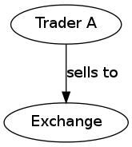

.. raw:: latex

	\begin{titlepage}
	\centering
	\singlespacing

	\vspace*{2in}

	\begin{center}
		\Huge PitFail Report 1 \\
		\Large An Online Financial Engineering Game
	\end{center}

	\vspace*{2in}

	\large
	September 30, 2011 \\

	\vspace*{0.5in}

	Software Engineering I, Group 3 \\
	\href{https://github.com/pitfail/pitfail-reports/wiki}{https://github.com/pitfail/pitfail-reports/wiki} \\

	\vspace*{0.5in}

	Michael Koval, Cody Schafer, \\
	Owen Healy, Brian Goodacre \\
	Roma Mehta, Sonu Iqbal \\
	Avanti Kulkarni \\
	\end{titlepage}

.. sectnum::

.. contents:: Table of Contents

.. raw:: latex

	\pagebreak

Individual Contributions
========================

.. raw:: latex

	\begin{center}
	\small

.. csv-table::
	:header: "Responsibility", "Michal Koval", "Cody Schafer", "Owen Healy", "Brian Good-acre", "Roma Mehta", "Sonu Iqbal", "Avanti Kulkarni"
	:widths: 15, 6, 6, 6, 6, 6, 6, 6

	Customer Reqs. (6),                ,     ,     ,     ,     ,     , 100%
	Glossary of Terms (4),          40%,  10%,  10%,  10%,  10%,  10%,  10%
	Functional Reqs.,                  ,     ,     ,     ,     ,     ,
	→ Stakeholders (2),                , 100%,     ,     ,     ,     ,
	→ Actors (2),                      , 100%,     ,     ,     ,     ,
	→ Goals (4),                    50%,  50%,     ,     ,     ,     ,
	→ Casual UC (5),                   , 100%,     ,     ,     ,     ,
	→ Dressed UC (11),              40%,  20%,     ,  40%,     ,     ,
	→ UC Diagram (4),                  , 100%,     ,     ,     ,     ,
	→ UC Tracability,              100%,     ,     ,     ,     ,
	Seq. Diagrams (9),                 ,     ,     ,     ,     , 100%,
	Nonfunc. Reqs. (6),                ,     ,     ,     ,     , 100%,
	Domain Analysis,                   ,     ,     ,     ,     ,     ,
	→ Concepts (12),                   ,     , 100%,     ,     ,     ,
	→ Associations (4),                ,     , 100%,     ,     ,     ,
	→ Attributes (3),                  ,     , 100%,     ,     ,     ,
	Contracts (6),                     ,     ,     ,     , 100%,     ,
	User Interface (8),            100%,     ,     ,     ,     ,     ,
	Plan of Work (3),                  ,     ,     , 100%,     ,     ,
	References (1),                 14%,  14%,  14%,  14%,  14%,  15%,  14%

.. raw:: latex

	\end{center}


Customer Statement of Requirements
==================================

Investors today are seeking more effective financial tools that not only
motivates them to invest in the stock market and improve their decision making
skills but also an application that is interesting enough to keep using. Our
goal is to build a system that is less focused on simulation than on playing a
game. Existing trading simulations mimic the inconveniences of trading stocks
on real markets; while this might help future traders to practice, it is out of
place for the typical internet user. PitFail's philosophy is that the market
for trading *practice* is already well-handled by games such as Investopedia.
PitFail instead believes that it is more important to teach theory than
mechanics. In contrast with the existing alternatives, PitFail offers number of
differentiating features: while the core program centers around buying and
selling of liquid assets (stocks, options; anything with available market
prices), PitFail aims eventually to users to trade directly with each other in
non-liquid assets such as derivatives. To achieve a low-threshold for getting
in to the game, PitFail may be played using users' existing accounts (such as
Twitter, smart phones or Facebook) with essentially no setup.

.. PitFail is an financial game which will allow investor players to virtually
.. invest money in real-world stocks. The basic features include buying and
.. selling stocks/securities from the exchange, trading between players, and
.. designing new derivatives. PitFail can also be accessed using Twitter, Facebook
.. and Android interface.

PitFail creates a virtual stock world, creating a network of stock investors,
through which they trade real-world stocks without the risk of losing real
money. Unlike existing trading simulations, PitFail does not require the
players to go through a time-consuming registration process. Players can login
to the system using their existing e-mail addresses and the system remembers
the players for their next use. As such, PitFail requires essentially no
commitment and it is easy for players to get started.  Initially, the player is
given a fixed amount of startup funds and uses these funds to buy virtual
stocks.

You could take a trading game different ways -- Investopedia, which is
excruciatingly tied to the real world, or Neopets which is isolated and
pristine -- but the nice thing about capitalism is that we can play with any
rules, so long as they're consistent. But so many (all that I'm aware of) of
the games that have been written so far left out something so important: you
can't enter (enforced) contracts with other players.

It's not a trivial detail -- if you can't enter contracts, you can't turn
intangible ideas into *assets* -- ie, you can't commoditize all the things you
might like to commoditize (well, maybe you can if that's nothing). There's a
good reason they don't do this, of course: to enforce contracts you either need
a legal system (doable -- Wikipedia has one, but a serious impediment still) or
contracts that a computer can enforce. PitFail makes a compromise -- users can
enter into contracts (in the form of derivatives), but the rules are reduced to
a simple set that the system can enforce, yet that can be combined creatively
by the players.

This adds a new aspect to the game -- illiquidity. The PitFail stock exchange
is simulated as a perfectly efficient, perfectly liquid market. This is of
course unrealistic -- in the real world, trading volume is finite, trades are
not made constantly, not all trades are made at the marginal price. Alas, it
would be hard for PitFail to simulated illiquidity in stocks -- unless we have
access to an actual massive population of traders, it would be simply *too*
illiquid to be worth playing.

There are many options for a player to choose from once he/she logs in:

1. Player can join a team (a small group of already registered players). Once
   player joins a team, the player will buy/sell/compete with other players/teams
   using collective portfolio of the team.

2. Player can join a league (a group of already registered players) where the
  members of a league compete with each other using their individual portfolio.

3. Player can play in the "Global League" which includes all players.

When the player trades and builds a portfolio, the system should have access to
real-time stock information and should adjust the value of a player's
investments based on this real time stock info. PitFail retrieves actual stock
prices from a third-party source Yahoo! that monitors stock exchanges and
maintains up-to-date (though delayed) stock prices. If the corresponding actual
stock loses value on a real-world stock exchange, the player's virtual
investment loses value equally.  Likewise, if the corresponding  actual stock
gains value, the player's virtual investment grows equally.

As a game, a crucial part of the application is maintaining player portfolio.
The application  provides every player with portfolio to view his or her
history and modify his or her current investments (i.e. currently owned stocks
and derivatives). In addition to the securities currently owned by the player,
the player is able to view a few summary statistics about their portfolio, such
as a history of net worth over time, and an indication of which assets have
increased in value since their purchase. What the player ultimately cares
about, of course, is net worth in the future -- that's what they are trying to
optimize. We can't tell them that, of course, nor should we, since it's the
whole point of playing the game. We should even be careful in categorizing
assets by change in value -- users will of course purchase assets that perform
oppositely to hedge risk.  Basically, we don't want to decide strategy for the
player; we want to give them information and let them decide strategy.

To add a flavor of a game, players can monitor each other's progress by viewing
a feed of recent activity and browsing leader boards. PitFail also offers
aggregate feeds of recent activity. This allows a group of people to keep
abreast of their friends' or enemies' activities. Remember, this is not real
personal information we're talking about -- we're willing to sacrifice privacy
(if you can call it that) for a competitive spirit. PitFail provides the
players with the ability to comment on other's trades when browsing recent
activity or viewing another user's portfolio. These comments make players feel
involved and part of a larger community. One additional feature PitFail
provides is the ability for players to "upvote" and "downvote" trades based on
their opinion of trade. PitFail can then rank users and assign status symbols
(e.g. badges) to users with the strongest ability to vote predictively. Of
course, predicting is only so good if you can't make good trades yourself --
but it's interesting to see both rankings nonetheless. This type of ranking
appears to be unique to PitFail. Another feature that appears to be unique to
PitFail is that it allows users to design their own securities (i.e futures or
options) , thus creating new financial products. Even without a court system to
enforce complex contracts, custom securities allow PitFail's users to a new
financial environment.

As mentioned, PitFail can be accessed via a website, Twitter, Facebook, or an
Android application. Each of these methods have their own purposes. As financial
trades are compact and atomic and that they can be expressed through small
messages, PitFail provides a Twitter and Facebook interfaces where players can
buy/sell securities by tweeting to a particular account/ writing post on
Facebook account wall .  Twitter and Facebook  provide a familiar interfaces to
use the system. Also, as no registration  is required which makes it easy to
use.  PitFail can also be accessed via a website that offers additional set of
features (In addition to all of the functionality provided by the Twitter
interfaces): like view portfolio, design custom securities, interact socially
with other users and play against or in co-operation (teams/leagues) with other
users. Also, website helps to generate some advertising revenue,
making it desirable to attract users to the PitFail website by offering
features that are not possible via Twitter/Facebook.  Android interface
provides features that are similar to that of the website, with the addition of
notifications to the user when some event occurs within PitFail.

The motivation for implementing teams/leagues comes from the apparent fact that
most (perhaps all) trading games target students and teachers as their
principal user base, suggesting this accounts for most of the people who
actually play these games. While PitFail is mostly seeking a different niche --
the casual online player -- the classroom market is too big to ignore
completely, hence a feature that makes it possible for students to play against
each other in a league.

Below is the list of customer requirements:

1. **REQ-1** Stock Market Simulator Website: Investors are looking for an
   effective tool that allows users to invest and learn without having to
   invest real money and also allows them to interact with other users more
   effectively to make the game really enjoyable.

2. **REQ-2** Android Application: Mobile users who like having native
   applications can use such system with quick access.

3. **REQ-3** Access via Twitter/Facebook: Users who heavily use social networks
   like Facebook/Twitter can connect to PitFail easily.

4. **REQ-4** Simple User Interface: Users are looking for simple interface that
   welcomes new users and guides the new user through portfolio management.

5. **REQ-5** Zero-Configuration Setup: Users should not have to set any
   settings or explicitly create an account to begin playing.

6. **REQ-6** Updated Stock Information: Application should present stock
   symbols, company names, stock history, updated stock values and prices
   amongst other details.

7. **REQ-7** Basic Trading: Users should be able to buy and sell stocks whose
   values change over time.

8. **REQ-8** Large, Liquid, Efficient Market: The simulated "exchange" should
   present the illusion of a large, liquid and efficient market -- stocks are
   traded constantly, at marginal price, and each individual trade is small
   compared to the total trading volume.

9. **REQ-9** Relation to the outside world: The values of stocks should be in
   some way related to the outside world so that users have information to base
   trading decisions on.

10. **REQ-10** Player Portfolio: Each player must have separate portfolio that
    gives him/her option to buy/sell new securities, view currently owned
    securities.

11. **REQ-11** Evaluate Portfolios: Securities owned by each player should be
    periodically evaluated and should be updated to their current value.

12. **REQ-12** Advertisements: The website must contain appropriate and
    interesting advertisements relating to finance and stock

13. **REQ-13** Coordinators for Supervision: Users must be able to create
    their own leagues.

14. **REQ-14** Summary Statistics: The website should provide users with a few
    summary statistics about their portfolio -- aggregate value over time,
    which securities have increased in value. The website shouldn't usurp the
    role of deciding strategy for the player; only the most basic of stats
    should be displayed.

15. **REQ-15** Voting: players should be able to up/down-vote each other's
    trades. Vote tallies should be visible to other users.

16. **REQ-16** Commenting: players should be able to comment (via the website
    -- you can already comment on anything via Twitter) on each other's trades.
    Comments should be visible to all users.

17. **REQ-17** Moderation: There should be at least a minimal degree of comment
    moderation so blatantly offensive comments can be removed.

18. **REQ-18** Designing Derivatives: Players should be able to enter into
    contracts with each other that will be enforced by the PitFail system.

19. **REQ-19** Guided designing of derivatives: The website should guide
    players into common formats for derivatives to make it easier for new
    players to figure out.

20. **REQ-20** Rankings: On the website players should be able to see rankings
    of all players by portfolio value (liquid assets only), and by voting
    score.

Representing Financial Products for Online Simulation
=====================================================

Example: Options
-------------------

There are different kinds of options, but the basic form goes something like:
"on a preset date, trader A agrees that trader B may optionally (at trader B's
discretion) buy X shares of XYZ for D dollars, from trader A."

Right away we see this will have some sharp edges in an online game:

1. It requires obtaining a decision from trader B on the specified date, while
   trader B may in real life be sleeping, be at work, be in the hospital, not
   care about the game anymore, etc.

2. If trader A doesn't have X shares of XYZ at the exercise time, the software
   will have to handle that in a way that's fair to both players, and doesn't
   require getting them out of bed.

Luckily, real life comes to the rescue. First, stocks, being traded on
exchanges, are fairly liquid, and have a market value that can be easily looked
up. So if, on the exercise date, trader B has the option of buying X shares of
XYZ for D dollars, we already know what trader B wants to do: if X shares of
XYZ is worth more than D dollars, she'll buy it; otherwise she won't. It's
reasonable to imagine that trader B would much rather have the software make
this obvious decision for her than have to remember to be online at the right
time to make a trivial decision in a game.

The second problem is moot for a different reason: in real life, not only are
stocks liquid, but *options* are liquid: they are set according to standard
terms and traded on exchanges. Thus, in real life, options are rarely
exercised; rather on the exercise date trader A simply buys back the option,
which he can reliably do since there are thousands of other traders buying the
same option. Likewise trader B simply sells it back. The option never gets used
and the actual value of exercising it is reflected only in the change in its
price.

Alas, in an online game where membership may be sporadic, derivatives cannot be
liquid, so buying the option back from the exchange isn't feasible. However,
stocks *are* liquid, so it's safe to assume that, if trader B can't buy the
promised X shares of XYZ, she'll be content with the corresponding value of
those shares in dollars.

Entering into a Contract
------------------------

Since trader B gets positive value from the option contract and trader A gets
negative value, in order for the contract to come about trader B needs to pay
trader A for the privilege.

In the game, trader A can offer to "sell" the derivative to trader B -- meaning
that, if trader B accepts, the derivative is created and they enter the
contract. So for example, trader A can offer an option to B for $35. If trader
B accepts, trader B pays trader A $35 and they enter the contract. Importantly,
the $35 is not part of the derivative -- it doesn't depend on the eventual
execution of the derivative.

Representation
--------------

The proposed representation of a derivative consists of:

1. An exercise date,

2. A condition on which the derivative will be exercised,

3. A list of securities to be traded.

So for example, an option to buy 100 shares of GE on 9/18 for $350 would be
represented as:

1. 9/18

2. GE > $3.5

3. [100 * GE, -350]

The - in -350 indicates that the money is moving from the buyer to the seller.

Representation of dates is clear, but the representation of the condition and
the securities is not. It is described in the next section.

A Language for Securities
-------------------------

A security consists of two pieces of information:

1. The "flavor" (if a stock, the stock ticker symbol)

2. An amount, with a sign.

Stocks, derivatives and dollars would be possible flavors. If the sign is +,
the security is to be moved from the seller to the buyer (in the option
example, trader A is the seller and trader B is the buyer). If it's -, it is to
be moved from the buyer to the seller.

Comparing Securities
--------------------

*Not all securities can be compared*. This is simply because in a world where
derivatives are not standardized and not traded on exchanges, it is impossible
for software to know the value of a derivative, or to say if one derivative is
more valuable than another

Therefore, the only comparable securities are:

1. Dollars

2. Stocks

Securities are compared according to their dollar value at the present time.
The dollar value of a stock is the last traded price of that stock.

Derivatives have endpoints
--------------------------

When trading on an exchange, you normally think of a derivative as looking like



or


It would not be technically infeasible (or even harder) to use this
representation in an online game, but it could lead to serious problems. In
real life, because the exchange takes one half of the trade, it needs to put
effort into enforcing a standard of behavior for the traders: importantly, the
exchange puts limits on leverage and sets margin requirements. It's hard for
software to do a good job of this -- it would likely lead to a high number of
defaults.

In the game, a better representation is


importantly, neither trader A nor trader B *owns* the derivative; rather they
each own one endpoint of it. An analogy would be a socket always having two
endpoints (although sockets aren't normally traded).

*Only the buyer endpoint of a derivative can be traded*. This is necessary to
prevent people absorbing their debt into dummy accounts which will then
default. There is no reason that the buyer endpoint must have positive value --
so it map be vulnerable to the same tricks, but that is a problem that occurs
in real life as well, and is a natural aspect to the strategy of the game.

Exercising Trades
-----------------

What happens when, on the exercise date, trader B goes to buy security XYZ from
trader A, and trader A doesn't have security XYZ? The answer depends on the
type of security.

If XYZ is dollars, we can assume trader A is now in default and will need to
declare bankruptcy, which is a whole topic in itself.

If XYZ is a stock, as mentioned earlier, it is a simple matter to convert XYZ
to dollars, and then the rules for dollars apply.

The trickiest case is when XYZ is a derivative. First, remember that you don't
trade derivatives, you trade endpoints, so what trader B is actually purchasing
from trader A is one *endpoint* of derivative XYZ. The key point is that a
derivative is just a contract: if trader A doesn't have the correct endpoint of
XYZ, an XYZ derivative can be created at that time, giving trader B his
promised endpoint, and letting trader A keep the other.

For trader B this is obviously acceptable -- she get what she was promised, but
what about for trader A? In fact, this should be entirely acceptable for trader
A as well, because derivative endpoints cancel each other out. This means that
receiving the seller endpoint of XYZ is no different than giving away the buyer
endpoint -- so again, the difference should be moot for trader A.

A problem *will* occur if derivative XYZ is past the exercise date, since this
would involve editing the past. In real life, this would be impossible; in the
game, it would be possible, but highly undesirable. However, assuming you can't
directly trade XYZ after it has expired, the only time this would be an issue
is when derivative XYZ is included as part of the contract of derivative ABC,
and the exercise date of XYZ comes first. Since this can be detected at the
time the user tries to create ABC, the error case can simply be presented to
the user as not allowed, and the problem will never arise.

Liquidating Portfolios
----------------------

When a user goes bankrupt (cannot pay all her debts) a portfolio will be
liquidated, hoping to obtain as much cash as possible.

Cash is already cash. Stocks are liquid assets and will be immediately sold
back on the exchange for cash. The remaining assets are derivatives and equity
shares.

Sadly, or fortunately, depending on your point of view, in economics the value
of products is determined by what the market participants are willing to pay
for them, so the software cannot put a value of derivatives and equity. The
software will put these at auction for a period, say 1 day, and any that are
not sold will vanish.

A Prediction Market for Voting on Trades
========================================

Background
----------

Sites such as StackOverflow allow users to vote on items posted by other users,
to express approval or disapproval. Here that concept is extended with a
prediction market to give users an incentive to vote and to vote well.

The implementation tries to work as much like a real prediction market as
possible: the profit to the voters is tied as literally as possible to the
object being voted on. This means that voting doesn't add any "new" concept of
what a winner is -- it merely mimics the existing concept.

Implementation
--------------

When a trade is made
....................

Say *Jen* sells a call option XYZ to *Nitish* for $100 (the other end of the
option is currently held by *Atif*). To support voting, the following things
happen at this time:

1. Jen and Nitish set aside $0.25 each into the *common pool*.

2. Nitish places 0.02*XYZ into the *buyer pool*.

3. Jen places 0.02*$100 into the *seller pool*.

The three pools are tied to this particular trade. The exist, potentially,
forever, although the software may wish to reap pools on old trades.

The game then does a hacky "pre-money evaluation" of the pools. Since one half
of a trade is always cash (please let this be true), the game values XYZ at
$100 and both pools are valued at $2.00.

Casting Votes
.............

Casting votes works exactly analogously to investing in a company. A vote costs
a user $0.20, and in exchange they get $0.20 worth of the "company".

Say *Mike* thinks that Nitish got the better deal, so he casts the first vote,
for Nitish. Mike pays $0.20 into the *buyer pool*. Now the *buyer pool* contains:

- $0.20 in cash
- 0.02*XYZ

Since 0.02*XYZ is considered to be worth $2.00, the pool now contains $2.20, so
Mike's $0.20 entitles him to 9% of the pool, which he receives instantly in the
form of $0.018 in cash and 0.02*0.09*XYZ.

*A note on small numbers:* Votes are supposed to be small compared to other
trades, but not so small that users don't bother with them. Because votes are
tiny enough to divide cents and be annoying when looking at balance sheets,
they don't show up on balance sheets until they are liquidated and added to the
user's single pool of cash.

Mike also receives, as a bonus for voting, 25% of the current contents of the
*common pool*. This gives users an incentive to vote and to vote early. Users can
only vote once per trade.

Showing the Results
...................

Vote tallies are displayed along with the announcement for a trade on the
PitFail website. The votes give a sense of how the community judges the
prudence of that trade.

What happens to those tiny securities?
......................................

After voting, Mike now has 0.02*XYZ, which, as we said before, is a call
option, the other end of which is held by *Atif*. From *Atif*'s perspective it
is irrelevant who holds the other end of the option, and it doesn't show up in
his balance sheet.

At some point, the exercise date for XYZ will come due, and it will be fully or
partly liquidated. Any cash is returned to Mike's pool of cash; any stock is
immediately sold and converted to cash.

Derivatives aquired through voting sit around in a user's "voting balance
sheet", which is not shown.

Reputation
..........

Sites such as Fluther and StackOverflow give "reputation" to users for
receiving votes. PitFail voting also offers another possibility: reputation for
*casting* votes accurately: "casting reputation" would simply be the total
amount of cash received from casting votes to date. A user with a high casting
reputation is good at judging other people's trades.

Casting or receiving reputation could be shown along with user names on the
site to create a more competitive atmosphere.

Interacting with a Trading Simulation over Twitter
==================================================

Motivation
----------

Twitter is a service that is already widely used by many people, so there is a
lower threshold of learning and discovery to play a game over Twitter than to
use a dedicated website. It is not expected that the Twitter interface will
duplicate all features of the website; rather users will be able to perform
their most common tasks from an interface they are familiar with.

The bulk of the proposal is a syntax that represents the operations of the
game. This syntax could integrate into any system that allows sending brief
messages from named accounts. However, since Twitter is already well integrated
this extra flexibility may be unnecessary.

Implementation
--------------

Accounts
........

The game has an account, tentatively named ``pitfail``, and will listen for
user tweets sent to ``@pitfail``.

Users must explicitly associate their Twitter accounts with their PitFail
accounts. Once Twitter name ``joe`` is associated with PitFail account
``joe26``, tweets from ``joe26`` will be interpreted as belonging to account
``joe``.

Another option is for a user to *start* playing FitFail over Twitter. This lets
the user start playing faster and with no setup -- the first message they send
to ``@pitfail`` creates an account. There's no way to automatically associate
this with an OpenID login (that I know of) -- if the user later wants to use
the PitFail website

The program may respond to tweets that require a response by sending tweets
back to users.

Syntax of the commands
......................

View Portfolio
``````````````

::

    @pitfail #portfolio

PitFail will respond with assets and liabilities in a human-readable form.

Buy a Stock
```````````

::

    @pitfail #buy 100 shares of HP

or::

    @pitfail #buy HP * 100

(See [[Products # A language for securities]])

or::

    @pitfail #buy $250 of HP

PitFail will respond with an ACK if successful, or an error if the trade
failed.

Sell a stock
````````````

::

    @pitfail #sell 100 shares of HP

    @pitfail #sell HP * 100

    @pitfail #sell $250 of HP

Offer a security for sale to a specific user
````````````````````````````````````````````

::

    @pitfail @joe #want 100 shares of HP for $250?

See [[Syntax for securities|Syntax]]

Accept an offer
```````````````

::

    @pitfail @laura #yes

This has an obvious ambiguity if `@laura` has made `@joe` more than one offer.
Because that ambiguity could be used to trick `@joe`, it should not be allowed
to make more than one outstanding offer to the same user from the same user.

Decline an offer
````````````````

::

    @pitfail @laura #no

Offer a security for sale at auction
````````````````````````````````````

::

    @pitfail #auction 100 shares of HP

When an auction is started it is assigned an id, which is a unique, short
string. The ID can be used when bidding on the auction.

Bid on an auction
`````````````````

::

    @pitfail #bid $15 on #ae7

Comment on a trade
``````````````````

::

    @pitfail @joe Are you serious?

Comment and vote on a trade
```````````````````````````

::

    @pitfail @joe Are you serious? #down

    @pitfail @joe Dammn... #up

These may be ambiguous, but it's not a big deal since little money is at stake.
If the user wants to dig up an old trade and comment on it, they can use the ID
assigned by pitfail::

    @pitfail @joe Are you serious? #cc2f #down

Design considerations
---------------------

- Operative words are given #tags so that users don't accidentally make trades
  when just trying to discuss them.

- When offering a security to another user, the role of the `@pitfail` account
  is minimized -- it's still there watching so it can actually make the trade,
  but the users feel as if they are just responding to each other. It makes it
  feel more like a real trade.


Glossary of Terms
=================
Asset
  These show up on a users balance sheet, as things that they own. An asset is
  anything which may someday be converted co cash.

Coordinator
  PitFail user responsible for administering a *league*. See `Actors and
  Goals`_ for more information.

Game
  The trading of securities given a particular set of rules with the object to
  increase the value of one's portfolio.

Invite-Only League
  Restricted league where becoming a *member* requires approval by a
  *coordinator*.

League
  An instance of the *game* having particular rules associated with it. A
  *coordinator* may create a league for *players* to join.

Member
  *Player* who has a portfolio associated with a specific league. Members of a
  league compete against each other.

OAuth
  Protocol used for authenticating users and sharing information with PitFail
  on their behalf. See (http://oauth.net/).

OpenID
  Protocol used for authenticating users using their existing accounts. See
  (http://openid.net/).

OpenID Provider
  Third-party service that provides an OpenID identity for users; e.g. Google.

Player
  PitFail user participating in one or more *leagues*. See `Actors and
  Goals`_ for more information.

Portfolio
  Collection of *securities* associated with a specific user and league. Each
  user aims to maximize the value of his or her own portfolio.

Public League
  Open league where users can choose to become *members* with no approval.

Security
  Financial asset having a cash value. This includes *stocks*, bonds, and
  *derivatives*.

Stock
  Claim on the earnings of a company. To PitFail players, a stock is an opaque
  asset with fluctuating value.

Ticker
  Short string which uniquely identifies a stock.

Functional Requirements Specification
=====================================

Stakeholders
------------

- *Advertisers* who purchase ads on the website
- *Spectators* interested in finance who do not wish to invest in the real market
- *Teachers* of economics courses and their *students*

Actors and Goals
----------------

..  - A *Player* is one who participates by buying and selling securities.

..  - Wants to increase the value of their portfolio, thereby proving competency
..    at security trading.
..  - Competes with other players for higher ranks in leagues.

- A *Web Player* is a *player* who interacts with the *game* via the web
  browser interface. 

  - Buys and Sell Stocks.
  - View and Modify Portfolio.
  - Create League.
  - Participate in Leagues.

- A *Twitter Player* is a *player* who interacts with the *game* via the
  Twitter interface. This actor contains has limited use cases compared to a Web Player.
  
  - Buys and Sells Stocks
  - Participates in Leagues

- A *MobilePlayer* is a *player* who interacts with the *game* via the
  Twitter interface. This actor contains has limited use cases compared to a Web Player.
  
  - Buys and Sells Stocks
  - View Portfolio
  - Participate in Leagues

- A *Coordinator* is responsible for administering a *league*.

  - Wants to effectively administer the tournament to provide either a learning
    experience to the *players*, or, alternately, an enjoyable experience to
    the *players*.
  - Desires a construct in which to effectively challenge others interested in
    security trading.

- The *database* is the store for all persistent data on interactions with the
  *system*. It stores data regarding all user portfolios and the association of
  authentications with users.

- A *stock information provider* is a supplier of stock pricing data for the present
  (within the margin of some minutes). They are queried for all data regarding
  actual market numbers. Currently, *Yahoo* is the *stock information provider*
  (via its Yahoo Finance API).

- *Authentication providers* allow us to uniquely identify users and associate
  some stored state with their unique identification.

- *Twitter* is utilized both as a authentication provider (for all *players* as
  well as a portion of the interface to the service.


Casual Use-Case Description
---------------------------
The system is designed such that customization and setup by a *player* is
minimized. As such, league joining is unneeded by new players. In fact, to be a
new *Twitter player*, one can simply send a *commanding tweet* and the PitFail
system will automatically initialize the required backing data.

Account creation is omitted from the use case listing because account creation
is always accomplished implicitly. Third party services are used for
authorization, and all other setup is accomplished with defaults that may be
changed at another point it time by the *player* as requested.

=============  ===================================================  ===================  =====
Actor          Description                                          Short Name            UC#
=============  ===================================================  ===================  =====
WebPlayer      Purchases a security from the market at the price    Buy                  UC-1
               the *stock price source* indicates is the market
               price for that security.
WebPlayer      Sells a held security at the price indicated by the  Sell                 UC-2
               *stock price source*.
WebPlayer      Indicates that they wish to begin participating in   Join League          UC-3
               a particular league. Does not remove them from any
               league. Also note that leaveing a league is omitted
               to prevent people from gaming the system by
               joining a league, doing poorly, and leaving to
               essentially have a "clean record".
WebPlayer      Examine the contrents of his or her portfolio,       View Portfolio       UC-4
               displaying information regarding their current
               assets and liabilities as well as how they have
               been progressing over time
WebPlayer      Examines details of a particular security.           Get Security         UC-5
                                                                    Details
WebPlayer      Checks league statistics. Provide a clear view of    View League Stats    UC-6
               the leaderboard as well as changes over time.
TwitterPlayer  Purchases a security from the market at the price    Buy via Twitter      UC-7
               the *stock price source* indicates is the market
               price for that security.
TwitterPlayer  Sells a held security at the price indicated by the  Sell via Twitter     UC-8
               *stock price source*.
TwitterPlayer  Query portfolio value & other details.               Portfolio Info       UC-9
TwitterPlayer  Changes his or her current (default) league.         Change Default       UC-10
               The default league is the league which UC-1(Buy)     League
               and UC-2(Sell) requests are sent to when a league
               is not specified in the command string.
Coordinator    Creates a league.                                    Make League          UC-11
Coordinator    Modifies a league's settings. A coordinator will     League Settings      UC-12
               need to manage a league via changing settings
               regarding the league.
Coordinator    Add an additional Coordinator to a league.           Add Coordinator      UC-13
Coordinator    Remove a coordinator from the league.                Remove Coordinator   UC-14
Coordinator    Delete a league.                                     Delete League        UC-15
Coordinator    Accept or decline requests to join a league.         Manage League        UC-16
Coordinator    Invite players to a league.                          Invite to League     UC-17
WebPlayer      Authenticates with the system.                       Authentication       UC-18
WebPlayer,     Has their initial account (portfolio tracking)       Create User          UC-19
TwitterPlayer  created.
WebPlayer      Vote on trade.                                       Vote                 UC-20
TwitterPlayer  Vote on trade via a Twitter repost.                  Vote by Tweet        UC-21
WebPlayer      Create derivative.                                   Derivative Designer  UC-22
WebPlayer      Accept offer of a derivative.                        Accept derivative    UC-23

=============  ===================================================  ===================  =====

Fully Dressed Use Cases
-----------------------

UC-1: Buy
.........
Related Requirements:
        - REQ1: Stock Market Simulator Website
        - REQ2: Android Application
        - REQ3: Access via Twitter/Facebook
        - REQ5: Updated Stock Information
        - REQ6: Player Portfolio

Initiating Actor:
        Any of: Webplayer, TwitterPlayer, MobilePlayer

Actor's Goal:
        To purchase a security from the market, to add it to his portfolio, and
        see his updated portfolio.

Participating Actors:
        Database, Securities, Stock Price Source, Yahoo!

Preconditions:
        The user should have created an account, be in a league  with settings
        that allows the "BUY", and have enough money to perform the BUY of the
        security.

Postconditions:
        The user needs to be able to see his purchased security in his
        portfolio and track the progress of the security in his portfolio until
        he "SELLS" it.

Flow of Events for Successful Buy:
        1. → The *Player, Webplayer, or TwitterPlayer* determines a *Security*
           and how much of it to "BUY".
        2. ← *System* signals the *Stock Price Source* for the price of the
           security.
        3. ← *Stock Price Source* sends the price of the *Security* to the
           *System.*
        4. ← *System* signals the *Database* for the amount of money the
           *Player* has.
        5. ← *Database* sends the amount of money for the *Player* to the
           System.
        6. ← *System* checks that there is enough money for compelete the
           transcation.
        7. ← *System* signals the *Database* to complete the transcation for a
           *Player*, *Security*, and the quantity.
        8. ← *Database* signals the *System* the transcation is complete.
        9. ← *System* signals to the *Player* "Transcation Completed."

Flow of Events for Unsuccessful Buy:
        1. → The *Player, Webplayer, or TwitterPlayer* determines a *Security*
           and how much of it to "BUY".
        2. ← *System* signals the *Stock Price Source* for the price of the
           security.
        3. ← *Stock Price Source* sends the price of the *Security* to the
           *System.*
        4. ← *System* signals the *Database* for the amount of money the
           *Player* has.
        5. ← *Database* sends the amount of money for the *Player* to the
           System.
        6. ← *System* checks that there is enough money for compelete the
           transcation.
        7. ← There is not enough money. *System* signals to the *Player*
           "Transcation Not Completed: Insufficient Funds."

UC-2: Sell
..........
Related Requirements:
        - REQ1: Stock Market Simulator Website
        - REQ2: Android Application
        - REQ3: Access via Twitter/Facebook
        - REQ5: Updated Stock Information
        - REQ6: Player Portfolio

Initiating Actor:
        Any of: Webplayer, TwitterPlayer, MobilePlayer

Actor's Goal:
        To purchase a security from the market, to add it to his portfolio, and
        see the updated portfolio

Participating Actors:
        Database, Securities, Stock Price Source, Yahoo!

Preconditions:
        - User is logged in
        - Contain in his portfolio at least the quantity of securities his is
          requesting to sell.

Postconditions:
        - The user's portfolio will reflect the quantity of securities sold.

Flow of Events for Successful Sell:
        1. → The *Player(ANY)* determines a *Security*
           and how much of it to "SELL".
        2. ←  *System* signals the *Stock Price Source* for the price of the
           security.
        3. ←  *Stock Price Source* sends the price of the *Security* to the
           *System.*
        4. ←  *System* signals the *Database* for the amount of the *Security*
           the *Player* has.
        5. ←  *Database* sends the amount of the *Security* the *Player* has to
           the System.
        6. ←  *System* checks that there is enough *Securities* to complete the
           transaction.
        7. ←  *System* signals the *Database* to complete the transcation for a
           *Player*, *Security*, and the quantity.
        8. ←  *Database* signals the *System* the transaction is complete.
        9. ←  *System* signals to the *Player* "Transaction Completed."

Flow of Events for Unsuccessful Sell:
        1. → The *Player(ANY)* determines a *Security*
           and how much of it to "SELL".
        2. ←  *System* signals the *Stock Price Source* for the price of the
           security.
        3. ←  *Stock Price Source* sends the price of the *Security* to the
           *System.*
        4. ←  *System* signals the *Database* for the amount of the *Security*
           the *Player* has.
        5. ←  *Database* sends the amount of the *Security* the *Player* has to
           the System.
        6. ←  *System* checks that there is enough *Securities* to complete the
           transaction. There is not.
        7. ←  *System* signals to the *Player* "Transaction Not Completed:
           Insufficient Securities."

UC-4: View Portfolio
....................
Related Requrements:
        - REQ1: Stock Market Simulator Website
        - REQ4: Simple User Interface
        - REQ5: Updated Stock Information
        - REQ6: Player Portfolio

Initiating Actor:
        Only *WebPlayer*, the similar UC-9 is provided for the *Twitter player*.

Actor's Goal:
        To view information regarding their portfolio. This information
        includes the currently owned securities, minimal statistics regarding
        those securities (as they relate to the current and past value of the
        portfolio), current avaliable capital (and similar minimal information
        regarding its change), and the overall value of the portfolio (also
        with some statistical information regarding changes over time). The
        actor desires this information to make decisions regarding what their
        next interaction with the system should be. They use this info to
        decide to sell stock they have or buy an increased number of shares of
        stock they have).

Participating Actors:
        *Stock information provider*, *Database*

Preconditions:
        None, note that authentication & account creation are handled within
        this use case.

Postcondions:
        None, this is a stateless action. Information is displayed to the user
        but no internal actions are taken.

Flow of Events for Main Success Scenario:
        1. → *Web player* browses to a page which will display his portfolio.
        2. ← *System* checks for authentication and when it does not exsist (a)
           runs the authentication (UC-18). Checks for a associated *user* in
           the system and when there is none runs (b) user creation (UC-19).
        3. ← *System* requests the information about the user's portfolio for
           this particular league from the *Database*.
        4. → *Database* returns the information regarding the portfolio.
        5. ← *System* forms a query regarding all the currently held securities
           within the portfolio and dispatches it to the *stock info provider*.
        6. → *Stock info provider* returns the requested data.
        7. ← *System* forms a web view of the portfolio information and returns
           it to the *web player*

Additional Notes:
        When this use case is running the other contained use cases (UC-18 and
        UC-19), each of these perform their own sequence of interactions with
        the user. In the case of a failure in one of the included use cases,
        the users remains in the control of that included use case until the
        failure is resolved or another use case is initiated.

UC-5: View League Statistics
.............................
Related Requirements:
        - REQ-1: Shock Market Simulator Website

Initiating Actor:
        WebPlayer

Actor's Goal:
        To view the performance of his or her portfolio relative to other
        league members. For a teacher, this may also be used to verify that his
        or her students are actively participating in the game.

Participating Actors:
        Database

Preconditions:
	The league that is being viewed exists and the league is either public or the user is a member.

Postconditions:
        None; this is a stateless action.

Flow of Events for Main Success Scenario:
        1. → *Player* requests to view league performance.
        2. ← *System* signals the *Database* for authentication and the league's leaderboard.
        3. ← *Database* authenticates the user's ability to view the statistics and returns the league's leaderboard.
        4. ← *System* returns a leaderboard of all league members.

Flow of Events for league does not exist:
	1. → *Player* requests the league statistics page.
	2. ← *System* signals the *Database* for authentication and the league's leaderboard.
	3. ← *Database* signals the *System* that the league does not exist.
        4. ← *System* returns "page not found" error.

Flow of Events for league is invite-only and the user is not a member:
	1. → *Player* requests the league statistics page.
	2. ← *System* signals the *Database* for authentication and the league's leaderboard.
	3. ← *Database* signals the *System* that the league is invite-only and the *Player* is not a member.
        4. ← *System* returns "access denied" error.

UC-6: Modify League Settings
............................
Related Requirements:
        - REQ-1: Stock Market Simulator Website
        - REQ-9: Coordinators for Supervision

Initiating Actor:
        Coordinator

Actor's Goal:
        To modify settings for the coordinator's league. This includes modifying
        the league's name, nickname, starting funds, and security settings.

Participating Actors:
        Database

Preconditions:
        - League that is being modified exists
        - Initiating actor is a coordinator of the league that he or she is modifying

Postconditions:
        - League name is still unique
        - League nickname is still unique
        - Starting funds is positive

Flow of Events for Main Success Scenario:
        1. → *Coordinator* requests to view league settings page.
        2. ← *System* signals the *Database* for authentication and the league's settings page.
        3. ← *Database* authenticates the user's ability to modify the league settings and returns the league settings page.
        4. ← *System* returns a league setting page populated with the current settings.
        5. → *Coordinator* submits updated league settings.
        6. ← *System* Validate new league settings
        7. ← *System* sends updated settings to the *database.*
        8. ← *Database* signals the *System* that the settings have been updated.
        9. ← *System* signals the *Coordinator* "Settings have been updated."

Flow of Events for league does not exist:
	1. → *Player* requests the league settings page.
	2. ← *System* signals the *Database* for authentication and the league's settings page.
	3. ← *Database* signals the *System* that the league does not exist.
        4. ← *System* returns "page not found" error.

Flow of Events for user is not a coordinator of the league:
	1. → *Player* requests the league settings page.
	2. ← *System* signals the *Database* for authentication and the league's settings page.
	3. ← *Database* signals the *System* that the league is invite-only and the *Player* is not a member.
        4. ← *System* returns "access denied" error.

Use Case Diagram
----------------
.. figure:: UseCaseDiagram.pdf
        :width: 100%

Use Case Tracability Matrix
---------------------------
The following is the relationship between the use-cases defined above and the
requirements discussed in the statement of requirements:

- **UC-1:** REQ-1, REQ-2, REQ-6, REQ-7, REQ-8, REQ-9
- **UC-2:** REQ-1, REQ-2, REQ-6, REQ-7, REQ-8, REQ-9
- **UC-3:** REQ-1, REQ-20
- **UC-4:** REQ-1, REQ-2, REQ-6, REQ-10, REQ-11, REQ-14
- **UC-5:** REQ-1, REQ-6, REQ-9
- **UC-6:** REQ-1, REQ-14, REQ-20
- **UC-7:** REQ-3, REQ-6, REQ-7, REQ-8, REQ-9
- **UC-8:** REQ-3, REQ-6, REQ-7, REQ-8, REQ-9
- **UC-9:** REQ-3, REQ-6, REQ-10, REQ-11, REQ-14
- **UC-10:** REQ-3, REQ-20
- **UC-11:** REQ-1, REQ-13, REQ-17
- **UC-12:** REQ-1, REQ-13, REQ-17
- **UC-13:** REQ-1, REQ-13, REQ-17
- **UC-14:** REQ-1, REQ-13, REQ-17
- **UC-15:** REQ-1, REQ-13, REQ-17
- **UC-16:** REQ-1, REQ-13
- **UC-17:** REQ-1, REQ-13
- **UC-18:** REQ-1, REQ-4, REQ-10, REQ-11, REQ-17
- **UC-19:** REQ-1, REQ-4, REQ-5, REQ-10, REQ-11
- **UC-20:** REQ-1, REQ-2, REQ-15, REQ-20
- **UC-21:** REQ-3, REQ-15, REQ-20
- **UC-22:** REQ-1, REQ-18, REQ-19
- **UC-23:** REQ-1, REQ-2, REQ-18, REQ-19

System Sequence Diagrams
------------------------
UC-1:
Buy Stocks (Scenario: Successful operation)

.. figure:: ssd/BuyStocks_SD.png
    :width: 50%

UC-2:
Sell Stocks (Scenario: Successful Operation)

.. figure:: ssd/SellStocks_SD.jpg
    :width: 50%

UC-3:
View Portfolio (Scenario: Successful Operation)

.. figure:: ssd/ViewPortfolio_SD.jpg
    :width: 50%

UC-4
View League Statistics (Scenario: Successful Operation)


UC-5
Modify League settings (Scenario: Successful Operation)


Nonfunctional Requirements
==========================

Usability
---------
The website should be easy to navigate irrespective of the type of user.  It
should have an appealing user interface which is pleasant to the eyes.  A
through consideration should be given for its aesthetic design in order to make
it easily navigable and to have a good readability. The key focus should be on
making the user interface as interactive as possible.

Performance
-----------
In order to have a great performance, the website should be as lightweight as
possible by keeping minimum hardware demands. For it to be efficient, any task
initiated by the user should be completed in a timely manner.  The web server
should be able to serve multiple requests and when a large number of users are
logged in.

Reliability
-----------
In case of Internet failure, the user's portfolios should be brought back to a
consistent state when user logs in the system again after the failed internet
connection. The system should keep a backup of user's data in case of server
failure. A proper care should be taken to handle a situation where a particular
stock source is not available (i.e. Yahoo).

Security
--------
The system should be secure enough such that user's privacy is maintained.  The
system should have a login process irrespective of the application i.e via
Website, Mobile or Twitter interface.

Supportability/Extensibility
----------------------------
It should be feasible to extend any server components and include improved
versions of modules which can be installed only by administrators. For future
purposes of handling the load, it should be easier to include more number of
servers to achieve load balancing. The system should be platform independent so
that it is easy to move to newer technologies or the next versions of web
server.

Maintainability
---------------
The system should be easy to maintain for the administrator. The administrator
should be provided with an interface to interact with the entire system to make
changes and to recover from any failure manually as well. The interface should
give the administrator enough capability to perform future maintenance.

Testability
-----------
The system should be flexible enough to allow creating test databases and fake
players so that feature test does not need to manipulate the actual database.
This would ensure that it has great testability which can be used to build a
more robust

Consistency
-----------
It should be ensured that the application is consistent throughout irrespective
of what interface the player is using i.e whether website, mobile application
or Twitter interface. Functionality might be limited on these different
interfaces but it should not difficult for the user to shift from one
application to another to access the system. Buzz words used should be same
throughout and on all the interfaces to avoid confusion.

Documentation
-------------
The website should have enough material in the form of tutorial which can help
the user to understand the rules and policies of the Stock fantasy league game
and how it works.

Domain Analysis
===============

Domain Model
------------

Concept Definitions
...................

Our Domain uses the following concepts (which appear in the Domain Model
diagrams later):

User
````

*Definition*: A human being playing the PitFail game.

Web Browser
```````````

*Definition*: The User's browser, running on the User's computer.

*Responsibilities*:

 - Take input from User
 - Send requests to Web Server
 - Receive responses from Web Server
 - Render page content

Android Client
``````````````

*Definition*: The Android application: PitFail, running on the User's Android phone.

*Responsibilities*:

 - Listen to user input via touch
 - Send request to Web Server, receive response from web server
 - Display appropriate screen with response action

Web Server
``````````

*Definition*: HTTP web server, running on PitFail's server.

*Responsibilities*

 - Receive requests from Web Browser
 - Delegate requests to Web Framework
 - Receive responses from Web Framework
 - Send Responses to Web Browser

Web Framework
`````````````

*Definition*: Web framework APIs.

*Responsibilities*

 - Receive requests from Web Server
 - Convert requests to structured data and delegate to appropriate handlers
 - Receive rendered pages in the form of structured data and convert to markup
 - Send responses to Web Server

Page Renderer
`````````````

*Definition*: Creates a presentation aimed at the User in the form of
structured data.

*Responsibilities*:

 - Decide what information should be rendered
 - Convert prices/balance sheets/news to human-readable form
 - Send rendered pages to the Web Framework

OAuthConsumer
`````````````

*Definition*: Takes the role of the "consumer" in the OAuth protocol.

*Responsibilities*:

 - Receive requests from Web Framework
 - Send requests for authentication to Twitter.com
 - Receive + store session secrets from Twitter.com
 - Inform Login Manager of new logins

Stock Trader
````````````

*Definition*: Is in change of the logic of translating high-level trades into
model operations.

*Responsibilities*:

 - Translate an atomic trading operation (buy, sell, offer to player, accept,
   decline) into a model operation.
 - Decide if a trading operation is legal in terms of which user is performing
   it, the current state of their portfolio, the current prices of stocks.
 - Manipulate the model to reflect the results of a trade (if it is valid).

Price Fetcher
`````````````

*Definition*: Gets real-world stock prices.

*Responsibilities*:

 - Receive requests for price information from various components
 - Request new price information from Price Source
 - Receive price information from Price Source
 - Maintain a cache of recent price quotes

Login Manager
`````````````

*Definition*: Handles the current user login.

*Responsibilities*:

 - Receive new login information from OAuthConsumer
 - Store current login information for the session
 - Query the Model to check for existing user information
 - Update the Model to reflect new user information

Web Controller
``````````````

*Definition*: Receives and processes requests delegated by the Web Framework.

*Responsibilities*:

 - Receive requests delegated by the web framework
 - Parse user-supplied data into an internal form
 - Invoke appropriate operation in the Stock Trader
 - Inform the Page Renderer of the results of the operation

Twitter Listener
````````````````

*Definition*: Provides an interface for users to play PitFail via Twitter.

*Responsibilities*:

 - Maintains a connection with Twitter.com and listens for tweets
 - Delegates tweets to the Interpreter
 - Receives responses from the interpreter and sends them as tweets

Facebook Listener
`````````````````

*Definition*: Provides an interface for users to interact with PitFail via Facebook.

*Responsibilities:*

 - Listens to wall posts on PitFail Page and maintains a connection with Facebook.com
 - Delegates the wall posts with requests to buy/sell to the interpreter
 - Receives responses from the interpreter and sends them as a response to the Wall posts as comments.

Interpreter
```````````

*Definition*: Interprets text-based trading commands.

*Responsibilities*:

 - Receive text commands from Twitter Listener and Facebook Listener
 - Delegate commands to the Parser and receive a structured representation
 - Send structured commands to the Stock Trader and receive a response
 - Convert response to text and send back to the corresponding Listener

Parser
``````

*Definition*: Converts human-entered text to structured trading commands.

*Responsibilities*:

 - Receive text commands from the Interpreter
 - Convert commands to structured from

Model
`````

*Definition*: Handles persistent data.

*Responsibilities*:

 - Create and maintain a database handle
 - Convert high-level model operations to database queries
   
Model Diagram
-------------

A sparse overview of the Domain Model looks like

.. figure:: domain-analysis/Overview.pdf
    :width: 100%

We can zoom in on the various parts to add attributes and associations:

The Model is the backend persistent storage:

.. figure:: domain-analysis/Model.pdf
    :width: 50%

The Price Fetcher:

.. figure:: domain-analysis/PriceFetching.pdf
    :width: 50%

The Web trading front-end:

.. figure:: domain-analysis/WebTrading.pdf
    :width: 50%

The Twitter trading front-end:

.. figure:: domain-analysis/TwitterTrading.pdf
    :width: 50%

And the login process:

.. figure:: domain-analysis/Login.pdf
    :width: 50%

Attribute Definitions
.....................

Because it is primarily web-based, the PitFail program is mostly stateless.
Persistent data is almost entirely stored in a database, the schema for which
is described later.

A few attributes related to sessions and volatile information are stored within
the program itself. These are described here.

=============  ===============  =============================================================
Concept        Attribute        Meaning
=============  ===============  =============================================================
Model          database handle    Allows communication with the database.
Database       tables           Relational tables. Schema described elsewhere.
Price Fetcher  cached prices    Stores recently retrieved prices to avoid DOSing the service
OAuthConsumer  session secrets  OAuth authentication secrets
OAuthConsumer  auth status      Whether authenticated, and if so as whom
Login Manager  current login    Currently logged in user
=============  ===============  =============================================================

Association Definitions
.......................

=================  ==================  ================  ===================================================
Subject            Verb                Object            Meaning
=================  ==================  ================  ===================================================
Browser            sends request to    Web Server        The user has followed a link or performed at action

Login Manager      informs             Page Renderer     Reports login status so it can be displayed on page
Login Manager      manipulates         Model             When a new user logs in, remember them in database
Model              informs             Login Manager     Tells is this a new user and who are they
OAuth Consumer     informs             Login Manager     Tells about new authentications

Model              sends query         JODBC             Sends SQL to be performed on the database
JODBC              returns strc. data  Model             Results of query

Stock Trader       requests            Price Fetcher     Requests price data for a ticker symbol
Price Fetcher      informs             Stock Trader      Returns requested data
Price Fetcher      requests            Price Source      Requests price for ticker
Price Source       informs             Price Fetcher     Tells price for ticker

Stock Trader       manipulates         Model             To perform a trade
Model              informs             Stock Trader      Current status of portfolios

Interpreter        sends text          Parser            Human-written command to be parsed
Parser             sends structure     Interpreter       Interpretation (or failure)
Interpreter        sends operation     Stock Trader      Trade to be performed
Stock Trader       sends status        Interpreter       did it perform correctly

Twitter.com        sends tweets        Twitter Listener  Live stream of user's tweets
Twitter Listener   sends tweets        Twitter.com       Response to users

Web Framework      delegates request   Web Controller    User performed a trade in browser
Web Controller     invokes             Stock Trader      Specifies high-level trading operation
Stock Trader       informs             Web Controller    Whether the operation performed successfully
Web Controller     informs             Page Renderer     Reports status of trade back to user
Page Renderer      informs             Web Framework     How to render the new page
Model              informs             Page Renderer     Current status of portfolios
=================  ==================  ================  ===================================================

Attributes Stored Persistently in Database
..........................................

Because this constitutes the majority of the state of PitFail, it is worth
giving a rough schema for the database, even though this will never be visible
to the user, because it indicates what data is expected to persist across
sessions.

.. image:: domain-analysis/Schema.pdf
    :width: 90%

System Operation Contracts
--------------------------

UC 1: Buy Security
..................
*Preconditions*:

 - Verify user entry into the system
 - Verify funds of the user
 - Verify availability of security in desired quantity (or even more)

*Post conditions*:

 - Update user portfolio
 - Update database of system with the latest value of available security

UC 2: Sell Security
...................
*Preconditions*:

 - Verify the number of securities with the user (should be sufficient enough to sell security)

*Post conditions*:

 - Update database with an increase in the number of available securities
 - Update user profile

UC 3: View Portfolio
....................
*Pre conditions*:

 - Valid and updated values of user's account

*Post conditions*:

 - Display of information is in a format readable and understandable by the requester

UC 4: View League Statistics
............................
*Pre conditions*:

 - Existence of Valid League
 - Participation of valid users into the league

*Post conditions*:

 - Display of information is in a format readable and understandable by the requester
 - Display of statistics should be according to the access rights of the requester

UC 5: Modify League Settings
............................
*Pre conditions*:

 - Existence of Valid League
 - Access of the League to its issuer

*Post conditions*:

 - Update the League information according to the new changes
 - Reflect the changes to the users participating in the league


.. We don't have one of these, as far as I know
.. Mathematical Model
.. ------------------

User Interface Design
=====================
PitFail's website satisfies the requirements that the other interfaces cannot:
enabling social interaction, providing a rich user interface, and coordinating
leagues. Providing a rich set of features above what is available via Twitter
is crucial for drawing existing users to the website. On balance, the website
must have a simple interface that welcomes new users and guides the new user
through the registration process. This starkly contrasts with many exiting
trading simulations, such as the Stock Market Game's seven page registration
procedure that requires a large amount of personal information.

Preliminary Design
------------------
Simplifying the registration procedure starts with the welcome page. Instead of
welcomes the logged-out user with a registration page, PitFail presents him or
her with a simple four-step guide to purchasing his or her first stock.
Existing users can bypass this guided process at any time by following the
"login" link that is in the top-right corner of ever page. This intentionally
mimics the login method on popular websites such as Facebook, Google, and
Reddit.

Welcome Page for New User
.........................
If the user is logged out, he or she is assumed to be a new user and is
presented with a guided login process.  Existing users can skip the account
registration by using the OpenID "login" link in the upper-right corner of the
page. This design intentionally designed to mimic the behavior of popular
websites such as Facebook, Google, and Reddit.

New users, on the other hand, are guided through the process of purchasing
their first security. Guiding new users through their first purchase helps the
new users gain familiarity with PitFail's user interface before confronting
the full complexity of portfolio management.

First, the user is asked to enter a stock ticker symbol into the search box to
request a quote:

.. figure:: ui-mockups/ui-welcome1
	:scale: 50%

Assuming the ticker symbol exists, the PitFail slogan is replaced with a stock
quote that indicates the stock's market value. The user then chooses how many
shares he or she wishes to purchase and clicks the "buy" button to confirm the
purchase (this process of purchasing a stock is described in more detail when
discussing the portfolio page):

.. figure:: ui-mockups/ui-welcome2
	:scale: 50%

After the user clicks "buy" he or she is prompted to login using OAuth, OpenID,
or Facebook Connect. Single-click login buttons are provided for most common
providers, such as Facebook, Google, and Twitter:

.. figure:: ui-mockups/ui-welcome3
	:scale: 50%

Once authentication is complete the user's PitFail account has been initialized
and the stock has been purchased. This account creation is completely
transparent to the user and no personal information is required to complete the
login process. From this point forward, new users and returning users are treated
identically.

Portfolio Management
....................
Now logged in, the user is redirected to his or her Global League portfolio
page. The portfolio page is the heart of the PitFail website and serves as a
portal to the rest of the website and is split into three sections: (1)
controls to buy/sell securities, (2) league controls, and (3) an overview of
the securities in the current portfolio:

.. figure:: ui-mockups/ui-portfolio
	:scale: 50%

Much like when completing the guided account creation process, users can
purchase shares of a stock at market price by entering a ticker symbol in the
large search box near the top of the page. This displays a stock quote for the
requested company and displays the fields necessary to purchase the stock:

.. figure:: ui-mockups/ui-buy
	:scale: 50%

The user completes the purchase by entering a number of shares or dollar amount
into the text field and clicking the "buy" button. Similarly, the user can sell
shares at market price by using the same input technique in the table row that
corresponds to the stock that he or she wishes to sell (not pictured due to
space constraints).

Alternatively the user could click the "add" button to begin creating a
derivative. This stock is added to the table and the user can continue to add
stocks until he or she is satisfied. Once the user is done adding stock(s), he
or she "fills in the blanks" in a description of the derivative. Once the offer
is complete the potential buyer is prompted to accept the offer. This
interface is easy-to-use and gives the user a better understanding of how
derivatives function on the real stock market:

.. figure:: ui-mockups/ui-derivative
    :scale: 50%


Users that are members of multiple portfolios (e.g. students, teachers) can
switch between their portfolios using the tabs near the top of the page. All
actions, including buying/selling securities, only apply to the currently
selected portfolio. Besides managing his or her own portfolio, each user can
also view the current league's leader board:

.. figure:: ui-mockups/ui-leaderboard
	:scale: 50%

The leader board shows a list of all users in the current league ranked by the
current net worth of their portfolios. This encourages friendly competition and
a provides a natural portal for the addition of social features in future
versions.

League Coordination
...................
Besides the league-dependent "portfolio" and "leader board" links, there are two
contextual links that are only visible to league coordinators. First, the
league administration page allows league coordinators to change league-wide
preferences:

.. figure:: ui-mockups/ui-admin
	:scale: 50%

These preferences include the league's name, nickname (used in places where the
full name would be too long), starting funds, and access restriction
preferences. An identical form is used for league creation.

Second, the league coordinator has access to tools necessary to manage the
league's members. This includes inviting new members, removing members, and
promoting existing members to league coordinator status:

.. figure:: ui-mockups/ui-members
	:scale: 50%

This page is particularly important for invite-only leagues, such as those used
by teachers. League coordinators are presented with a comprehensive list of
current members and a queue of pending join requests that are awaiting
approval.

Social Features
...............
One of the differentiating features of the PitFail website is the tight
integration of social features. The bottom of each page contains a league-specific
newsfeed, similar to those found on Facebook or Github:

.. figure:: ui-mockups/ui-newsfeed
	:scale: 50%

This displays a live, real-time stream of events presented sorted in
reverse-chronological order. These events include when a league member (1)
joins the league, (2) goes broke, (3) purchases a stock, (4) sells a stock, (5)
creates a derivative, or (6) collects on an expiring derivative. Members of the
league can post short comments in response to any of these events by clicking
the "comment" button associated with the event.

Additionally, users may "up-vote" or "down-vote" transactions by clicking on
the arrows associated with each trade or derivative creation. These votes are
used to measure the predictive accuracy of the voter. Users that correctly and
reliably predict the future performance of a stock purchases or derivatives are
acknowledged on the league's leaderboard.


User Effort Estimation
----------------------
Several of the most common usage scenarios for the PitFail website are
evaluated below. In particular, note that common scenarios (e.g. buying a
stock) are much easier to perform than rare scenarios (e.g. creating a new
league):

====================================  ======  ==========
Usage Scenario                        Clicks  Keystrokes
====================================  ======  ==========
purchase a stock                      5       7
create a derivative                   2       27
sell a stock                          5       2
create a new league                   4       19
modify an existing league             5       4
invite a user to a league             6       5
====================================  ======  ==========

These usage scenarios are discussed in detail below.

Purchase a Stock
................
Assume the user wishes to purchase 10 shares of Google stock in his or her
Global League portfolio. The user must:

- **Navigation:** total of three clicks, as follows

 1. Click on "login".
 2. Click on the "Global League" tab.
 3. Click on "portfolio".

- **Data Entry:** total of two clicks and seven keystrokes, as follows

 1. Click on the "enter a ticker symbol" text field.
 2. Press the keys "G", "O", "O", and "G".
 3. Press "enter" to load the quote.
 4. Press the keys "1" and "0" to specify 10 shares.
 5. Click the "buy" button to confirm the purchase.

Note that the user could press "enter" instead of clicking the "buy" button.

Creating a Derivative
.....................
Assume the user wishes to offer a call option to Bucky that includes 10 shares
of Google stock and expires on December 25, 2011. This option costs $1000 to
begin active and one can buy the shares for $10,000 if and only if the market
rate for Google stock is greater than $1000 per share. The user must:

- **Navigation:** total of two clicks, as follows

 1. Click on "login".
 2. Click on the "Global League" tab.

- **Data Entry:** total of 3 clicks and 27 keystrokes, as follows

 1. Click on the "enter a ticker symbol" text field.
 2. Press the keys "G", "O", "O", and "G".
 3. Press the "enter" key to load the quote.
 4. Press the keys "1" and "0" to specify 10 shares.
 5. Click the "add" button to begin creating a derivative.
 6. Press the "B", "u", "c", "k", and "y" keys to enter the recipient's name.
 7. Press "tab" to move to the "premium" field.
 8. Press the keys "1", "0", "0", and "0" to enter $1000.
 9. Press "tab" to move to the "expiration date" field.
 10. Press the "1", "2", "/", "2", and "5" keys to select December 25th of the current year.
 11. Press "tab" to move to the "strike price" field.
 12. Press the "1", "0", "0", "0", and "0" keys to enter $10000.
 13. Click on the "Propose Contract" button to complete the transaction.

Sell a Stock
............
Assume the user wishes to sell 10 shares of Google stock from his or her Global
League. The user must:

- **Navigation:** total of three clicks, as follows

 1. Click on "login".
 2. Click on the "Global League" tab.
 3. Click on the "portfolio" tab.

- **Data Entry:** total of 2 clicks and 2 keystrokes, as follows

 1. Click on the text input in the row corresponding to Google.
 2. Press the keys "1" and "0" to specify 10 shares.
 3. Click the "sell" button to confirm the purchase.

Note that the user could press "enter" instead of clicking the "sell" button.

Create a New League
...................
Assume the user wishes to create a new league named "Rutgers" with the nickname
"RU", $100,000 starting funds, and allow public access. The user must:

- **Navigation:** total of two clicks, as follows:

 1. Click on "login".
 2. Click on "create league"

- **Data Entry:** total of two clicks and 19 keystrokes, as follows

 1. Click on the "name" field.
 2. Press the keys "R", "u", "t", "g", "e", "r", and "s" to enter the name.
 3. Press the tab key to move to the "nickname" field.
 4. Press the keys "R" and "U" to enter the nickname.
 5. Press the tab key to move to the "starting funds" field.
 6. Press the keys "1", "0", "0", "0", "0", and "0" to enter $100,000.
 7. Press the tab key to move to the "access restriction" field.
 8. Press the down-arrow key to select "public".
 9. Click the "create league" button.

Note that the user could have selected "public" using the mouse and/or pressed
"enter" instead of clicking the "create league" button.

Modify an Existing League
.........................
Assume a coordinator of the "Rutgers" league wishes to change the league's
nickname from "RU" to "RU1", which he or she is a coordinator of. The user
must:

- **Navigation:** total of three clicks, as follows:

 1. Click on "login".
 2. Click on the "Rutgers" tab.
 3. Click on the "admin" link.

- **Data Entry:** total of two clicks and four keystrokes, as follows

 1. Click on the "nickname" field.
 2. Press the "backspace" key to clear the field's contents.
 3. Press the keys, "R", "U", and "1" to enter the new nickname.
 4. Click on the "update field" button.

Note that the user could have pressed "enter" instead of clicking the "create
league" button.

Invite User to a League
.......................
Assume a coordinator of the "Rutgers" league wishes to add the "Bucky" user
as a coordinator of the "Rutgers" league. The user must:

- **Navigation:** total of three clicks, as follows:

 1. Click on "login".
 2. Click on the "Rutgers" tab.
 3. Click on the "members" link.

- **Data Entry:** total of three clicks and five keystrokes, as follows

 1. Click on the "invite member" text field.
 2. Press the keys "B", "u", "c", "k", and "y" to enter the user name.
 3. Click on the "coordinator" checkbox.
 4. Click on the "add" button.

Note that the user could have pressed "enter" instead of clicking the "add"
button:

Plan of Work
============

.. figure:: plan_of_work.pdf
        :scale: 80%

References
==========
Miles,  Russ  and  Kim  Hamilton.  Learning  UML  2.0.  Ed.  Eric  McLaughlin  and  Mary  O'Brien. Sebastopol: O'Reilly, 2006.

.. TODO
