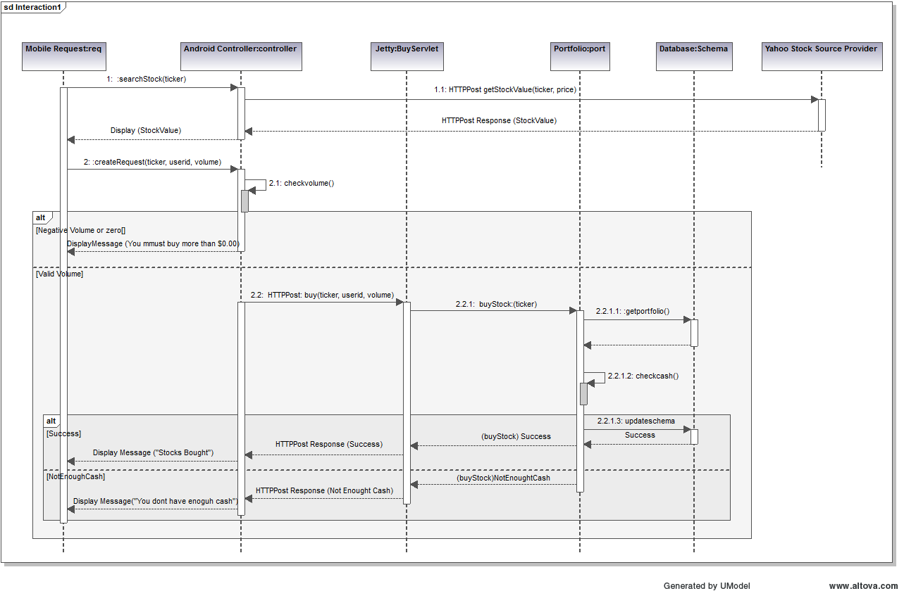
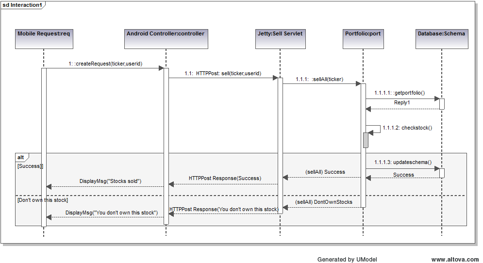
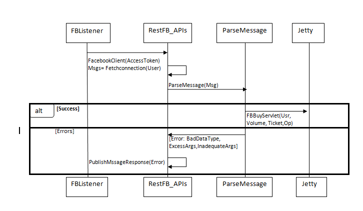
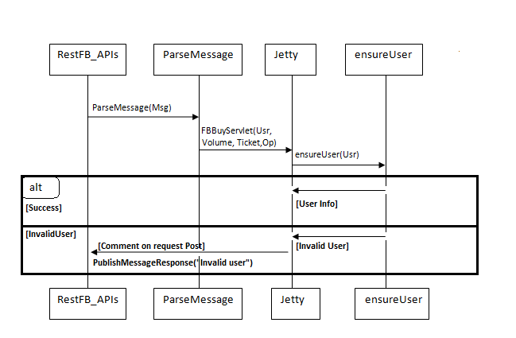
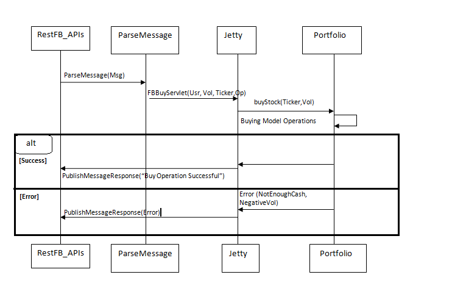
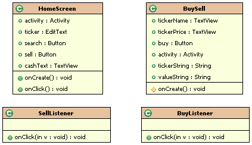
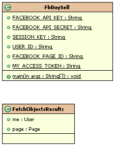

.. raw:: latex

	\begin{titlepage}
	\centering
	\singlespacing

	\vspace*{2in}

	\begin{center}
		\Huge PitFail Report 2 \\
		\Large An Online Financial Engineering Game
	\end{center}

	\vspace*{2in}

	\large
	November 4, 2011 \\

	\vspace*{0.5in}

	Software Engineering I, Group 3 \\
	\href{https://github.com/pitfail/pitfail-reports/wiki}{https://github.com/pitfail/pitfail-reports/wiki} \\

	\vspace*{0.5in}

	Michael Koval, Cody Schafer, \\
	Owen Healy, Brian Goodacre \\
	Roma Mehta, Sonu Iqbal \\
	Avanti Kulkarni \\
	\end{titlepage}

.. sectnum::

.. contents:: Table of Contents

.. raw:: latex

	\pagebreak

Individual Contributions
========================

.. raw:: latex

	\begin{center}
	\small

.. csv-table::
	:header: "Responsibility", "Michal Koval", "Cody Schafer", "Owen Healy", "Brian Good-acre", "Roma Mehta", "Sonu Iqbal", "Avanti Kulkarni"
	:widths: 15, 6, 6, 6, 6, 6, 6, 6
    
    Interaction Diagrams (35),     ,  10%,  30%,     ,  10%,  10%,  30%
    Classes and Specs (13),        ,     ,     ,     ,     ,     ,
    ¿ Class Diagram (8),        50%,     ,     ,     ,  25%,  25%,
    ¿ Signatures (5),          100%,     ,     ,     ,     ,     ,
    Arch. and Design (22),
    ¿ Arch. Styles (5),            , 100%,     ,     ,     ,     ,
    ¿ Package Diagram (5),         , 100%,     ,     ,     ,     ,
    ¿ Map. Hardware (2),           , 100%,     ,     ,     ,     ,
    ¿ Database (5),                ,     ,     , 100%,     ,     ,
    ¿ Other (5),                   ,     ,  20%,     ,  40%,  40%,
    Algos. and Structures (4),     ,     ,     , 100%,     ,     ,
    User Interface (10),           ,     ,     ,     ,     ,     ,
    ¿ Appearance (5),          100%,     ,     ,     ,     ,     ,
    ¿ Prose Description (5),   100%,     ,     ,     ,     ,     ,
    Plan of Work (4),              ,     ,     , 100%,     ,     ,
    References (2),                ,     ,     ,  50%, 25% ,  25%,

.. raw:: latex

	\end{center}

Glossary
========

Stock information provider
        A supplier of stock pricing data for the present (within the margin of
        some minutes). They are queried for all data regarding actual market
        numbers. Currently, *Yahoo* is the *stock information provider* (via
        its Yahoo Finance API).

PitFail Website - PWS
        An interface to pitfail composed of HTML, Javascript, CSS, and images
        which is designed to be rendered and accessed from within a modern
        webbrowser. This provides the most common interface for user
        interaction with the system.

Twitter text command interface - TTCI
        A system whereby a user of PitFail (or one who desires to become a user
        thereof) sends a message limited in size by the entity known as Twitter
        (pressently, the author notes this size to be 140 8bit characters)
        directed towards an account fully contolled by the PitFail software.
        PitFail then processes the text contained within this message via a
        deterministic non-backtracking parser to determine the user's
        intention. PitFail then exectutes the action it anticipates the user
        desired, possibly returning some acknowledgment or additionaly
        information to the user via the very same mechanize the user utilized
        to contact PitFail.

Simple HTTP Interface - SHI
        Presently utilized by the Android client. Provides bare-bones access to
        allow a workable beta.

Facebook text command interface - FTCI
        When a user posts to a particular Facebook wall, their posting is taken
        to be a request to the system and is processed in a manner similar to
        TTCI. *Fixme: Where is the code? Does it run in the same context as
        PWS, SHI, and TTCI? Does it interface via SHI?*

Android Application - AA
        Presently, the only code which does not run in the "server" context.
        Provides a simplistic interface to pitfail.

Stock Database - SD
        A library of code which provides featurful access to `Stock Information
        Providers`. It allows for simplified implimentations of caching,
        collating, quota enforcment, and fallback to be applied to incomming
        stock information from a variety of sources which provide heterogeneous
        APIs to access the `Stock Information`.

Interaction Diagrams
====================

Performing actions (Buy/Sell/...) via the Web frontend
------------------------------------------------------

Suppose the user has filled out a form like this one:


and presses "Buy".

In order to process that request, the following must happen:

1. An HTTP post is sent from the browser to the server (Jetty).
2. Jetty delegates the request to the web framework, Lift.
3. Form data is parsed and processed.
4. A call is made to the model to perform the operation.

These steps are described in more detail below.

When Lift gets an HTTP POST
...........................

.. image:: sequence-diagrams/diagrams/form-submission.pdf
    :width: 90%

PitFail is currently using jQuery to submit forms. Ideally we'd like our forms
to work using either jQuery or traditional HTML forms, but we got this working
first so it's what we're using for now.

When the user hits "Buy", JavaScript in the page generates an HTTP POST
directed at PitFail's server. The server Jetty receives the POST, and calls
LiftServlet.doPost() (actually there are some other steps involved because
LiftFilter must first filter the requests but these are all internal to Lift).
LiftServlet passes the request on to LiftRules to dispatch it.

LiftRules recognizes that this is an Ajax request coming from an HTML form, and
extracts the form fields out of it. LiftRules keeps a table of onSubmit
callbacks indexed by field name. For all the incoming fields, Lift calls the
onSubmit callback, and then finally the onSubmit callback for the submit button
-- that way, by the time the submit button's callback is invoked, all the
fields will have been invoked first.

We are not sure why Lift handles forms this way -- in particular why it uses an
onSubmit callback for things like text fields (that don't have an action
associated with them) rather than just gathering all the data together into a
single Map. This means that the only thing we use these onSubmit callbacks for
is to save a single value which will be used later. We ended up writing a good
deal of abstraction over Lift forms, because what we really want is to get all
the data together as a single object.

Checking for Consistency
........................

Scala is a statically typed functional language that has a lot in common with
ML, where the philosphy is that you should use the type system to prove the
consistency of your data at compile-time, eliminating the need for run-time
checks.

Unfortunately, this is web programming, where your data is regularly sent to
domains outside of your control. It appears that a strong type system relies a
good deal on trust, which you simply can't do when half your program lives in a
web browser. We found most of our work was spent meticulously pulling untrusted
data back into a strongly typed format, only to have it be clobbered again at
the next page reload.

When a form is submitted, we have to do 2 things with the data:

1. Convert the user's loosely structured input into a strongly-typed internal
   representation.

2. Perform the action requested.

At either stage something can go wrong; we call errors in the first stage
"input errors" and errors in the second stage "processing errors". The only
real difference between the two is where in the code they occur -- either in
the View or in the Model.

The process of structuring data and checking for input errors looks like this:

.. image:: sequence-diagrams/diagrams/input-errors.pdf
    :width: 90%

The Submit handler calls process() on the enclosing Form, which calls process()
on all of its fields, which either succeed with Some[Result] or fail with
Nothing (This is Scala's Option monad). The Options are then sequenced together
into a single success or failure.

If the data makes it past input checking, a model operation must then be
performed. It can be quite tricky to come up with an interface to model
operations that

1. Is DRY (doesn't duplicate logic (especially checking) between the View and
   the Model).

2. Respects MVC by not requiring the View to make assumptions about the logic
   that goes on in the Model.

Our code succeeds OKish at these points. Places where that could be improved
are described later (See for example `Sell Stock`_). A typical model operation looks like:

.. image:: sequence-diagrams/diagrams/typical-model-op.pdf
    :width: 60%

That is, the View requests a single, atomic, high-level operation, which either
succeeds entirely or fails with one of a collection of possible errors. The
View is then responsible for turning the error into a human-readable message.

To get error messages back to the user, all calls into the model are wrapped in
an additional error handler in a trait called BasicErrors:

.. image:: sequence-diagrams/diagrams/processing-errors.pdf
    :width: 70%

This captures errors to be returned to the user displayed on the page.

The actual operations
.....................

Compared to the above framework, the actual trading operations are
comparatively simple. Unfortunately part of the reason for that is that they
are comparatively incomplete.

The operations below are shown only from the side of the View; they also have
corresponding Model operations, but because these are common to all frontends
they are shown later.

Buy Stock
`````````

The web front-end side of the Buy operation looks like:

.. image:: sequence-diagrams/diagrams/buy-stock-web.pdf
    :width: 90%

Sell Stock
``````````

The web front-end side of the Sell operation looks like:

.. figure:: sequence-diagrams/diagrams/sell-stock-web.pdf
    :width: 90%

That last error might seem a little puzzling if you've seen the website:

.. image:: sequence-diagrams/images/portfolio.pdf
    :width: 60%

We only let the user sell stocks they own; how can we possibly fail with
DontOwnStock? There are two reasons:

1. The model has no way of knowing that we have already performed this check in
   the view.

2. After the page is rendered but before the user hits "Sell", there is a delay
   during which other asynchronous requests can come in and change the model.

We cannot see a way to avoid this redundancy, but it is slightly concerning
because it violates the two principles we are basing the model API on:

1. The "check" is performed in two places, implemented separately.
   
2. The View takes on some of the role of the Model in deciding which stocks it
   is possible for a user to sell.

It has not been a huge problem yet, but it does raise a question: which parts
of the code are responsible for deciding what a user is permitted to do?
Ideally that should be decided in the Model, but as we see here we limit the
user's choices simply by how we present the information to them, and that is
decided in the View.

Rendering Pages
---------------

Pages don't perform actions and so they are accessed over HTTP GET. Lift
handles GET like this:

.. image:: sequence-diagrams/diagrams/http-get.pdf
    :width: 80%

That is, the request is delegated to a Snippet object's render() method, which
returns the HTML for the generated page. The selection of which snippet to use
is done based on a mapping stored in LiftRules.

View Portfolio
..............

Viewing a portfolio is essentially a task of pulling information out of the
model and converting it to HTML:

.. figure:: sequence-diagrams/diagrams/view-portfolio-web.pdf
    :width: 90%


BUY/SELL via the Android Cleint
--------------------------------



    Buy Stocks via Android Client

The diagram above is the interaction sequence diagram for UC Buy Stocks from an Android Mobile Client.
As shown, first the search action is initiated by the Android Controller which requested by the Android user.
The Android controller sends an HTTP Post request to Yahoo Stock Source. This request specifically asks
for the Stock Value of the stock ticker by sending the corresponding tag with the request. Once the response
is received, the Mobile Client creates the Buy request. The Android controller calls the BuyServlet using an
HTTP Post request via the Jetty Server.The Jetty server has capability to support both Scala and Java sources
as it runs on a JVM. All the servlets for Android are written in Java which internally calls functions
from Scala classes.  The reason for choosing Java for Android client is for its compatibility.The BuySerlvlet
internally makes use of the Portfolio class the extract the user info from the Database. If the Volume to be 
bought is correct, user's portfolio is updated and results are sent back to the user.



    Sell Stocks via Android Client

The diagram above is the interaction sequence diagram for UC Sell Stocks from an Android Mobile Client.
The user initiates the action by creating a request by providing the Stock ticker name he intends to sell off.
The Android controller sends an HTTP Post request to SellServlet via the Jetty Server. The BuyServlet 
makes use of portfolio class and call the function to update the user profile.Because we expect 
asynchronous requests there is a possibility that by the time a SellStock is completely executed 
there can be another asynchronous call from some other client interface by the same user. 
Such a situation is handled by throwing back an exception message "You dont own this stock" and  
corresponding appropriate message back to the user.Currently, we sell off all the corresponding stocks. 
In the future, we do plan to give user an option of amount of volume he wants to sell off. 

Buy/Sell Operations via FaceBook Interface
------------------------------------------

If a player wants to access PitFail via Facebook, he or she can post the request on PitFail's wall.

The request has to be in format:
Username: Operation(Buy/Sell):[volume]:Ticker

Currently FaceBook interface only supports two operations ¿ Buy or Sell securities.

To process this request :
1.This request should be listened to and FB app should be notified of the wall post

2.The wall post should be read and parsed.

3.The request should  invoke appropriate module from server to get the operation done

4.The player should be notified of the status of the request (successful/failed)
Here is a description in detail:

Parse Message:
..............

The first step is to read the wall post and parse it to a request that a server can handle.



FBListener listens to the wall post of our account and notifies pitFail FB app of any new wall post.  We use RestFB APIs  that access Facebook account of PitFail using the unique access token provided by FaceBook.  API fetchConnection(User) reads the new wall post and passes it to ParseMessage module. ParseMessage processes the wall post, extracts the information required to process the request. It also checks for the right number of arguments and the data type (e.g. Volume has to be a number).
If the message is good enough to be processed (no errors), the parsed request is sent to server , otherwise the player is notified of the error by commenting on player's wall post. 

Ensure User:
............

Now that the message is parsed, we need to check the authenticity of the user. Facebook interface of PitFail does not (for now) support registration.  The player has to be already registered to the system to play the game via FB interface.



ensureUser ensures the existence of a user before the user's request tries to access portfolio. 
If the user exists, the request is processed further otherwise the player is notified of the error occurred by posting a comment on his wall post.

The Operations (Buy/Sell)
.........................

Once the wall post is parsed into a trade request  and the existence of user is checked, the actual operation takes place.

Buy Stock:
``````````



Sell Stock:
```````````


.. figure:: sequence-diagrams/FB/sell.png
    :width: 90%

The  working of a server is explained in detail in website section.
When the server receives a valid request from a legitimate user, it accesses
the portfolio of the user to perform the operation.  Based on the value
returned by user, FB App posts comment on the player's wall post saying
"Successful" or "failed <reason>"


Class Diagram and Interface Specification
=========================================

Class Diagram
-------------

The core class diagram for PitFail is shown below. It is discussed in `Data
Types and Operation Signatures`_.

.. figure:: class-diagrams/class-diagram.pdf
    :width: 100%





		Class Diagram for Android Client




		
		Class Diagram for FB Client


Data Types and Operation Signatures
-----------------------------------

Mapping between Scala and UML is more difficult than mapping between a
"traditional" object-oriented language such as C++ or Java and UML class
diagrams. In particular, methods and attributes in Scala are often
interchangeable and both may use symbols for their names. As such, any method
that accepts zero parameters and has no side-affects is written as an attribute
instead of a method. Any methods or attributes that contain symbols or
punctuation, such as "$", are prefixed with <<operator>>. Keep these conventions
in mind when reading the following section.

As a financial simulator, PitFail requires interacting with several types of
quantities: (1) volume of stock, (2) stock prices, (3) cash, and (4) fractional
ownership of an asset. These concepts are represented by, respectively, the
*Shares*, *Price*, *Dollars*, and *Scale* classes:

.. figure:: class-diagrams/sigs-wrappers.pdf
    :width: 80%

Using these special-purpose classes provides much more type safety than storing
all four of these quantities as BigDecimals. This is especially important when
performing mathematical operations on these types: some combinations of types
are useful, while others are meaningless. The process of switching from a
unilateral use of BigDecimal caught several bugs that would have otherwise gone

The next most important classes are those that represent individual stocks and
stock quotes. In PitFail's object model, *Stock* is a something that can be
purchased on a market, a *Quote* is a stock paired with it's current price, and
a *StockAsset* is the number of shares of a stock owned by a particular user:

.. figure:: class-diagrams/sigs-stocks.pdf
    :width: 80%

Immediately one is drawn to the peculiar decision of splitting *QuoteInfo* from
*Quote*. This is intentionally done to isolate optional information about a stock,
which may not always be available, from the information that is necessary to make
a trade. By isolating this superfluous information it is possible to change its
in-memory representation from an object to a sparse data structure if necessary.

Given a *Stock*, a *Quote* must be generated using a stock data provider such as
Yahoo! Finance. This is encapsulated in the *StockDatabase* interface and its
concrete implementations:

.. figure:: class-diagrams/sigs-stocks-db.pdf
    :width: 80%

Most importantly, the *YahooCSVStockDatabase* and *YahooYQLStockDatabase*
classes query Yahoo! Finance for updated stock quotes. These two classes are
combined using the *CachingStockDatabase*, a in-memory cache that uses a hash
table to memoize repeated queries for the same quotes. Finally, the
*FailoverStockDatabase* tries a list of stock providers in series until one
query succeeds: this is important because Yahoo! Finance's YQL interface
provides the richest interface to stock data, but is notoriously unreliable.

Once a stock has been purchased by a user it is wrapped in a *StockAsset* and
added to the user's portfolio. As the *User*, *Portfolio*, and *StockAsset*
classes contain persistent data, all of these classes interact with the
database using Squeryl:

.. figure:: class-diagrams/sigs-portfolio.pdf
    :width: 80%

Similarly, a variety of database-wrapper classes are defined for derivatives:

.. figure:: class-diagrams/sigs-derivatives.pdf
    :width: 80%

This set of classes is the primary interaction between the view, the model, and
the database. Calling one of these methods, e.g. *buyStock()* on a *Portfolio*,
causes Squeryl to accordingly update the database and to generate a new entry
in the news feed (when appropriate). These entries are stored in the *Newsfeed*
class, which is a simple chronological log:

.. figure:: class-diagrams/sigs-news.pdf
    :width: 2.5in

System Architecutre and System Design
=====================================

Architectural Styles
--------------------

PitFail is composed of a large number of pieces of code which provide a wide
range of functionality. This necessitated using different achitectural styles
for various portions of the program. Some sections of the code are independent
of other portions to the degree that they can be viewed as libraries. This is
particularly the case with the Stock Database code, which presents itself as a
library from which different querying archetectures may be constructed.

The Stock Database library heavily follows the pipe and filter achitectural
style. Each class (also called a Stock Database, SDB) either links other SDBs
together or communicates with a concrete SDB. In practice, many more of the
SDBs form the interior "filtering" functions rather than the endpoint "driving"
functions. The filtering SDBs impliment collating of requests, caching of
results, various forms of rate limiting, and fallback between different
pipelines of SDBs.

Within the website, implimented via the Lift Webframework, View First MVC is
utilized. Lift provides a "View First" interface for those devolping via it,
meaning that control of the program's execution is in the hands of the View
code, and can be passed off to other portions as needed. In the case of
PitFail's website, model code is independent of the website itself (and thus
Lift). Control code is specific bound to Lift's framework but clearly split
from the view code. The control component within the website provides
information such as authorization info to the view for processing.

Identifying Subsystems
----------------------

The majority of the code for PitFail falls under the "server side" category.
All code for controlling the WebPage, Twitter Iterface, Model, General Text
Command Interface, and what shall be refered to as the Simple HTTP Request
interface (a Java Servlet presently used for Android interaction) run within a
single contexed on the server.

Key "client side" portions of the code are the Android application and the
Javascript code generated by Lift which notifies server side handlers of some
event/change or makes a request which runs a server side handler. None of the
`WebPage` Javascript code should be considered a subsystem of PitFail

- Model. This includes database interactions. It is divoriced from any of the
  various frontend/interface subsystems, each of which make calls into it
  rather than modifying the DB directly.
- Main Webpage. Written using Lift. Is itself split into view and controll portions.
- Text Interface (TI). Provides a wrapper around the backend allowing for the
  execution of parsed text based commands which result in modifications or
  queries to the backend.

  - This addtionally encompasses the Twitter Text Command Interface (TTCI).
    TTCI utilizes the Text Interface code as a library, simply calling the
    Parser and Action Handler as possible commands are recieved via a
    continuous Twitter stream.
- SHI. Implimented as a Java Servlet which runs within the same server as Lift.
  Accesses the backend directly via the backend code. Is called via HTTP
  requests by the Android and Facebook(?) interfaces, neither of which run in
  the same context as the other subsystems.

.. figure:: component_diagram.pdf

        Major Subsystem Diagram of PitFail

Mapping Subsystems to Hardware
------------------------------

The majority of the subsystems are placed on the same server. Additionally,
they all occupy the same Jetty server, and thus can directly access methods
provided by the other subsystems. The subsystems which are in this unified
group are the Backend, Lift webpage, TTCI, and SHI.

The Lift client side helpers (javascript which provides a link between user
interaction with webpage via a webbrowser and the backing Lift webpage code)
run within a connecting user's webbrowser, thus on their own hardware.

The Android client is running on a variety of platforms, including Cellular
Telephones, Touchscreen tablets, emulators, and whatever the modding community
ported Android to in the last hour or so. No control over this hardware is to
be had, and as such the application must run flawlessly on all possible
configurations.

.. error:: FIXME: where is FACEBOOK???

Persistent Data Storage
-----------------------

PitFail does need to store data to outlast a single execution of the system since users will be playing PitFail for months or years at a time. 

The persistent objects are the users' accounts, the users' transcations, and stocks' performances, and portfolios' performances over time. Each user will be associated with numerous buys, sells, and derivatives and these will all need to be stored in a medium for quick and reliable access. For each transcation, this data will increase. Each stock and portfolio will represent the true test of the data storage. These objects require performance data that the users require a visual graph for and statistics on. Depending on the sampling frequency of stock prices, this data can grow every five to thirty minutes. 

As an example to explain the data storage requirements, for a system with 50 users each holding 15 unique assets, a five minute sampling frequency over one year storing records as doubles would yield:
(50 users) * (15 assets/user) * 260 working days * 6.5 hours/day * (60 minutes/hour) * (1/5 samples/(asset* minute)) * (8 bytes/sample) = 121.7 megabytes. 

Since any of these figures can be increased to make the performance data more precise, storing this information can easily become overwhelming. 

PitFail is stored in a light-weight and portable H2 relational database that takes advantage of the relations between users, portfolios, stocks, assets, leagues, companies, etc. It is scalable to handle the large amount of information needed to create performance charts and statistics. 

Database Schema
...............

The current version of PitFail does not have a model representation for
leagues, companies, historical prices, or saving information about how or when
an asset was purchased. The following Schema suggests how this could be
augmented:

.. figure:: schema/Schema.pdf
    :width: 80%

Below is the database schema for a MySQL implementation of the database, which
is a possibiltiy in the future depending on the ability of H2 and Squeryl to
model leagues, companies, auctions, orders, and other new uses.

Schema Follows::

        CREATE TABLE user (
                userid INTEGER  AUTO_INCREMENT,
                PRIMARY KEY (userid),
                
                #leagueid INTEGER , #redundant. can get through Company entitiy
                #FOREIGN KEY (leagueid) REFERENCES league, #update on delete, on update
                companyid INTEGER ,
                FOREIGN KEY (companyid) REFERENCES company, ##update on delete, on update
                
                twitter VARCHAR(25), #currently not required
                username VARCHAR(25), #could make not null
                password VARCHAR(25), #could make not null
                
                registration_date DATETIME,
                first_name VARCHAR(30), 
                last_name VARCHAR(30), 
                email VARCHAR(50)
                );

        CREATE TABLE company(
                companyid INTEGER  AUTO_INCREMENT,
                PRIMARY KEY (companyid),
                
                #portfolioid INTEGER , # not needed since portfolioid == companyid
                #FOREIGN KEY (portfolioid) REFERENCES portfolio,
                leagueid INTEGER,
                FOREIGN KEY (leagueid) REFERENCES league,
                #Relation - User - Stored in the User table
                
                name VARCHAR(25),
                slogan VARCHAR(100),
                registration_date DATETIME
                );
                
        CREATE TABLE league(
                leagueid INTEGER AUTO_INCREMENT,
                PRIMARY KEY(leagueid),
                
                admin INTEGER ,
                #FOREIGN KEY(admin) REFERENCES user,
                #Relation - Company - Stored in the Company table
                #Relation - User - Stored in the User table
                
                name VARCHAR(25),
                description VARCHAR(500),
                slogan VARCHAR(100),
                
                start_date DATETIME,
                end_date DATETIME,
                start_cash DOUBLE(20,4),
                margin_limit DOUBLE(20,4)
                #more league options can be included here
                );
                
        CREATE TABLE portfolio(
                portfolioid INTEGER , #the portfolio id == company id
                PRIMARY KEY (portfolioid),
                FOREIGN KEY (portfolioid) REFERENCES company,
                
                cash DOUBLE(20,4)
                
                #Relation - Asset - Stored in Asset Table#
                );

        CREATE TABLE asset(
                ticker VARCHAR(25) ,
                FOREIGN KEY (ticker) REFERENCES stocks_derivatives,
                
                portfolioid INTEGER ,
                FOREIGN KEY(portfolioid) REFERENCES portfolio,
                
                #need to say if it is a stock or derivative and then what type of derivative
                typed VARCHAR(10), 
                
                shares DOUBLE(10,4), #NOT NULL,
                purchase_value DOUBLE(20,4), #NOT NULL,
                purchase_date DATETIME,
                sold_value DOUBLE(20,4),
                sold_date DATETIME,
                
                PRIMARY KEY (ticker, portfolioid, purchase_date) #this allows multiple purchases of the same asset
                );
                        
        CREATE TABLE auction(
                        auctionid INTEGER AUTO_INCREMENT,
                        PRIMARY KEY(auctionid),
                        portfolioid INTEGER,
                        FOREIGN KEY (portfolioid) REFERENCES portfolio,
                        ticker VARCHAR(25),
                        FOREIGN KEY (ticker) REFERENCES stocks_derivatives,
                        winning_offer INTEGER,
                        FOREIGN KEY (winning_offer) REFERENCES auction_offers,
                        price_start DOUBLE(20,4),
                        price_close DOUBLE(20,4),
                        time_open DATETIME,
                        time_closeDATETIME
                        );
                        
        CREATE TABLE auction_offers(
                        auctionid INTEGER,
                        FOREIGN KEY (auctionid) REFERENCES auction,
                        portfolioid INTEGER,
                        FOREIGN KEY (portfolioid) REFERENCES portfolio,
                        offer DOUBLE(20,4),
                        time_offer DATETIME,
                        
                        PRIMARY KEY(auctionid,portfolioid, time_offer)
                        );

        CREATE TABLE stocks_derivatives( 
                ticker VARCHAR(25) ,
                PRIMARY KEY (ticker),
                
                num_holders INTEGER #optional increment/decrement this. If this == 0, then do not update since no one holds this assest
                );

        CREATE TABLE historical_price(
                ticker VARCHAR(25),
                FOREIGN KEY (ticker) REFERENCES stocks_derivatives,
                        
                date_time DATETIME,
                price DOUBLE (10,4),
                
                PRIMARY KEY(ticker,date_time)
                );

ORM
---

PitFail uses the Squeryl ORM to access the database. Squeryl works by
implementing a domain-specific language (DSL) to build literal SQL queries.
This means that Squeryl code has Scala syntax, but SQL semantics. For example::

    from(users) (u =>
        where(u.username === name)
        select(u)
    ) headOption

PitFail opted for an ORM for two reasons:

- This ensures consistency between our in-memory model objects and their
  on-disk counterparts.
  
- This makes our model code database agnostic.

However, now that we have actual experience with the Squeryl ORM, we realize
there are some pitfalls that have to be weighed against the benefits. First,
because an ORM makes it so easy to get actual Scala objects out of our table
rows, it encourage most of the logic to be written in Scala. At first sight
this might seem to be a benefit, as we enjoy writing Scala more than we enjoy
writing SQL. But what we did not realize was that by making the transition from
SQL to Scala as painful as it is with raw JBDC, it forces you to put more of
your logic in stored procedures, where importantly *everything is in sync*. The
instant you bring a table row into the program, you risk forgetting that it
might not be in sync anymore. And even if you wrap your code in database
transactions, it doesn't help, because transactions have no control over what
goes on in memory.

PitFail will probably continue to use the Squeryl ORM, but with these caveats
in mind.

Network Protocol
----------------

PitFail has multiple clients like Website, Twitter, Android and Facebook. All these clients
communicate with the PitFail server via HTTP (Hyper Text Transfer Protocol) over TCP/IP sockets. 
Another network protocol which PitFail uses is JDBC (Java Database Connectivity) to communicate 
with the H2 database which is a Open Source Java based database.
Following is a brief description of both the protocols.


HTTP (Hyper Text Transfer Protocol):
HTTP is well known internet protocol and is used by most of systems communicating over the internet. 
HTTP defines how messages should be defined, packaged and transmitted over the internet. 
HTTP is a stateless protocol and does not maintain any state of messages sent over it. 
HTTP makes use of "Request" and "Response" headers to transfer data. 

Message format:
The request message consists of the following:
a.Request line, such as GET /pitfail/index.html HTTP/1.1, which requests a resource called /pitfail/index.html from server.
b.Headers such as Accept-Language: en
c.An empty line.
d.An optional message body.

HTTP defines nine methods indicating the desired action to be performed on the identified 
resource out of which PitFail uses its POST method for almost all its communication with the server. 


JDBC (Java Database Connectivity):
JDBC provides methods for querying and updating data in a database. JDBC is oriented towards 
relational databases. JDBC allows multiple implementations to exist and be used by the same application. 
The API provides a mechanism for dynamically loading the correct Java packages and registering them 
with the JDBC Driver Manager.The Driver Manager is used as a connection factory for creating JDBC connections.
JDBC connections support creating and executing statements. These may be update statements such as SQL's CREATE, 
INSERT, UPDATE and DELETE, or they may be query statements such as SELECT. 


Global Control Flow
-------------------

Requests can come into PitFail at any time from Twitter, Facebook, Android, and
the Website. This version of PitFail gives essentially no thought to how we
would like performance to degrade under heavy load, except for two limited
areas:

1. Stock prices retrieved from Yahoo are cached for 5 minutes, which, if no
   *new* stocks are introduced, will limit the total rate of requests to Yahoo
   to {number of unique ticker symbols} / {5 minutes}. But if new ticker
   symbols are introduced, there is no limit to how many requests PitFail will
   attempt (and likely fail) to make to Yahoo.
   
2. The framework PitFail is built on already has some flow-control features:
   HTTP requests are handled by a thread pool, as are some of the internal
   messages in the system (via Lift Actors).

To see whether one client making requests in rapid succession to PitFail would
starve out another client we timed how long it took the server to respond to
isolated requests with and without background spam. The results (in seconds):

====== === === ===
Load   Q1  Med Q3
====== === === ===
Quiet  .15 .17 .23
Spammy .11 .13 .23
====== === === ===

Apparently the not-spamming client does not starve, not even the least bit, so
Lift must be performing some flow control, but we do not know what. We are very
impressed with Lift; this performance has certainly nothing to do with our
design.

Hardware Requirements
---------------------

PitFail requires Jetty server to be running which does not pose any strict hardware requirements. 
However, having a following hardware specification is recommended for a better and smooth 
experience for the user.

Processor: Intel Pentium III with 1GHZ or above (or an equivalent configuration). We used machines with Intel.  

Memory:  1GB or more of RAM 

System type: 32 or 64 bit Operating System

Disk Space: Minimum 150 MB for complete installation 		

Network: Network bandwidth > 56kbps

The three client interface of Pitfail which are Website, Twitter and Facebook can be 
accessed from any device which has web browsing capabilities. For the Android Application for 
Pitfail, any mobile device running android and connected to the internet can execute the application.


Algorithms and Data Structures
==============================

Algorithms
----------

Buying on Margin
................
All PitFail users will start with a predetermined amount of capital cash that is their money to use. In order to trade for more stocks, PitFail users can buy/sell on margin, which is performing stock actions with money on loan. This money will require the user to pay interest on the loaned money each day until it is returned and paid in full, including total interest. 

PitFail uses the Simple Interest Formula to compute the money users owe due to interest. The loan will cost the user a predetermined cost per day:
	Interest/Day = Principal * Rate
	where Rate is determined by the going market rate

The amount of margin for a user is also an algorithm. Since a user owns the
capital money he starts with and can borrow additional money from lenders, a
user should be able to pay back his lenders at any moment. Therefore, the
margin offered per user will be no more than the total capital cash the user
would have if he liquidated all of his assets at current market value. For
example, if a user owns 500 shares of stock ABC @ $25 and has $10,000 unused
capital cash, the user is able to buy 1,000 shares of stock BCD @ $22.5,
resulting in $0 capital cash and $0 for margin buying. Therefore, if stock
ABC's price increases to $30 a share, this user would now have $2,500 available
on margin. 

High Frequency Trading and Automatic Drone Traders
..................................................

High Frequency Trading is a power player in today's current stock market. As a side project, PitFail will try to implement such a system that is automated and performs many transactions (in our case) per minute. To allow for a productive experiment, brokerage fees will be turned off for high frequency trading accounts. The goal of such a system will be to break even. These will be called Automatic Drones Traders and can be programmed to be high frequency traders. They will be created to simulate additional buying and selling. They will be based on the following:
* buying a rising stock
* selling a stinking stock
* buying a random stock and holding it until the stock moves by +/- 1% and then selling it
* buying the stocks of the top performers on PitFail
* buying recently bought stocks on PitFail
* etc...

Cover's Universal Algorithm
...........................

This algorithm will be impemented by an Automatic Drone. It begins by buying
nearly all the stocks available in the stock exchange and creating ratios
amongst the stocks (in Pitfail's case, constant). By the end of the day, some
stocks will increase and some stocks will decrease in price, changing the ratio
between the stocks. This drone will sell/buy stocks to rebalance the ratios in
the portfolio for the start of the next day. 

Concurrency
-----------

PitFail is built on the Lift web framework, which uses Erlang's Actor model to
provide concurrency. An Actor is essentially an event loop witha synchronized
queue: actors can respond to messages on their own queue, or send messages to
other queues.

PitFail makes real use of actors in a small handful of places. Background tasks
are run in an actor because Lift actors run in a threadpool; that way
background tasks don't hog a whole thread and can merely pull one off the
thread pool periodically. The other place PitFail uses an actor is to send
notification emails, because the operation can block for a long period of time
and the rest of the page request (updating the model, responding with a repyl
page) needs to be able to continue without waiting for the email to be sent.

Data Structures
---------------

User Interface Design and Implementation
========================================
PitFail's overall user interface closely resembles the interface depicted in
its mockups: most of the changes were merely cosmetic. Most of the functional
changes are because the current implementation of PitFail is missing features
that were included in the mockup: e.g. companies, leagues, and social
interaction. These changes are grouped into general categories, described in
detail, and justified in the following sections.

Welcome Page for New User
-------------------------
PitFail was originally described as having a "guided registration" process
where the user registers as part of purchasing his or her first stock. While
the user can still explore the stock purchasing interface before logging in,
the current implementation of PitFail does not support this "zero effort"
registration because of a technical limitation. As such, guided messages no
longer are displayed next to each step in the purchasing pipeline:

.. raw:: latex

    \begin{figure}[H]
        \centering
        \includegraphics[height=1.5in]{ui/ui-welcome2}
        \includegraphics[height=1.5in]{ui/actual-welcome}
    \end{figure}

Note that the list of steps is not visible and the current step is not
indicated with an arrow. Some form of guided registration will be implemented
in the next version of PitFail. Thankfully, this doesn't change user effort:
the user simply must login *before* selecting a stock instead of *after*
selecting a stock.

Portfolio Management
--------------------

Perhaps the largest change from the original mockups to the current
implementation is the user's portfolio. This was planned to be displayed as a
single large table containing the all of the user's assets: a combination of
cash, stocks, and derivatives. This design made it difficult to visually
differentiate between types of assets and to locate an asset of interest.

Instead, the portfolio displayed as a "T"-chart, splitting assets and
liabilities into two separate columns. The assets column is further subdivided
by the type of asset: cash, stocks, and derivatives. These subdivisions allow
the user to quickly locate an asset of interest, for example, when selling a
stock. Each column is summarized with a "total" row that estimates the current
value of his or her portfolio by approximating the value of derivatives as if
they were immediately executed. While none of these changes dramatically alter
user effort relative to the mockup, reformatting the portfolio as a "T"-chart
and adding this additional information makes it much easier for a user to view
his or her current assets at a glance:

.. raw:: latex

    \begin{figure}[H]
        \centering
        \includegraphics[width=3in]{ui/ui-portfolio}
        \includegraphics[width=3in]{ui/actual-portfolio}
    \end{figure}

Besides the changes to the table of assets, there are clearly several features
missing from the implementation: (1) historic portfolio performance, (2)
multiple portfolios, and (3) league navigation. These missing interface
elements will be restored after companies, leagues, and logging of historic
prices are implemented in the next iteration of PitFail.

Buying Stocks
-------------
Purchasing stocks is one of the fundamental activities on PitFail. The
interface for buying stocks is very similar to the interface shown in the
original mockups: when the user enters a valid ticker symbol in the large
search bar, a small stock quote expands below the search bar. This quote
includes a few statistics about the stock's daily performance and a graph of
the stock's performance over time.

.. raw:: latex

    \begin{figure}[H]
        \centering
        \includegraphics[width=3in]{ui/ui-buy}
        \includegraphics[width=3in]{ui/actual-buy}
    \end{figure}

Unlike the original mockup, the options for interacting with the stock are not
embedded in the stock quote. Instead, they are displayed in a dedicated section
of the webpage. This extra space is used to display a short description of
stock trading and helps guide new users through the process: something that
will be even more important once options are supported. While the original
mockups allowed the user to enter an amount in either shares or dollars, this
was found to be confusing and was removed in the current version of the user
interface.

Neither of these changes do not considerably effect user effort.

Trading Derivatives
-------------------

If the user clicks the "add to derivative" button instead of the "buy stock"
button, he or she is presented with the derivative offering page. In the
original mockups this was shown as a prose-like description of a derivative
with a number of blanks. Originally intended to guide the user through the
derivative creation process, this was found to be unfeasible with the number of
derivative configuration options supported in PitFail. As such, this was
redesigned to resemble a traditional form: a prose description followed by a
table of input fields.

.. raw:: latex

    \begin{figure}[H]
        \centering
        \includegraphics[width=3in]{ui/ui-derivative}
        \includegraphics[width=3in]{ui/actual-derivative}
    \end{figure}

Once the derivative has been created it can either be offered to a specific
user or to a public auction. If a buyer is specified, that user is prompted to
accept or decline the offer using a special form in his or her portfolio. If
the derivative is offered to a public auction, a link to the auction page is
added to the sidebar and other users have an opportunity to bid. These features
were not included in the mockups, so see the User Effort Estimation section
below for a detailed usability analysis.

Social Features
---------------
PitFail's original mockups included a real-time newsfeed at the bottom of every
page. This news feed was a log of trading history and served as a hub for social
interaction between users. A limited implementation of this newsfeed is
included in the current version of PitFail. Unlike the mockup, the newsfeed is
included in every page's sidebar instead of the footer. This is similar to the
real-time feed that was recently added to Facebook and will be familiar to the
majority of PitFail's users.

.. raw:: latex

    \begin{figure}[H]
        \centering
        \includegraphics[height=2in]{ui/ui-newsfeed}
        \includegraphics[height=2in]{ui/actual-newsfeed}
    \end{figure}

Besides the different location, much of the functionality displayed in the
mockups has not yet been implemented. Notably, this includes: (1) user-specific
newsfeeds, (2) voting, (3) commenting, (4) messages for derivative trades, and
(5) messages for a users going broke. These features will be implemented in the
next version of PitFail and do not effect user effort.

User Effort Estimation
----------------------
Several of the most common usage scenarios for the PitFail website are
evaluated below. In particular, note that common scenarios (e.g. buying a
stock) are much easier to perform than rare scenarios (e.g. creating a new
league):

====================================  ======  ==========
Usage Scenario                        Clicks  Keystrokes
====================================  ======  ==========
purchase a stock                      3       7
create a derivative                   4       27
act on a pending derivative offer*    1       1
bid on a derivative auction*          4       5
close a derivative auction*           1       1
sell a stock                          3       2
create a new league                   n/a     n/a
modify an existing league             n/a     n/a
invite a user to a league             n/a     n/a
====================================  ======  ==========

Features that are not currently implemented are shown as empty rows and actions
that have been added since the original mockups are marked with asterisks. Both
these new usage scenarios and existing usage scenarios that were modified are
analyzed in detail below. This includes buying and selling stocks because of
the lack of league support in the current version of PitFail.

Purchase a Stock
................

Assume the user wishes to purchase 10 shares of Google stock. The user must:

- **Navigation:** total of one click, as follows

 1. Click on "login".

- **Data Entry:** total of two clicks and seven keystrokes, as follows

 1. Click on the "enter a ticker symbol" text field.
 2. Press the keys "G", "O", "O", and "G".
 3. Press "enter" to load the quote.
 4. Press the keys "1" and "0" to specify 10 shares.
 5. Click the "buy" button to confirm the purchase.

Note that the user could press "enter" instead of clicking the "buy" button.

Creating a Derivative
.....................

Assume the user wishes to offer a call option to Bucky that includes 10 shares
of Google stock and expires on December 25, 2011. This option costs $1000 to
begin active and one can buy the shares for $10,000 if and only if the market
rate for Google stock is greater than $1000 per share. The user must:

- **Navigation:** total of one click, as follows

 1. Click on "login".

- **Data Entry:** total of 3 clicks and 27 keystrokes, as follows

 1. Click on the "enter a ticker symbol" text field.
 2. Press the keys "G", "O", "O", and "G".
 3. Press the "enter" key to load the quote.
 4. Press the keys "1" and "0" to specify 10 shares.
 5. Click the "add" button to begin creating a derivative.
 6. Press the "B", "u", "c", "k", and "y" keys to enter the recipient's name.
 7. Press "tab" to move to the "premium" field.
 8. Press the keys "1", "0", "0", and "0" to enter $1000.
 9. Press "tab" to move to the "expiration date" field.
 10. Press the "1", "2", "/", "2", and "5" keys to select December 25th of the current year.
 11. Press "tab" to move to the "strike price" field.
 12. Press the "1", "0", "0", "0", and "0" keys to enter $10000.
 13. Click on the "Propose Contract" button to complete the transaction.

Sell a Stock
............

Assume the user wishes to sell 10 shares of Google stock from his or her Global
League. The user must:

- **Navigation:** total of one clicks, as follows

 1. Click on "login".

- **Data Entry:** total of two clicks and two keystrokes, as follows

 1. Click on the text input in the row corresponding to Google.
 2. Press the keys "1" and "0" to specify 10 shares.
 3. Click the "sell" button to confirm the purchase.

Note that the user could press "enter" instead of clicking the "sell" button.


Act on Derivative Offer
.......................

Assume the user wishes to accept a derivative that was directly offered to him
or her:

- **Navigation:** total of one click, as follows

 1. Click on "login".

- **Data Entry:** total of one click, as follows

 1. Click on the "accept" button next to the correct derivative.

Bid on Derivative
.................

Assume the user wishes to bid $50,000 on a derivative that is being sold in a
public auction:

- **Navigation:** total of two clicks, as follows

 1. Click on "login".
 2. Click on the correct derivative link in the sidebar.

- **Data Entry:** total of two clicks and five keystrokes, as follows

 1. Click on the "your bid" field.
 2. Press the keys "5", "0", "0", 0", and "0".
 3. Click the "Cast Bid" button.

Close Derivative Auction
........................

Assume the user wishes to close an auction that he or she posted:

- **Navigation:** total of one click, as follows

 1. Click on "login".

- **Data Entry:** total of one click, as follows

 1. Click on the "close" button next to the correct auction.

Progress Report and Plan of Work
================================

Progress Report
---------------

All use cases still need more implementation to allow for increased functionality. In 
particular, Leagues and Teams need to be implemented while the actual interactions with the 
stock exchange need to expand to address exceptions usability requirements. 

======  ======================  ============  ================================================
UC#     Use Case Short Name      % Completed   Comments
======  ======================  ============  ================================================
UC-1    Buy                     50%           Functionality needs to be increased and made
                                              uniform across varying interfaces. Smaller 
                                              details like after hours buying, orders, and 
                                              brokerage fees need to be added.
UC-2    Sell                    50%           Functionality needs to be increased and made
                                              uniform across varying interfaces. Smaller 
                                              details like after hours selling, orders, and 
                                              brokerage fees need to be added.
UC-3    Join League             0%            Leagues have not been implemented yet.
UC-4    View Portfolio          75%           Current portfolios can be viewed, but this use 
                                              case will be expanded when a portfolio will need 
                                              to hold more items.
UC-5    Get Security            50%           Needs more functionality, like Buy and Sell.
UC-6    View League Stats       0%            Leagues have not been implemented yet.
UC-7    Buy via Twitter         60%           Users can buy only stocks according to a strict 
                                              input guidelines. There are some bugs that need 
                                              to be fixed.
UC-8    Sell via Twitter        60%           Users can sell only stocks according to a strict 
                                              input guidelines. There are some bugs that need 
                                              to be fixed.
UC-9    Portfolio Info          75%           Users can see other user's portfolios, but 
                                              additional information should be displayed, e.g. 
                                              graphs, creation date, percent increased...
UC-10   Change Default          0%            Leagues have not been implemented yet.
UC-11   Make League             0%            Leagues have not been implemented yet.
UC-12   League Settings         0%            Leagues have not been implemented yet.
UC-13   Add Coordinator         0%            Leagues have not been implemented yet.
UC-14   Remove Coordinator      0%            Leagues have not been implemented yet.
UC-15   Delete League           0%            Leagues have not been implemented yet.
UC-16   Manage League           0%            Leagues have not been implemented yet.
UC-17   Invite to League        0%            Leagues have not been implemented yet.
UC-18   Authentication          75%           Currently done through Twitter, will need to be 
                                              increased for additional logins.
UC-19   Create User             75%           Users can be created only if they have a Twitter 
                                              account.
UC-20   Vote                    0%            Voting has not been implemented yet.
UC-21   Vote by Tweet           0%            Voting has not been implemented yet.
UC-22   Derivative Designer     25%           Partially implemented, but not lacks important 
                                              functionalities and an intuitive design.
UC-23   Accept derivative       75%           Basic functionality is present. Need to expand to
                                              allow counter-offers and to be updated for newer
                                              versions of the implemented derivatives.
======  ======================  ============  ================================================

Plan of Work
------------
.. figure:: plan_of_work/pow_report2-rotated90.pdf
        :scale: 80%

Breakdown of Responsibilities
-----------------------------

=====================  ======================  
Modules                Owner                   
=====================  ======================  
Website                Michael, Owen           
Android                Roma, Sonu              
Facebook               Avanti, Sonu                  
Twitter                Cody                    
Database               Brian                   
Back-end Functions     Michael, Owen, Brian    
=====================  ======================  

The integration of the system and testing will not require a primary coordinator. 
Since each module relies on only the database and back-end functions and is independent 
of the other modules, the chances of one module affecting the others are low. Each 
auxiliary module developer is responsible for communicating with the database and 
back-end functions developers to ensure their code is using the database and back-end 
functions correctly. During team meetings, the features being employed on each 
auxiliary module will be discussed to ensure that common features are being deployed 
across all systems. Testing will be the responsibility of each module developer. 


References
==========
Marsic, Ivan. *Software Engineering*. Piscataway: Rutgers University, 2011. PDF.
Miles,  Russ  and  Kim  Hamilton.  *Learning  UML  2.0*.  Ed.  Eric  McLaughlin  and  Mary  O'Brien. Sebastopol: O'Reilly, 2006.


http://en.wikipedia.org/wiki/Hypertext_Transfer_Protocol

http://en.wikipedia.org/wiki/Java_Database_Connectivity

