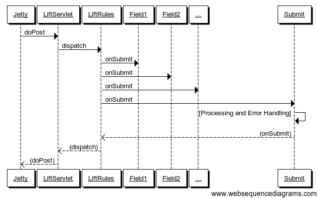
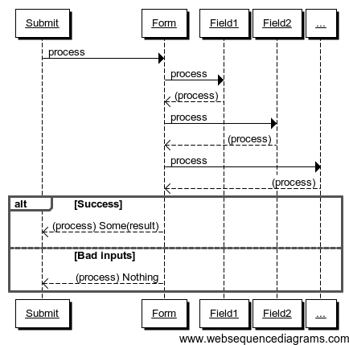
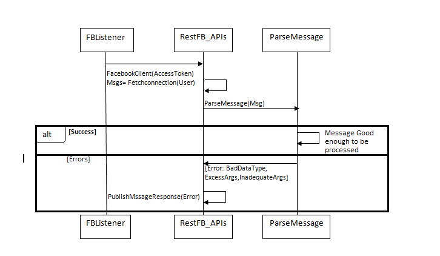
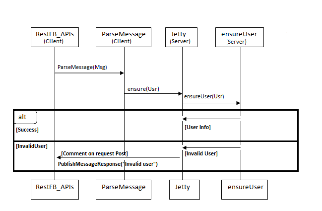
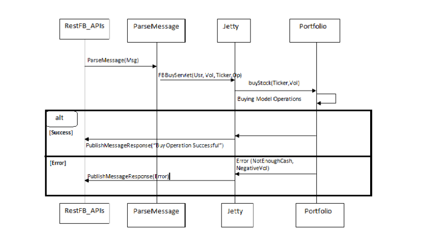
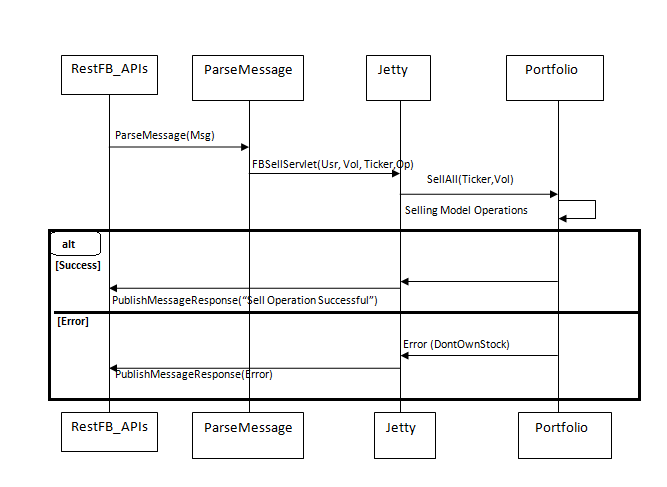
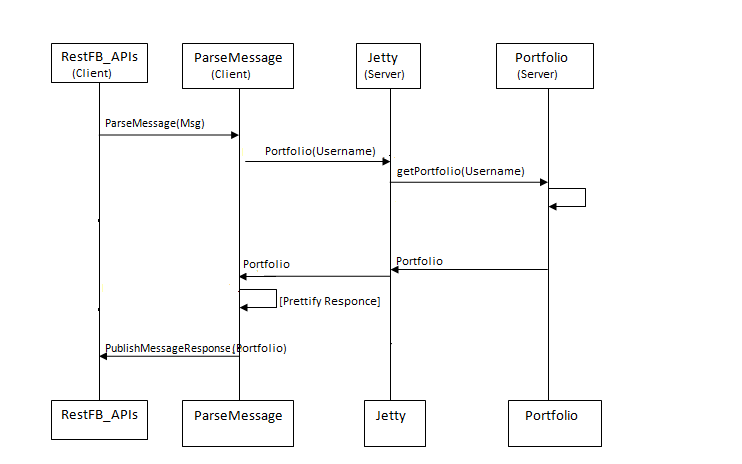
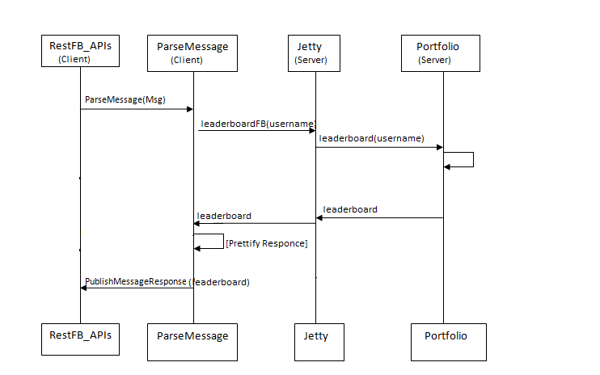

Overall Architecture
====================

PitFail follows roughly an MVC [MVC]_ architecture. David Pollak (Lift's
author) believes that Lift is a "View First" architecture [View]_, but since
none of use are familiar with "View First", nor do we really know what it
means, we stuck to MVC.

Model
-----

The model contains the most domain-specific parts of PitFail. These are classes
that represent trades (model/stocks.scala ref_225), portfolios
(model/stocks.scala ref_204), derivatives (model/derivatives.scala ref_807),
etc.

The Model provides a large set of public methods for extracting data and
performing operations. These are described in more detail in the section on
interactions_.

The model resides in ``model/``.

Organization of the Model into traits
.....................................

If you look at the class ``Portfolio`` (model/users.scala ref_204) you will see
it defines no methods, but it does mix in many traits (``PortfolioOps``
(model/users.scala ref_782), ``PortfolioWithStocks`` (model/stocks.scala
ref_569), ``PortfolioWithDerivatives`` (model/derivatives.scala ref_789), ...).
This allows us to separate the many responsibilities of a portfolio (because
there are very many) without having to expose that decision to client code: the
client can use a ``Portfolio`` like a ``PortfolioWithStocks``.

This made the model code much easier to work with. It's hard to imagine working
in a language that doesn't have this feature; either you'd have to make client
code aware of how you've broken up responsibilities (which is sometimes
appropriate, but not usually), or have a few massive classes that are hard to
work with.

View
----

PitFail has multiple view components that all refer back to the same model.
These are the website, Android, Twitter and Facebook clients.

The Views use the public accessor functions in the Model to retrieve data and
perform actions.

* Website view in ``website/view/``
  
* Twitter view in ``texttrading/twitter.scala``
  
* Android view in ``android/Pitfail_Android_Cleint/src/com/pitfail/``
  
* Facebook view in ??????

Controller
----------

To preserve the relationship between the Domain Model and the code, it is
better to have few controller classes [Controllers]_. A controller class is one
that does not represent a concept in the domain (e.g. a Derivative is a
domain-specific concept, but a DerivativeTradeOps is not (See also "Anemic
domain model" [Anemic]_)). However, a few controller classes did sneak in:

* ``Checker`` (website/control/Checker.scala) runs a timer to perform periodic
  checks (dividend payments etc).
  
* ``LoginManager`` (website/control/LoginManager.scala) holds a current login
  
* ``Logout`` (website/control/Logout.scala) performs a logout
  
* ``Newsletter`` (website/control/Newsletter.scala) sends the newsletter
  
* ``OpenIDLogin`` (website/control/OpenIDLogin.scala) handles OpenID protocol
  
* ``PortfolioSwitcher`` (website/control/PortfolioSwitcher.scala) keeps track
  of a user's "current" portfolio
  
* ``TwitterLogin`` (website/control/TwitterLogin.scala) handles the OAuth
  protocol to log in with Twitter

All external libraries that our code uses
-----------------------------------------

(*Note you don't need to install these dependencies because ``sbt`` will do
that automatically. This list is provided to give a clearer idea of how our
code is structured*).

* `sbt <https://github.com/harrah/xsbt>`_ as the build tool.

* `Lift <http://liftweb.net/>`_ as the web framework.
  
* `H2 Database <http://www.h2database.com/html/main.html>`_ as the database.
  
* `Joda Time <http://joda-time.sourceforge.net/apidocs/org/joda/time/DateTime.html>`_ for time.
  
* `Dispatch <http://dispatch.databinder.net/Dispatch.html>`_ for HTTP.
  
* `up <https://github.com/harrah/up>`_ for heterogeneous lists.
  
* `SLF4J <http://www.slf4j.org/>`_ for logging.
  
* `Scalaz Library <http://code.google.com/p/scalaz/>`_ for miscellaneous functional
  programming features.
  
* `Scalatest <http://scalatest.org/>`_ for unit testing.
  
* `Java Servlet API
  <http://java.sun.com/developer/onlineTraining/Servlets/Fundamentals/servlets.html>`_
  for servlets.
  
* `GSON <http://code.google.com/p/google-gson/>`_ for JSON serialization.
  
* `Scribe <https://github.com/fernandezpablo85/scribe-java>`_ for OAuth protocol.

The Website
===========

The website is one of PitFail's Views in the MVC architecture. It makes calls
into the Model to perform specific operations (example website/view/CommentPage
ref_458).

Overall Website Architecture
----------------------------

The website is built on top of the Lift Web Framework [Lift1]_. It runs on the
Jetty Web Server [Jetty1]_.

Performing actions (Buy/Sell/...) via the Web frontend
......................................................

Suppose the user has filled out a form like this one (Figure :ref:`buyform`):

.. figure:: figures/architecture/buy-form.png
    :width: 30%
    
    :label:`buyform` A form for buying stock.
    
and presses "Buy".

In order to process that request, the following must happen:

1. An HTTP post is sent from the browser to the server (Jetty).
2. Jetty delegates the request to the web framework, Lift.
3. Form data is parsed and processed.
4. A call is made to the model to perform the operation.

These steps are described in more detail below.

When Lift gets an HTTP POST
...........................

The sequence of messages for an HTTP Post are (Figure :ref:`formsubmission`):


    
    :label:`formsubmission` Form submission

PitFail is currently using jQuery to submit forms
(website/html/templates-hidden/default.html ref_325). Ideally we'd like our
forms to work using either jQuery or traditional HTML forms, but we got this
working first so it's what we're using for now.

When the user hits "Buy", JavaScript in the page generates an HTTP POST
directed at PitFail's server. The server Jetty receives the POST, and calls
LiftServlet.doPost() (actually there are some other steps involved because
LiftFilter must first filter the requests but these are all internal to Lift).
LiftServlet passes the request on to LiftRules to dispatch it.

LiftRules recognizes that this is an Ajax request coming from an HTML form, and
extracts the form fields out of it. LiftRules keeps a table of onSubmit
callbacks indexed by field name. For all the incoming fields, Lift calls the
onSubmit callback, and then finally the onSubmit callback for the submit button
-- that way, by the time the submit button's callback is invoked, all the
fields will have been invoked first.

We have written a significant amount of code to interface with Lift forms,
which is described in `Improving Lift Forms`_.

Checking for Consistency
........................

Scala is a statically typed functional language that has a lot in common with
ML, where the philosphy is that you should use the type system to prove the
consistency of your data at compile-time, eliminating the need for run-time
checks [Typing]_.

Unfortunately, this is web programming, where your data is regularly sent to
domains outside of your control. It appears that a strong type system relies a
good deal on trust, which you simply don't have when half your program lives in
a web browser. We found most of our work was spent meticulously pulling
untrusted data back into a strongly typed format, only to have it be clobbered
again at the next page reload.

When a form is submitted, we have to do 2 things with the data:

1. Convert the user's loosely structured input into a strongly-typed internal
   representation (example website/view/ModelFields.scala ref_717).

2. Perform the action requested (example website/view/CommentPage ref_458).

At either stage something can go wrong.

Because we wrote our own form handling wrappers (`Improving Lift Forms`_), we
wrote error handling code for our form wrappers, using a trait called
``BasicErrors`` (website/intform/intform.scala ref_293). ``BasicErrors`` checks
each of the fields in the form for errors; if there are any errors these are
reported to the user, and if all are consistent, it builds a single object
containing all the form data (which is elaborated in `Improving Lift Forms`_).

The process of structuring data and checking for input errors looks like this
(Figure :ref:`inputerrors`):


    
    :label:`inputerrors` Checking for input errors

If the data makes it past input checking, the operation must be sent to the
domain-specific parts of the code, such as ``Portfolio`` or ``StockAsset``.
These operations are described in detail in interactions_.

If the operation fails because of something more fundamental -- say, for
example, the user attempts to buy more of a stock than is being offered for
sale -- the operation will throw an exception (``NoBidders`` in this case)
(model/stocks.scala ref_478). The View catches the exception and converts it to
a message that will be displayed to the user (example
website/view/StockSeller.scala ref_736).

We like this system because:

1. The Model (``Portfolio``, ``StockAsset``, ...) do not have to duplicate the
   checks made in the view. For example, the model never needs to check that a
   string is formatted correctly like a number [Dry]_.
   
2. The Model does not have to provide human-readable error mesages; it mearly
   throws exceptions, which the View then decides an appropriate message for.
   This keeps our code to the MVC pattern.


Overall Android Client Architecture:
--------------------------------------

The Android client runs on the Android phones (Android version 2.2 and above). 
The development for the same is done using Android Development framework (Android SDK) 
which is basically Android library written in Java language. The Android library 
allows the developer to create screens, manage flows among the screens and also 
define connection with server (if required). In Pitfail, the connection from 
Android client can be made to either Yahoo! Finance to get the latest stock rates 
and other information or to the PitFail server, to update the database information 
about the user and also to retrieve user information according to the flow.

Android Frameworks used:
.........................

Activities: 
.............

An Activity is an application component that provides a screen with 
which users can interact in order to do something. We created activities to perform 
different tasks like Sell Stock, LeaderBoard, New Team. Each activity is given a window 
in which to draw its user interface.

Services:
............

A Service is an application component that can perform long-running operations in the 
background and does not provide a user interface. Android provided two types of services. 
Bounded and Unbounded. We created an Unbound Polling service to receive stock updates from 
the server. An Unbound service will continue to run in the background even if the user 
switches to another application. The Polling service hits the Jetty server periodically to 
recieve stock updates on any of the stocks held by user. Our Polling service starts as soon 
as the User starts the PitFail Application on his device.

Notifications: 
................

Notification is a special feature of the Android smart phones, where the user can receive 
important updates about the account even when the application is not in the front screen. 
We used this feature to provide notification to the user when the rates of the shares held 
by the user change in the market. This will help the user to receive automatic updates, rather 
than checking the statistics from time to time. The Polling service passes any stock updates 
as new notifications with a unique ID to the Notification Manager. The Notification Manager 
then displays the stock update message as a New Notification on Android Status Bar. The user 
can clear the Notifications whenever he wants.

Operations via FaceBook Interface
---------------------------------

Facebook interface currently supports 4 operations:

1. Buy Stocks.
2. Sell stocks.
3. View Portfolio.
4. View Leaderboard.

If a player wants to access PitFail via Facebook, he or she can post the
request on PitFail's wall in the following format:

Username: Operation(Buy/Sell):[volume]:[Ticker]

Arguments in square brackets are optional. For example, View portfolio and view
leaderboard operations do not take volume and ticker as arguments. 

The request posted on the wall needs to be processed. To process this request :

1.This request should be listened to and FB app should be notified of the wall post
2.The wall post should be read and parsed.
3.The request should  invoke appropriate module from server to get the operation done
4.The player should be notified of the status of the request (successful/failed)

The operations takes place partly at Facebook client side and partly at server side. 

Here is a description in detail:

FaceBook Client:
................

Facebook client includes mainly two operations:

1. FBListener -- FBListener listens to our facebook page pitfail and notifies
   the app controller of any incoming request (a wall post) to be processed.
2. ParseMessage -- ParseMessage parses user's wall post to multiple token ,
   checks if the message follows the required syntax and decides if the message
   is good enough to be processed. Figure :ref:`parseMessage`.
   

    
    :label:`parseMessage`

FBListener listens to the wall post of our account and notifies pitFail FB app
of any new wall post.  We use RestFB APIs  that access Facebook account of
PitFail using the unique access token provided by FaceBook.  API
fetchConnection(User) reads the new wall post and passes it to ParseMessage
module. ParseMessage processes the wall post, extracts the information required
to process the request. It also checks for the right number of arguments and
the data type (e.g. Volume has to be a number, a request to view portfolio does
not take more than two arguments).

If the message is good enough to be processed (no errors), client controller
calls appropriate functions from the server, otherwise the player is notified
of the error by commenting on player's wall post. 

Server Operations:
..................

Now once the message is retrieved and parsed at the client side, the server
functions are invoked with the parsed tokens as arguments. 

Before processing any request, we always check if the username that is
requesting this operation is valid or not. Therefore before invoking any other
method client invokes EnsureUser method to enusure the authenticity of the
user. 

Ensure User:
````````````

Facebook interface of PitFail does not (for now) support registration.  The
player has to be already registered to the system to play the game via FB
interface. Figure :ref:`ensureUser`


    
    :label:`ensureUser`

ensureUser ensures the existence of a user before the user's request tries to
access portfolio. If the user exists, the request is processed further
otherwise the player is notified of the error occurred by posting a comment on
his wall post.

Once the user is checked for his/her authenticity, we can proceed further with
the actual operation requested by the user. Below are the operations user can
execute.

Buy Stock:
``````````

for all the operations below, once the ensureUser
confirms the authenticity of the user, FaceBook client invokes a Java servlet
on Jetty server. The main task handled by this java servlet is to accept
arguments from Facebook client and invoke appropriate scala mothods to perform
task requested by facebook client Here the servlet is: FBBuyServlet(Username).
Figure :ref:`fbbuy`
  

    
    :label:`fbbuy`

Sell Stock:
```````````

In sell stock , FBSellServlet() is the Java servlet that accepts arguments from
Facebook client and invokes scala  method to sell stocks. Figure :ref:`fbsell`
 

    
    :label:`fbsell`

View Portfolio:
```````````````

Before processing any request , we make sure (by invoking ensureUser) that the
username exists. Therefore there is no failure flow (alternate flow) for
portfolio view. We will invoke this funtion only if the ensureUser confirms
that the user exists. Figure :ref:`fbport`


    
    :label:`fbport`

Once client receives response (portfolio for the username) from server, client
prettifies the response make it look better as FaceBook wall post. 

View Leaderboard:
`````````````````

Apart from the leagues created by different users, we have a global league.
Players playing via facebook can view the leaders of global league by using
operation - view leaderboard.

Here too, we dont have a alternate (failure) flow, as this method will be
invoked only once ensureUser confirms that the username exists. :ref:`fbleader`


    
    :label:`fbleader`

Interacting with a Trading Simulation over Twitter
==================================================

Motivation
----------

Twitter is a service that is already widely used by many people, so there is a
lower threshold of learning and discovery to play a game over Twitter than to
use a dedicated website. It is not expected that the Twitter interface will
duplicate all features of the website; rather users will be able to perform
their most common tasks from an interface they are familiar with.

The bulk of the proposal is a syntax that represents the operations of the
game. This syntax could integrate into any system that allows sending brief
messages from named accounts. However, since Twitter is already well integrated
this extra flexibility may be unnecessary.

Implementation
--------------

Accounts
........

The game has an account, tentatively named ``pitfail``, and will listen for
user tweets sent to ``@pitfail``.

A user may *start* playing PitFail over Twitter. This lets the user start
playing faster and with no setup -- the first message they send to ``@pitfail``
creates an account. There's no way to automatically associate this with an
OpenID login (that I know of) -- if the user later wants to use the PitFail
website

The program may respond to tweets that require a response by sending tweets
back to users.

Syntax of the commands
......................

View Portfolio
``````````````

::

    @pitfail portfolio

PitFail will respond with assets and liabilities in a human-readable form.

Buy a Stock
```````````

::

    @pitfail buy 100 shares of HP

or::

    @pitfail buy HP * 100

(See [[Products # A language for securities]])

or::

    @pitfail buy $250 of HP

PitFail will respond with an ACK if successful, or an error if the trade
failed.

This implicitly places a market order. PitFail currently does not support setting
limits on the price at which the trade is executed.

Sell a stock
````````````

::

    @pitfail sell 100 shares of HP

    @pitfail sell HP * 100

    @pitfail sell $250 of HP

Reflections, now that we have tried it
--------------------------------------

Being able to specify trades as text commands is *very* convenient. Yes, you
have to learn the syntax of the commands, but once you do, it is much faster,
clearer, less awkward, and generally more pleasant than using a website.

