How the Domain Model Has Changed
================================

The original domain model diagram looked like this (Figure :ref:`origdomain`):

.. figure:: figures/domain/original-domain.pdf
    :width: 90%
    
    :label:`origdomain` The original domain model.

The single biggest change has been the addition of many more domain specific
concepts to the model. This is mostly due to our improved understanding of the
role that a domain model plays, namely to clarify and define the domain that
the system lives in. The old domain model was much less domain-specific and
more software-specific, which does not serve the original purpose.

The concepts that have been added are domain-specific concepts such as
``StockAsset``, ``DerivativeAsset``, ``NewsEvent``, ``EventComment``, etc.
(which appear below in the diagrams).

The new domain model has become too complicated to show in a single diagram.
The various pieces of it are diagrammed and explained in the following
sections. What has been *removed* from these sections are architecture-specific
aspects of the system; these have been moved to other sections. The reason is
that the architecture specific parts (how a request comes in, HTTP and AJAX
protocols) are not domain-specific.

One consequence of working more domain concepts into the model is that we had
to include some concepts that do *not* correspond to software objects. This is
noted where it occurs.

Users, Portfolios, and Leagues
==============================

Basic Definitions
-----------------

* "User" -- A human player of PitFail. A user may manage more than one
  portfolio.

* "Portfolio", aka "Team" aka "Company" -- A made-up PitFail entity that *owns*
  and *trades*. Many times in this document it may be mentioned that a
  "portfolio" places an order. The reason for this phrasing is that the order
  is associated with a portfolio, not with a user. The primary traders in
  PitFail are portfolios. A portfolio may be owned by more than one user.

* "League" -- a collection of portfolios competing against each other. A league
  is managed by a User, but participated in by Portfolios. Hence a single user
  may have portfolios that belong to different leagues.
  
An example might help to illustrate what is going on here (Figure :ref:`userexample`):

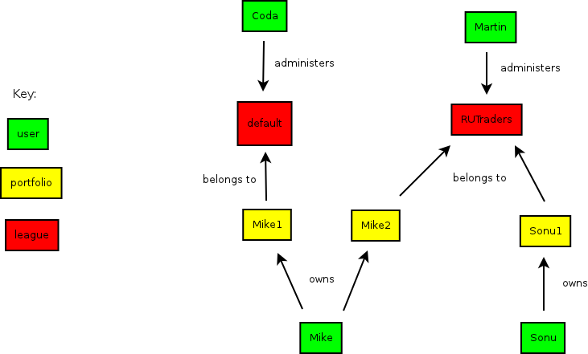
    
    :label:`userexample` An example of users, portfolios and teams.

In this example, Mike and Sonu are users. Mike has two portfolios, named Mike1
and Mike2; Sonu has 1 portfolio, named Sonu1. Mike1 belongs to a league named
"default"; Mike2 and Sonu1 belong to a league named "RUTraders".

Coda and Martin are users that administer the "default" and "RUTraders"
leagues. Coda and Martin might have portfolios of their own, but this is not
relevant to the business of administering leagues.

The reasons for the existence of each of these concepts is:

* "User" -- This provides a way for an actual human user to log into the site,
  to have an experience that is tied to them.
  
* "Portfolio" -- These actually do the trading. A Portfolio is the one actually
  credited with owning assets and being responsible for the payment of
  liabilities, *not* the user.
  
* "League" -- The purpose of a league is to represent "competition" between
  portfolios. Hence rankings are done within a league, and "rules" are set
  within a league. Trading, however, happens globally, among all leagues.

In the report we will often say that "a portfolio does this" and "a portfolio
does that"; the action is being initiated by a human, but we model it as if the
portfolio is the doer of an action: a portfolio buys a stock, a portfolio sells
a stock. If we want to refer to a real human being we will use the word
"player".

The User-Portfolio-League domain model
--------------------------------------

The basic concepts and relationships for the idle system are (Figure :ref:`userdomain`):

    
    :label:`userdomain` User/Portfolio/League concepts

Adding some of the creation/joining operations, this becomes (Figure :ref:`userdomain2`):

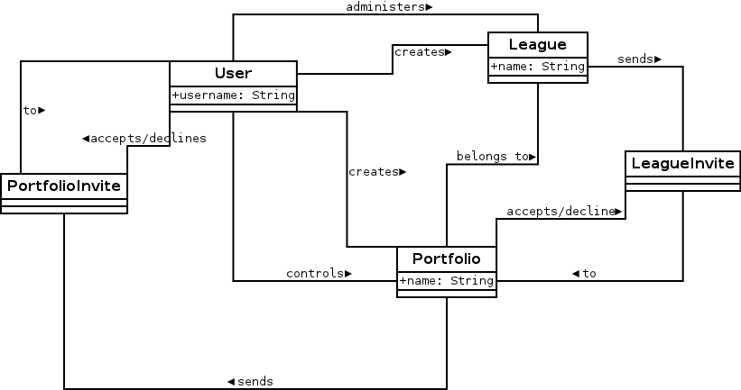
    
    :label:`userdomain2` User/Portfolio/League concepts, with creation/joining operations

Note a few potentially surprising things about this model:

* PortfolioInvites are sent to Users, and LeagueInvites are sent to Portfolios.
  This is because it is a User who will control a portfolio, and a Portfolio
  that will join a league (users do not join leagues).
  
* Even though, in reality, a human user initiates the action of "sending" an
  invite, it is shown in the diagram as originating from a Portfolio or a
  League, because that is how we interpret it; invites  come from the concepts
  that can be joined.

In the actual code, some of the "many-to-many" relationships acquired an extra
class (the association class). Such as (model/users.scala) (Figure
:ref:`association`):

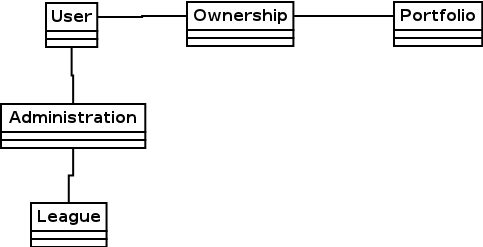
    
    :label:`association` Some association classes.

But this is a detail of the implementation and not part of the domain model; no
meaningful attributes are stored with Ownership and Administration.

Assets and Liabilities
======================

This part describes only the *ownership* aspect of assets and liabilities. The
trading and exercising aspects will be described later.

The diagram below shows only the part of the domain model that relate to the
ownership of assets and liabilities (Figure :ref:`assets`):

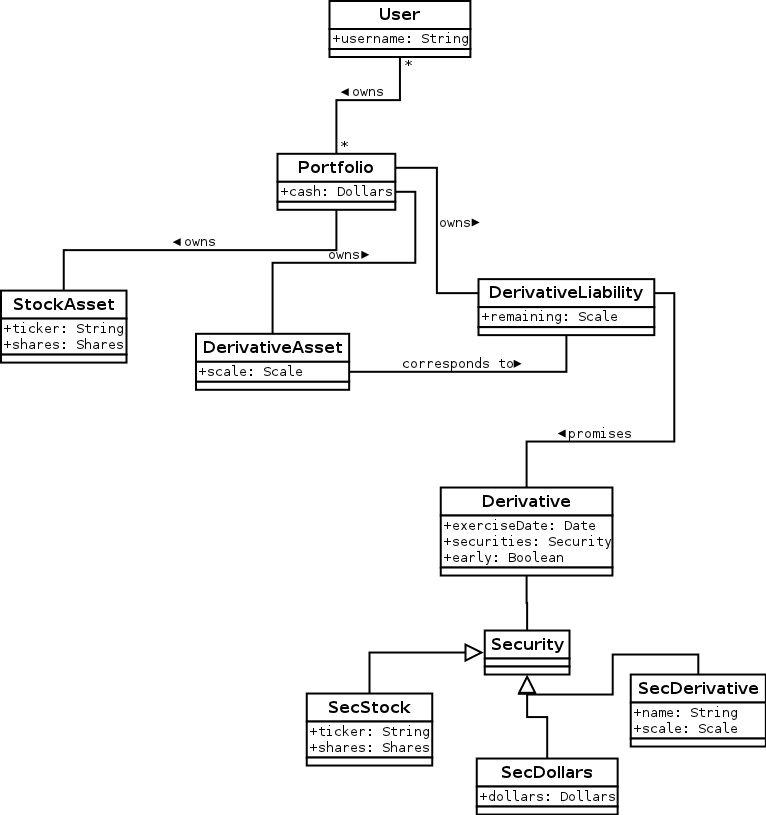
    
    :label:`assets` Assets and Liabilities

There are two kinds of assets: StockAssets and DerivativeAssets, and one kind
of liability: a DerivativeLiability.

How StockAssets work
--------------------

A stock asset is simply a number of shares of a particular stock. So for
example, 30 shares of MSFT is a stock asset.

How Derivative Assets/Liabilities work
--------------------------------------

A derivative, in PitFail, is a promise to exchange a list of assets on or
before a specified date. There are 3 parts to this contract:

1. The *Derivative* is the statement of the contract; that is, it is the list
   of assets to be exchanged, the date on which it is to occur, and whether the
   contract may be exercised early (See for example [American]_). The exact
   nature of how the contract is specified is described in the section on
   derivativeexp_.
   
2. The *DerivativeLiability* is the statement by one portfolio that they will
   offer up the assets specified in the Derivative.
   
3. The *DerivativeAsset* is a promise to a portfolio that they will be able to collect
   the assets promised in the Derivative.
   
Each DerivativeAsset corresponds to exactly 1 DerivativeLiability, and each
DerivativeLiability corresponds to 1 or more DerivativeAssets. Each
DerivativeAsset has a property called ``scale`` which is the portion of the
liability this asset has a claim on. A DerivativeLiability has an attribute
``remaining`` which is the fraction of the contract that has *not* been
exercised (Figure :ref:`remaining`):

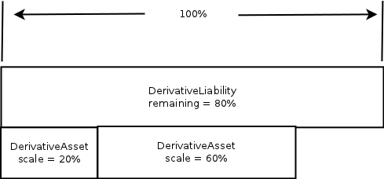
    
    :label:`remaining` The relationship between the sizes of DerivativeAssets and DerivativeLiabilities.

Every time a DerivativeAsset is exercised, it is deleted, and the ``remaining``
of the corresponding DerivativeLiability is reduced by the ``scale`` of the
DerivativeAsset. It is an invariant of the system that the sum of of the scales
of all DerivativeAssets for a particular DerivativeLiability must equal the
``remaining``.

.. _derivativeexp:

Derivatives
===========

The parts to a derivative contract are:

1. A list of securities to be traded.
   
2. A date on which this is to occur.
   
3. Whether it may be exercised early.
   
4. A condition that decides (automatically) whether the derivative will be
   exercised on the scheduled date.

(2) and (3) are just a ``DateTime`` and a ``Boolean`` respectively; (1) is
more complicated.

The list of securities is represented as a list, where each element may be one
of:

1. A "stock" security, ``SecStock``, which holds a ticker symbol and a number
   of shares.

2. A "dollars" security, ``SecDollar``, which holds a dollar amount.
   
3. A "derivative" security, ``SecDerivative``, which holds a named liability
   and a scale (see the section on `Scaling Derivatives`_). (At the moment
   there is no way within the PitFail UI to create a ``SecDerivative``.
   However, since the theoretical concepts behind it are complete, we describe
   it anyway).
   
If any of the quantities are negative (eg negative shares, negative dollars,
negative scale), that means that the securities are supposed to move from the
buyer to the seller.

For a descripton of how derivatives are exercised see `Exercising
Derivatives`_.
   
Scaling Derivatives
-------------------

Many aspects of PitFail require that derivatives be scaled. That is, given one
derivative, create a new one with identical terms, but "smaller" or "larger"
(Figure :ref:`scaling`):

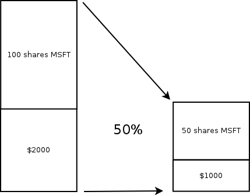
    
    :label:`scaling`

Scaling is done by scaling each security promised:

1. For SecDollar, scale the dollar amount
   
2. For SecStock, scale the share amount
   
3. For SecDerivative, scale the scale amount
   
and leaving the date and early exercise the same.

Trading Stocks
==============

The diagram below represents the "idle state" of the system with respect to
stock trading (:ref:`trading`):

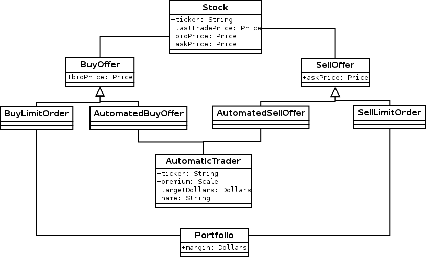
    
    :label:`trading` Stock trading at idle.

When the system is is idle, no trades are taking place; all that exist are
orders that have yet to be fulfilled.

PitFail allows only two kinds of orders to sit idly. These are

1. Limit orders
   
2. Automated (synthetic) trading orders.

Market orders do not exist when the system is idle because market orders are
executed at the offering price as soon as they are created. PitFail does not
provide explicit support for stop orders, but it would be easy for a user to
create one using the javascript automated trading API (and, when a Stop is
triggered, it becomes a market order [Stop]_, and so will be executed
immediately).

All orders in the idle state have two important properties: the available
number of shares, and the limit price. This will allow PitFail to form
automatic matches, as described later.

An invariant of the system is that when the order system is Idle, there are no
orders that can be matched with one another.

When a new order comes in
-------------------------

When a new order comes in, it has a desired number of shares, and it may or may
not have a limit price. First, all existing orders for the same stock are
collected, and sorted by desirability (ie, best price to worst price) Figure
:ref:`available1`:

.. figure:: figures/domain/available1.png
    :width: 20%
    
    :label:`available1` Comparing available with desired shares.

The incoming order is matched up against the best orders possible (that are
below its limit price, if any). Those orders are then completely or partially
executed (Figure :ref:`execution`):

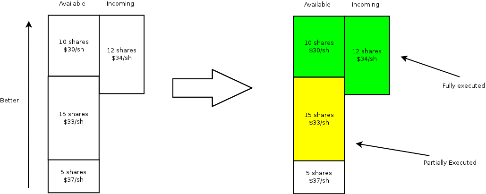
    
    :label:`execution` Which orders are partially or fully executed.

In this example, 10 shares will be purchased at 30/sh, and 2 shares at 33/sh.

You will notice that the orders already *in* the pool pay a price in not being
able to negotiate -- since the buyer is willing to pay 34/sh, they would, if
they could, increase their limit to 34/sh to take advantage. However, by having
orders in the pool that are *not* negotiated, there is a benefit in liquidity;
hence traders who place orders unexecuted into the pool will change a liquidity
premium in the trade (which is why there is a spread between the bid and ask
price for a stock as offered by the same trader [Makers]_).

If the newly placed order is not fully executed, and the trader specified a
limit, it will become part of the pool of unexecuted orders.

Margin
------

In order to ensure the smooth execution of orders, when a user places an order
that is not executed immediately, they must set aside margin so that the order
can be executed later. For a buy order the user sets aside cash that will be
used to buy the shares when the order is executed, and for a sell order the
user sets aside the shares that will be sold.

If the order is cancelled or not fully used the margin will be returned.

Domain model for trading
------------------------

The model below does not correspond 1-1 to actual software classes because our
architecture is not entirely object-oriented. For example, there is no class
called Execution; execution of orders is procedural (Figure :ref:`trading2`).

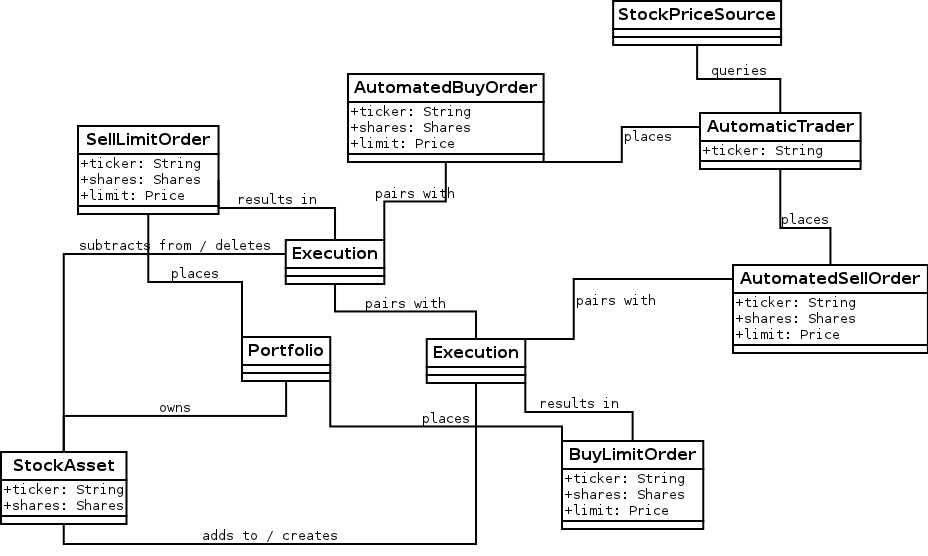
    
    :label:`trading2` The execution of a trade.

The association of AutomaticTrader with StockPriceSource is meant to convey
that the automatic traders use real-world bid and ask prices to set their bid
and ask prices.

Because there is too much to fit on one diagram, here is the part of the domain
model that deals with cash and margin (Figure :ref:`trading3`):

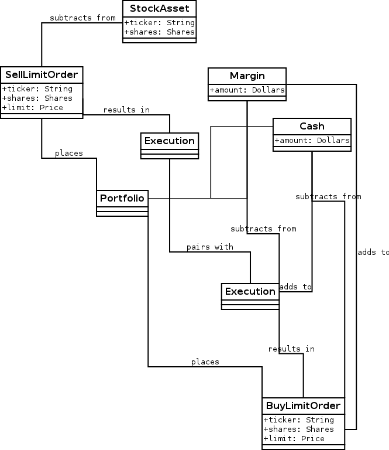
    
    :label:`trading3` How cash moves when trading.

(In the code, there is no object called Cash, rather it is an attribute of
Portfloio; but it is helpful to show it as such for the domain model).

The reason that the execution of a BuyLimitOrder "adds to" Cash is that all the
necessary cash has already been set aside in Margin; the cash that is being
added is the leftover margin.

When an order is cancelled (by its owner), all that must happen is that the
margin is restored (Figure :ref:`trading4`):

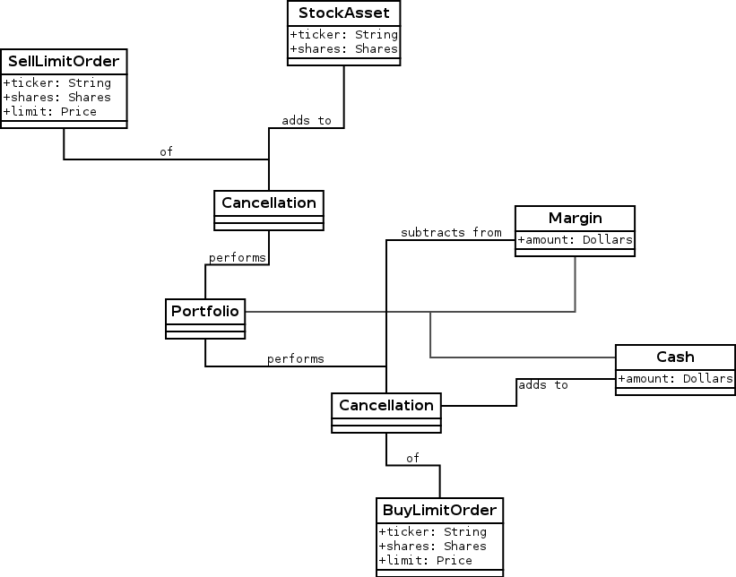
    
    :label:`trading4` Cancelling and order and restoring margin.

Dividends
=========

It is very important for PitFail to keep track of dividends paid by stocks,
for two reasons:

1. It would be unrealistic in a particularly unsettling way: stocks that will
   never pay dividends have no value; why are we trading them?
   
2. Because PitFail players will own stocks that pay dividends, and every time a
   dividend is paid the stock price drops abruptly, players would not
   appreciate having the price drop if they do not receive a dividend in
   return.

Periodically, PitFail queries Yahoo Finance to see if stocks owned by the
players have paid dividends. If they have, the system will pay dividends to the
player, in what is represented here (though not in the code) as a
``DividendEvent`` (Figure :ref:`dividends1`):

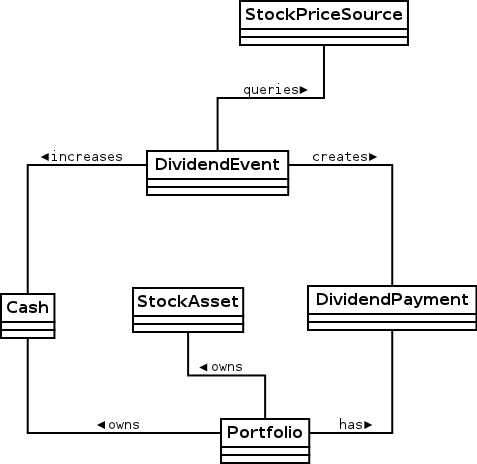
    
    :label:`dividends1` When dividends are paid.

The ``DividendPayment`` object is created only to allow the user to view the
history of their dividend payments.

News
====

The purpose of "news" is to show PitFail players to see what other PitFail
players have been doing. Importantly, News is not part of actual trading; this
is just for seeing what's going on.

This means that a single news event has associations with a lot of other
concepts, but not in a way that affects the rest of the program: it's just
point out, for example, which derivative was traded when reporting that a
derivative was traded.

The basic concept domain for News is (Figure :ref:`news1`):

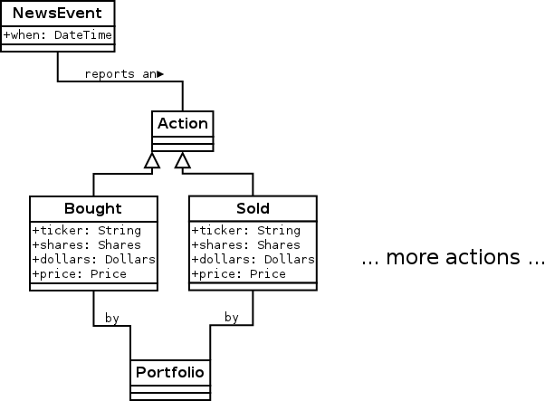
    
    :label:`news1` The news Domain.

only two actions are shown here; there are a lot so they are split up across
multiple diagrams.

Buying and selling stocks, as shown above, refer to the Portfolio who "did" the
action, and the information about what was bought or sold. This only applies to
orders that are executed (either immediately or later). Orders that are delayed
will generate another kind of an event.

Derivative Trading has the following kinds of events (Figure :ref:`news2`):

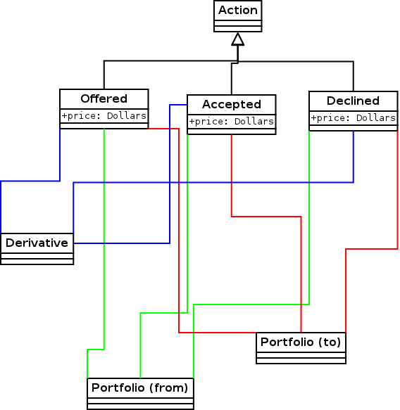
    
    :label:`news2` News for derivative trading.

``from`` and ``to`` are shown as separate concepts even though they are
instances of the same class, because they play a different role in these
events: one is the portfolio making the offer, the other is the portfolio
receiving, and possible accepting, the offer.

For Auctions we have (Figure :ref:`news3`):

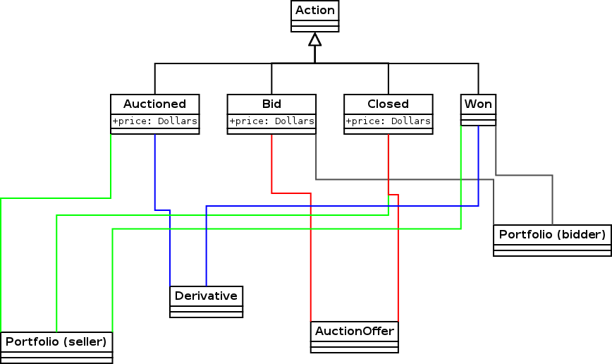
    
    :label:`news3` News for auctions.

There are other associations which are not shown, that relate to voting. These
are described in the section on voting.

Placing orders that get delayed are described by (Figure :ref:`news4`):

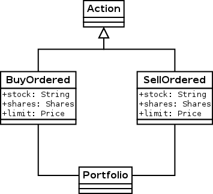
    
    :label:`news4` News for orders.

Where the associated portfolio is the one who performed the buy or sell.

There is one more event for exercising derivatives (Figure :ref:`news5`):

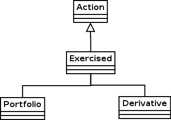
    
    :label:`news5` News for exercising derivatives.

Where the associated portfolio is the one who did the exercising.

Voting
======

When players enter into a contract (not executing it yet, just entering it)
involving a derivative, the following assets are moved (Figure :ref:`voting1`):

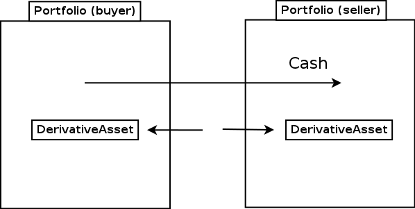
    
    :label:`voting1` How assets and liabilities change when a contract is
    entered.

If owning the asset (being in the buyer side of the contract) pays off more
than the cash payed, the buyer is happy. If owning the liability (being in the
seller side of the contract) is not bad enough to negate the cash received, the
seller got a good deal. These are not necessarily mutually exclusive.

Now, say a third player, the Voter, looks at his news feed and thinks that the
buyer got a good deal (and maybe the seller too, but that is not relevant yet).
The Voter would be happy with an arrangement like the following (Figure
:ref:`voting2`):

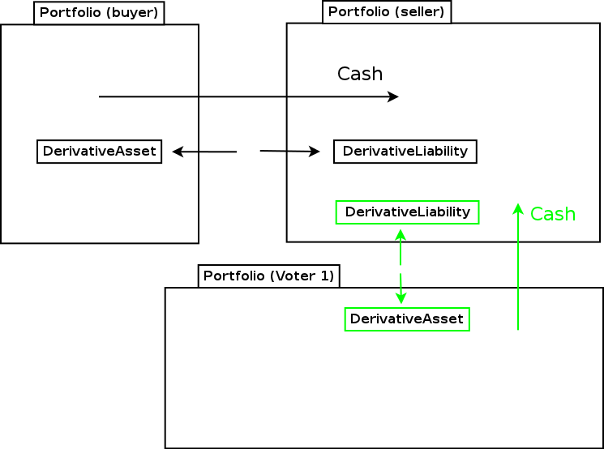
    
    :label:`voting2` Another player makes a similar deal.

where the derivative in green resembles the derivative in black, and the cash
in green resembles the cash in black. (As in, if it was a good deal for him,
it's a good deal for me too. Not necessarily true, but it could be true
sometimes).

When two portfolios enter a derivative, an object is created called
``DerivativeBuyerSetAside`` (there is a nearly identical process for sellers)
(Figure :ref:`voting3`):

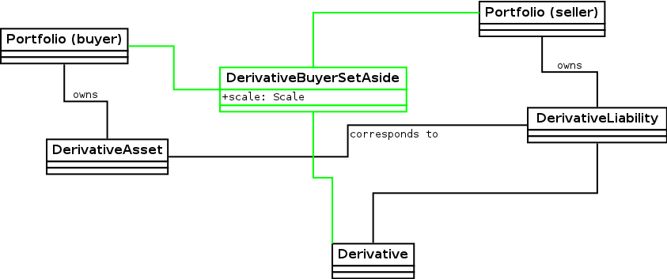
    
    :label:`voting3` DerivativeBuyerSetAside

(remember, the ``Derivative`` holds the terms of the contract, and the
``DerivativeAsset`` and ``DerivativeLiability`` show who owns which end).

The ``DerivativeBuyerSetAside`` holds one attribute, which is the "amount" left
to be voted on. For the precise meaning of this scale, see the section on
`Scaling Derivatives`_.

The ``scale`` remaining starts out at ``3%``. When the first voter votes in
favor of the buyer, they enter into a contract with the seller that is
identical to the original derivative, but scaled to 1.5% (= 3%/2). He also pays
the seller 1.5% of what the original buyer paid (Figure :ref:`voting4`):

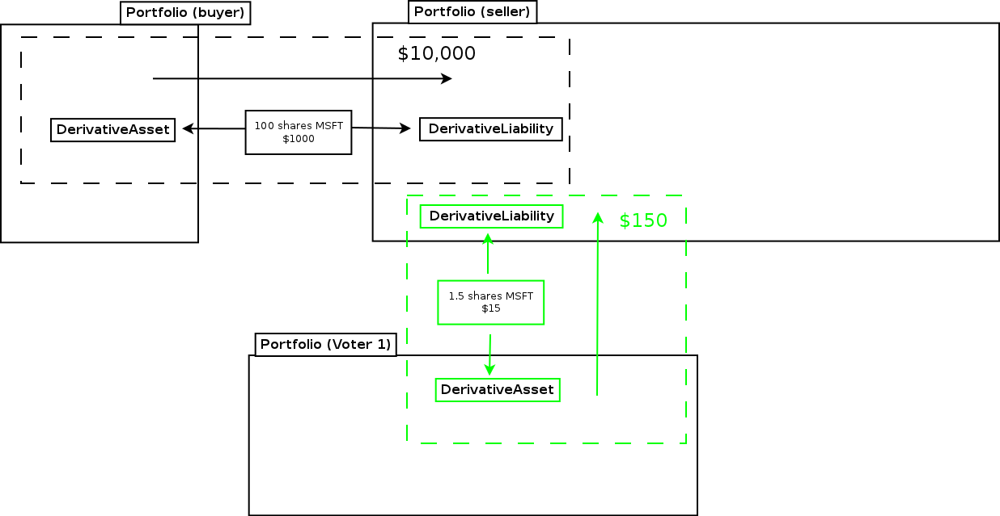
    
    :label:`voting4` A voter enters into a contract.

The ``scale`` remaining is then cut by half to 1.5% (The interpretation of this
is that the original ``3%`` is the total amount that will be allocated after
infinitely many votes are made).

Now if another player votes, they will realize 0.75% of the original trade (Figure :ref:`voting5`):

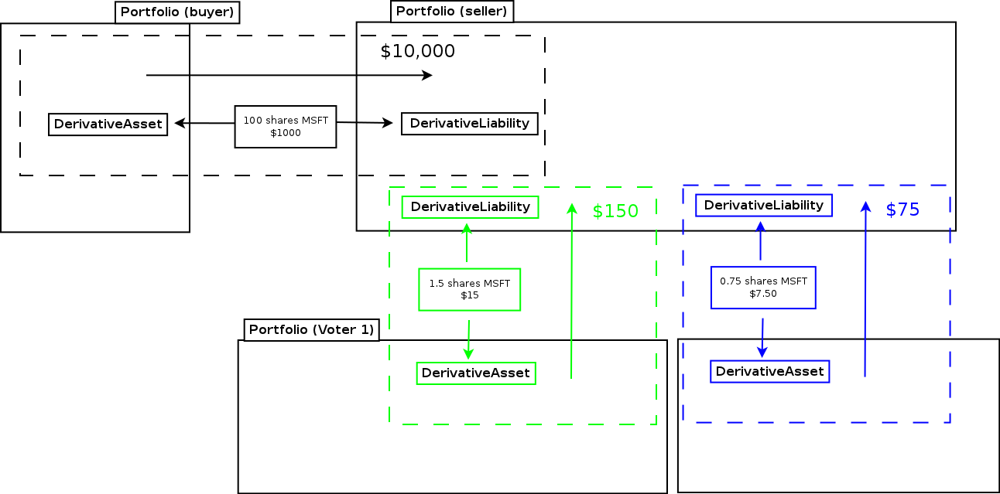
    
    :label:`voting5` Another voter casts a vote.

Votes are recorded and associated with the origanal NewsEvent, so that a score
of buyer-votes and seller votes can be calculated (Figure :ref:`voting6`):

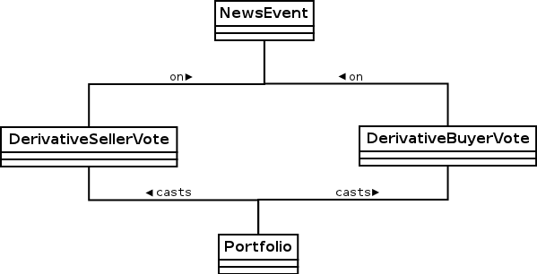
    
    :label:`voting6` Scoring events.

Comments
========

Compared to voting, comments are refreshingly simple.

Users, not portfolios, cast comments. A comment is associated with a news
event (Figure :ref:`comments1`):

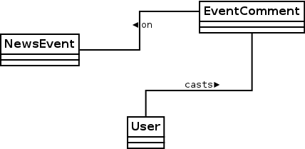
    
    :label:`comments1` Comments on a news event.

Auto Trades
===========

While the system is idle, an auto-trade is represented as (Figure :ref:`auto1`):

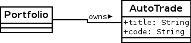
    
    :label:`auto1` An auto trade while the system is idle.

When a player runs an AutoTrade, we have what we conceptually (though not in
the code) call an AutoTradeEvent (Figure :ref:`auto2`):

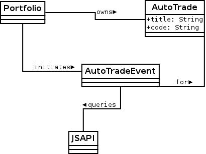
    
    :label:`auto2` An auto trade being run.

The ``JSAPI`` is a set of JavaScript functions and corresponding server-side
handlers that allow the Auto Trade to actually perform actions. See `Running an
Auto Trade`_.

