Stocks
======

``allStockHoldings``
--------------------

Gets all stocks held in PitFail (model/stocks.scala ref_158) Figure :ref:`allStockHoldings`.

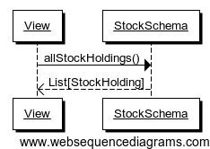
    
    :label:`allStockHoldings` allStockHoldings

``Portfolio.myStockAssets``
---------------------------

Gets stock assets from this portfolio (model/stocks.scala ref_937) Figure :ref:`myStockAssets`.

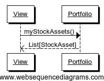
    
    :label:`myStockAssets` myStockAssets

``Portfolio.haveTicker``
------------------------

Gets an asset for this stock if we have one, None otherwise (model/stocks.scala
ref_407) Figure :ref:`haveTicker`.

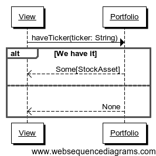
    
    :label:`haveTicker` haveTicker

``Portfolio.howManyShares``
---------------------------

Gets how many shares of this stock do we have (model/stocks.scala ref_666)
Figure :ref:`howManyShares`.

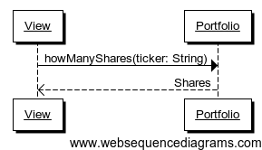
    
    :label:`howManyShares` howManyShares

``Portfolio.howManyDollars``
----------------------------

Gets how many dollars (at last traded price) of this stock we have
(model/stocks.scala ref_873) Figure :ref:`howManyDollars`.

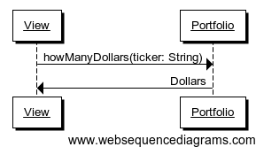
    
    :label:`howManyDollars` howManyDollars

``Portfolio.userBuyStock``
--------------------------

Attempts to make a market-order purchase of a stock (model/stocks.scala
ref_850) Figure :ref:`userBuyStock`.

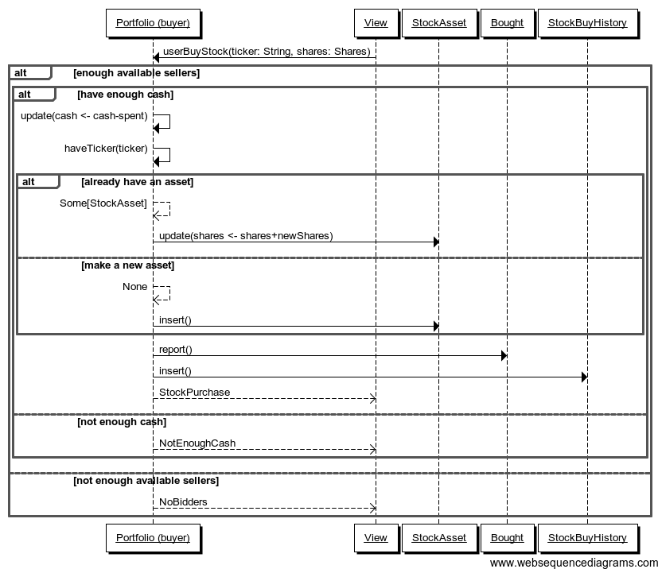
    
    :label:`userBuyStock` userBuyStock

``Portfolio.userSellStock``
---------------------------

Makes a sell market order for a stock (model/stocks.scala ref_620) Figure
:ref:`userSellStock`.

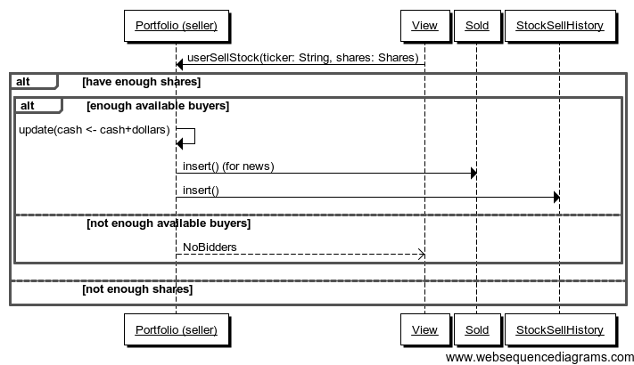
    
    :label:`userSellStock`

``Portfolio.userSellAll``
-------------------------

Sells all of the shares we own (with a market order)(model/stocks.scala
ref_306) Figure :ref:`userSellAll`.

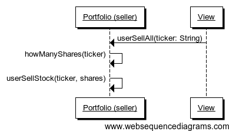
    
    :label:`userSellAll` userSellAll

``Portfolio.userMakeBuyLimitOrder``
-----------------------------------

Places a buy limit order. This involves first executing all of the order that
can be executed immediately (ie there are available sellers below the limit)
and then deferring the rest until another available seller comes in
(model/stocks.scala ref_184) Figure :ref:`userMakeBuyLimitOrder`.

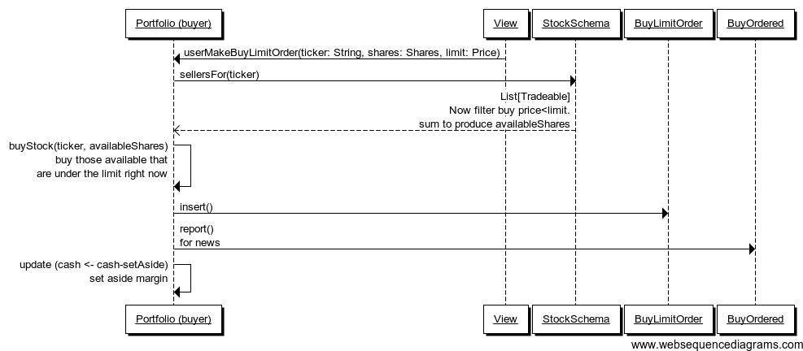
    
    :label:`userMakeBuyLimitOrder` userMakeBuyLimitOrder

``Portfolio.userMakeSellLimitOrder``
------------------------------------

Places a sell limit order. This involves executing all that can be executed
immediately (where ther are available buyers above the limit) and then defers
the rest (model/stocks.scala ref_939) Figure :ref:`userMakeSellLimitOrder`.

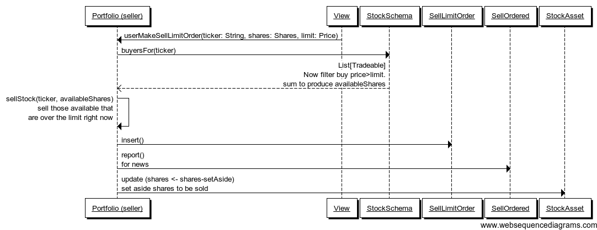
    
    :label:`userMakeSellLimitOrder` userMakeSellLimitOrder

``Portfolio.myBuyLimitOrders``
------------------------------

Gets all pending buy limit orders (model/stocks.scala ref_734) Figure
:ref:`myBuyLimitOrders`.

    
    :label:`myBuyLimitOrders` myBuyLimitOrders

``Portfolio.mySellLimitOrders``
-------------------------------

Gets all pending sell limit orders (model/stocks.scala ref_680) Figure
:ref:`mySellLimitOrders`.

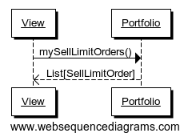
    
    :label:`mySellLimitOrders` mySellLimitOrders

``Portfolio.margin``
--------------------

Calculates the current margin that has been set aside (model/stocks.scala
ref_224) Figure :ref:`imargin`.

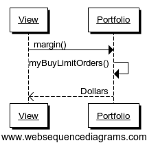
    
    :label:`imargin` margin

Derivatives
===========

Exercising Derivatives
----------------------

When a derivative is exercised, the goal is to move the securities from their
source (seller or buyer's portfolio) to their destination (buyer or seller's
portfolio). When this is possible, the procedure is easy; the only
complications that arise are when this is not possible (model/stocks.scala
ref_519).

Moving Dollars
..............

Say $100 dollars needs to move from A to B. If A has $100, $100 is deducted
from A's cash, and added to B's cash.

If A does not have $100, as much as possible is deducted and added to B's cash.
this should begin a process of margin call and forced liquidation, but PitFail
does not support this feature at this time (model/derivatives.scala ref_392).

Moving Stocks
.............

Say 100 shares of MSFT need to be moved from A to B. If A has 100 shares of
MSFT, they are deducted from A's portfolio and added to B's.

If A does not have 100 shares of MSFT, the following steps are taken:

1. First, A (under the control of the system, not the human player) attempts to
   buy 100 shares of MSFT at 15% above the last traded price. This is similar
   to a limit order in that the trade will execute at the ask price if the ask
   price is less than 1.15*(last trade price). This attempt to buy may be
   partially or completely executed (if there are shares available), or not at
   all.
   
2. If, after attempting to buy the remaining shares, A *still* does not thave
   100 shares MSFT, pays the remaining debt to B in cash, at
   1.15*(last trade price)*(shares unaccounted for).

3. If A does not have enough shares *or* enough cash, this should generate a
   margin call and A's assets should be liquidated, but PitFail does not
   support this feature.

This procedure for moving stocks differs significantly from the old procedure
(as of demo #1), because in the old version it was always possible to buy an
unlimited amount of a stock. When this became no longer possible, it was
necessary to design a system that would respect the limited volume available
but still be largely automatic; since we do not expect PitFail players want to
be bothered by an online game to resolve the issue. Hence the 15% premium --
high enough to give a user an incentive to actually own the stocks promised,
but not so high as to make it a disaster if they do not
(model/derivatives.scala ref_411).

Moving Derivatives
..................

This feature was removed from the most recent version of PitFail because the UI
still does not support creating a derivative that refers to another derivative
(making the support in the backend moot). In the old version, the way this
worked was that, if A owned the specified amount of the specified derivative,
it would be moved. If not, a *new* derivative would be created with terms
identical to the desired ones, for which A would hold the liability and B the
asset.

``Portfolio.myDerivativeAssets``
--------------------------------

Gets all derivative assets we own (model/derivatives.scala ref_74) Figure
:ref:`myDerivativeAssets`.

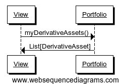
    
    :label:`myDerivativeAssets` myDerivativeAssets

``Portfolio.myDerivativeLiabilities``
-------------------------------------

Gets all deriavtive liabilities we own (model/derivaives.scala ref_484)
:ref:`myDerivativeLiabilities`.

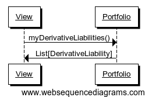
    
    :label:`myDerivativeLiabilities` myDerivativeLiabilities

``Portfolio.myDerivativeOffers``
--------------------------------

Gets all derivative offers that have been sent to us and not yet
accepted/rejected (model/derivatives.scala ref_462) :ref:`myDerivativeOffers`.

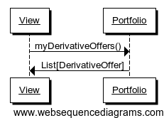
    
    :label:`myDerivativeOffers` myDerivativeOffers

``Portfolio.userOfferDerivativeTo``
-----------------------------------

Offers a derivative to another user (model/derivatives.scala ref_6)
:ref:`userOfferDerivativeTo`.

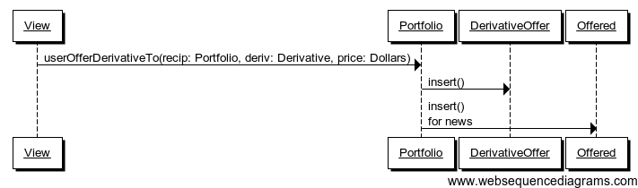
    
    :label:`userOfferDerivativeTo` userOfferDerivativeTo

``Portfolio.userOfferDerivativeAtAuction``
------------------------------------------

Offers a derivative at auction (model/derivatives.scala ref_674)
:ref:`userOfferDerivativeAtAuction`.

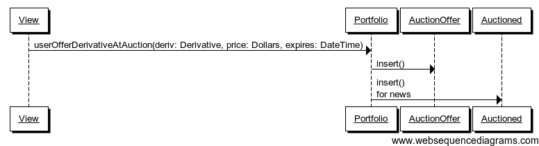
    
    :label:`userOfferDerivativeAtAuction` userOfferDerivativeAtAuction

``Portfolio.userAcceptOffer``
-----------------------------

Accepts a derivative offer (model/derivatives.scala ref_699) Figure
:ref:`userAcceptOffer`.

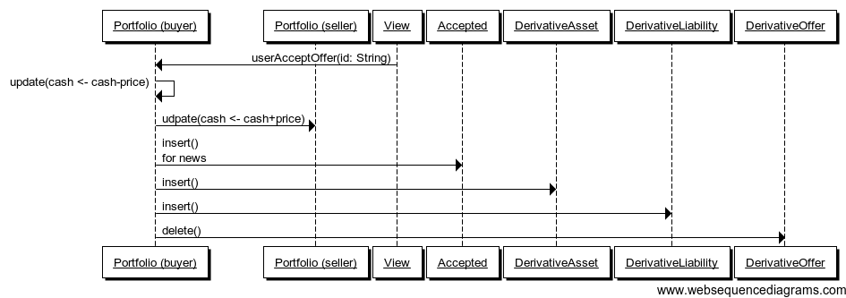
    
    :label:`userAcceptOffer` userAcceptOffer

``Portfolio.userDeclineOffer``
------------------------------

Declines a derivative offer (model/derivatives.scala ref_650) Figure
:ref:`userDeclineOffer`.

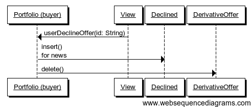
    
    :label:`userDeclineOffer` userDeclineOffer

``DerivativeAsset.userExecuteManually``
---------------------------------------

Exercise a derivative before its scheduled exercise date
(model/derivatives.scala ref_583) Figure :ref:`userExecuteManually`.

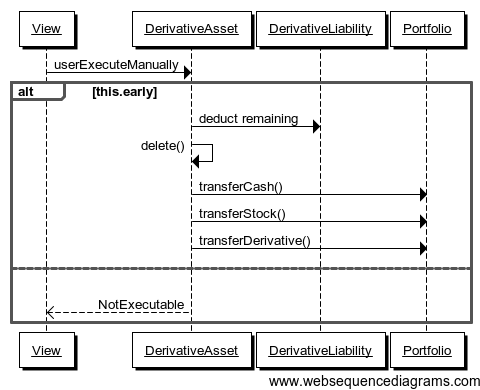
    
    :label:`userExecuteManually` userExecuteManually

``DerivativeAsset.systemExecuteOnSchedule``
-------------------------------------------

Executes a derivative on its scheduled exercise date, provided that the
contracted condition holds (model/derivatives.scala ref_289) Figure
:ref:`systemExecuteOnSchedule`.

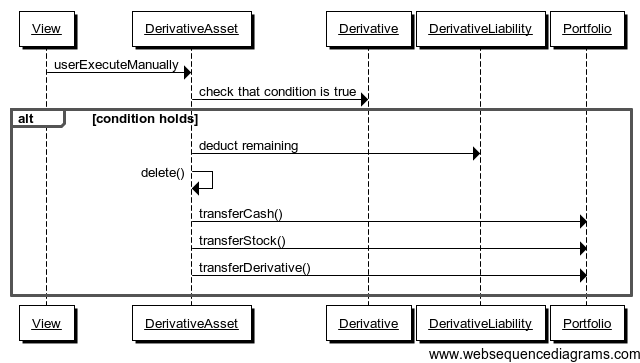
    
    :label:`systemExecuteOnSchedule` systemExecuteOnSchedule

``DerivativeAsset.spotValue``
-----------------------------

Gets how much a derivative would be worth should it be exercised today
(model/derivatives.scala ref_319) Figure :ref:`spotValue`.

.. figure:: figures/interactions/spotValue.pdf
    :width: 60%
    
    :label:`spotValue` spotValue

Dividends
=========

``DividendSchema.systemCheckForDividends``
------------------------------------------

Checks for new dividends, and credits them if there are
(model/dividends.scala ref_789) Figure :ref:`systemCheckForDividends`.

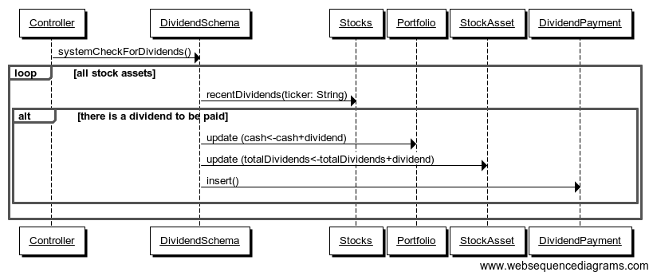
    
    :label:`systemCheckForDividends` systemCheckForDividends

``Portfolio.myDividendPayments``
--------------------------------

Gets a list of dividend payments that we have received (model/dividends.scala
ref_489) Figure :ref:`myDividendPayments`.

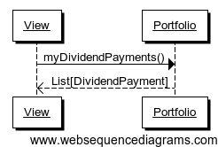
    
    :label:`myDividendPayments` myDividendPayments

Voting
======

``Portfolio.userVoteUp``
------------------------

Casts an up-vote on a trade (model/voting.scala ref_805) Figure
:ref:`userVoteUp`.

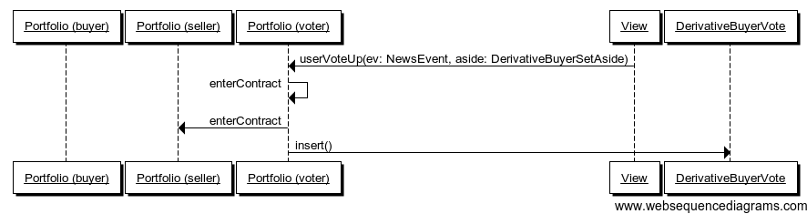
    
    :label:`userVoteUp` userVoteUp

``Portfolio.userVoteDown``
--------------------------

Casts a down-vote on a trade (model/voting.scala ref_940) Figure
:ref:`userVoteDown`.

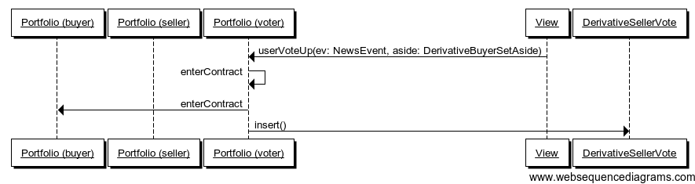
    
    :label:`userVoteDown` userVoteDown

``NewsEvent.buyerVotes``
------------------------

Gets all for-buyer votes on this event (model/voting.scala ref_146) Figure
:ref:`buyerVotes`.

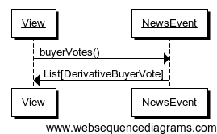
    
    :label:`buyerVotes` buyerVotes
    
``NewsEvent.sellerVotes``
-------------------------

Gets all for-seller votes on this event (model/voting.scala ref_405) Figure
:ref:`sellerVotes`.

.. figure:: figures/interactions/sellerVotes.pdf
    :width: 60%
    
    :label:`sellerVotes` sellerVotes

Comments
========

``User.userPostComment``
------------------------

Posts a comment on an event (model/comments.scala ref_494) Figure
:ref:`userPostComment`.

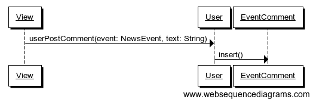
    
    :label:`userPostComment` userPostComment

``NewsEvent.comments``
----------------------

Get comments associated with this event (model/comments.scala ref_449) Figure
:ref:`getcomments`.

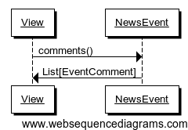
    
    :label:`getcomments` comments

Auto Trades
===========

Auto trades have a more complicated flow of control than other parts of the
code, because execution is split between the server and the client
(website/jsapi/jsapi.scala).

Running an Auto Trade
---------------------

I'm hoping the following diagram is clearer than it would be as a sequence
diagram Figure :ref:`runauto1`:

.. figure:: figures/interactions/auto1
    :width: 90%
    
    :label:`runauto1` The full sequence of running an auto-trade.

This corresponds to the following Auto-Trade code (in JavaScript -- what the
user types in)::

    buyShares('MSFT', 100)
    stockPrice('MSFT', function(price) {
        alert(price)
    })

The steps are:

1. The user presses the "Run" button. This sends an AJAX request to the server.
   
2. A callback in the Scala code (website/view/AutoTrades.scala ref_73) receives the
   AJAX request and sends a response in the form of a JavaScript command to be
   executed on the client [Ajax]_.

3. The JavaScript command gets the users AutoTrade out of the textarea, which
   is also a segment of JavaScript (website/jsapi/jsapi.scala ref_188).

4. The user's code is evaluated with ``eval()`` (website/jsapi/jsapi.scala
   ref_188).
   
5. The user's code makes an API call -- in this case
   ``buyShares(ticker,shares)``. ``buyShares()`` is a JavaScript function that
   lives in the client (website/jsapi/jsapi.scala ref_405), and that makes an
   AJAX request to the server (website/jsapi/jsapi.scala ref_867).
   
6. The server receives the AJAX request and performs the operation (buying a
   stock) (website/jsapi/jsapi.scala ref_645).
   
7. The user's code makes another request -- but this one is different because
   the user's code needs a reply.
   
8. A callback in the Scala code receives the request, gets the data, and
   constructs a response that consists of a JavaScript object (the price)
   (website/jsapi/jsapi.scala ref_18).
   
9. The user's callback is invoked with the response (website/jsapi/jsapi.scala
   ref_867).

.. [Ajax] http://exploring.liftweb.net/master/index-11.html

Creating
--------

This creates a new (blank) auto trade (model/auto.scala ref_168) :ref:`userMakeNewAutoTrade`.

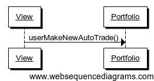
    
    :label:`userMakeNewAutoTrade` userMakeNewAutoTrade

Modifying
---------

This updates the stored information about an auto-trade (model/auto.scala
ref_337) Figure :ref:`userModify`.

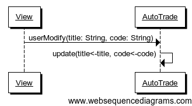
    
    :label:`userModify` userModify

Deleting
--------

This deletes an auto trade (model/auto.scala ref_309) Figure :ref:`userDelete`.

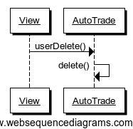
    
    :label:`userDelete` userDelete

Getting all auto trades
-----------------------

This gets all the auto trades associated with a portfolio (auto trades are
associated with portfolios, not users (see the domain model)) (model/auto.scala
ref_900) Figure :ref:`myAutoTrades`.

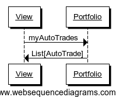

    :label:`myAutoTrades` myAutoTrades

News
====

Getting recent news events
--------------------------

This gets the most recent events that have been reported (model/news.scala
ref_531) Figure :ref:`recentEvents`.

.. figure:: figures/interactions/recentEvents.pdf
     :width: 60%
     
     :label:`recentEvents` recentEvents

Reporting an event
------------------

The API into reporting events is the ``report()`` method in the class
``Action``, which takes the action, associates a timestamp with it, and adds it
to the list of all events that have occurred (model/news.scala ref_121) Figure
:ref:`nereport`.

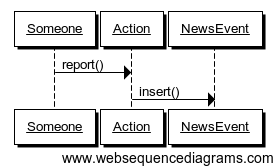
    
    :label:`nereport` Reporting a news event.

Auctions
========

Offering a derivative at auction
--------------------------------

This creates a new auctioned item (model/derivatives.scala ref_674) Figure
:ref:`userOfferDerivativeAtAuction2`.

    
    :label:`userOfferDerivativeAtAuction2` userOfferDerivativeAtAuction

Bidding on an auction
---------------------

This casts a bid on an auction item (model/auctions.scala ref_861) Figure
:ref:`userCastBid`.

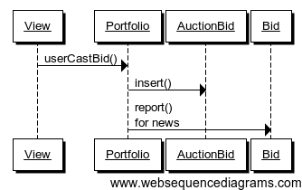
    
    :label:`userCastBid` userCastBid

Getting the current high bid
----------------------------

This gets the current high id, if there is one (if no bids have been cast,
there will be no high bid) (model/auctions.scala ref_188) Figure
:ref:`highBid`.

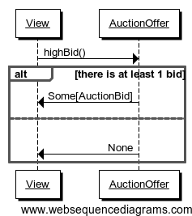
    
    :label:`highBid` highBid

Closing an auction
------------------

Closing an auction results in entering a derivative contract. See the sections
on derivatives for an explanation of what this means (model/auctions.scala
ref_870) Figure :ref:`userClose`.

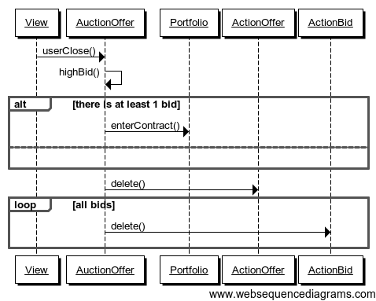
    
    :label:`userClose` userClose

Buy Via Android Cleint
------------------------

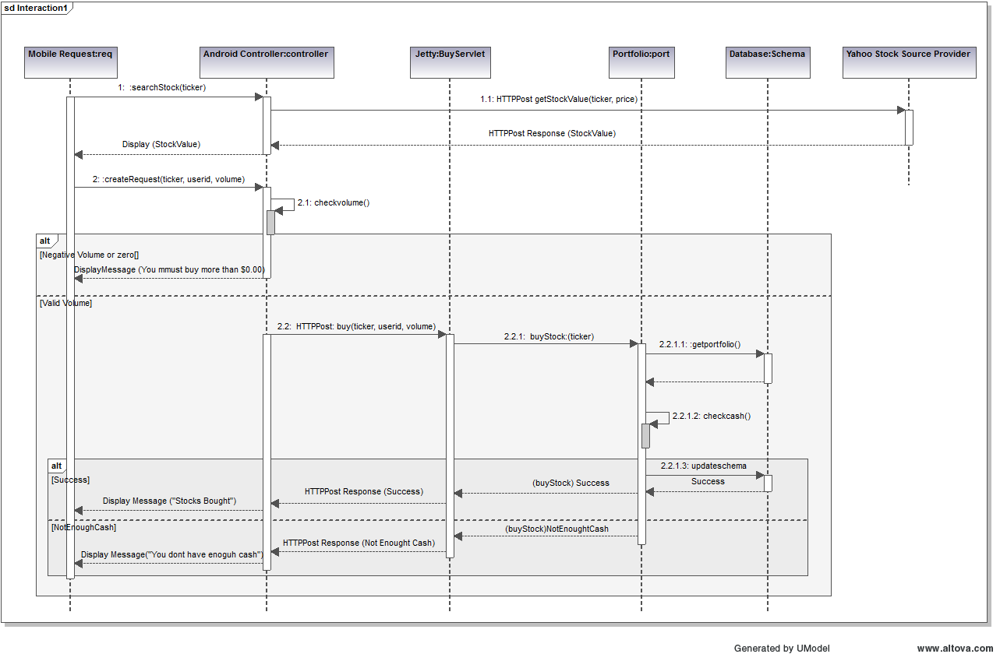

    :label:`abuy` Buy Stocks via Android Client

The diagram above (Figure :ref:`abuy`) is the interaction sequence diagram for
UC Buy Stocks from an Android Mobile Client. This Interaction diagram is the
extension of System sequence Diagram for UC-1 Buy Stocks. As shown, first the
search action is initiated by the Android Controller which requested by the
Android user. The Android controller sends an HTTP Post request to Yahoo Stock
Source. This request specifically asks for the Stock Value of the stock ticker
by sending the corresponding tag with the request. Once the response is
received, the Mobile Client creates the Buy request. The Android controller
calls the BuyServlet using an HTTP Post request via the Jetty Server.The Jetty
server has capability to support both Scala and Java sources as it runs on a
JVM. All the servlets for Android are written in Java which internally calls
functions from Scala classes.  The reason for choosing Java for Android client
is for its compatibility.The BuySerlvlet internally makes use of the Portfolio
class the extract the user info from the Database. If the Volume to be bought
is correct, user's portfolio is updated and results are sent back to the user.

Sell Via Android Cleint
-----------------------

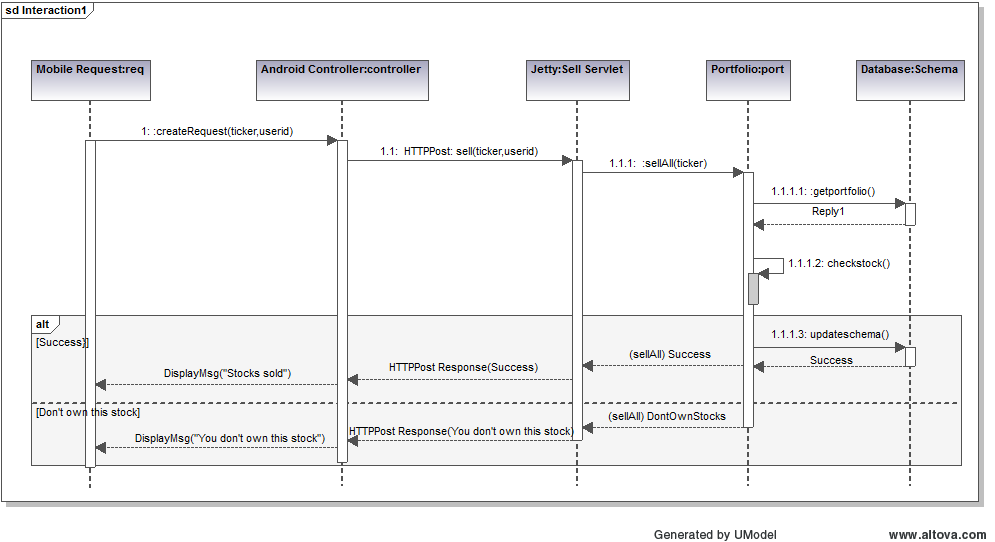

    :label:`asell` Sell Stocks via Android Client

The diagram above (:ref:`asell`) is the interaction sequence diagram for UC
Sell Stocks from an Android Mobile Client. The user initiates the action by
creating a request by providing the Stock ticker name he intends to sell off.
The Android controller sends an HTTP Post request to SellServlet via the Web
Server. The BuyServlet makes use of portfolio class and call the function to
update the user profile.Because we expect asynchronous requests there is a
possibility that by the time a SellStock is completely executed there can be
another asynchronous call from some other client interface by the same user.
Such a situation is handled by throwing back an exception message "You dont own
this stock" and  corresponding appropriate message back to the user.Currently,
we sell off all the corresponding stocks. 

Notifications for Android Client
---------------------------------

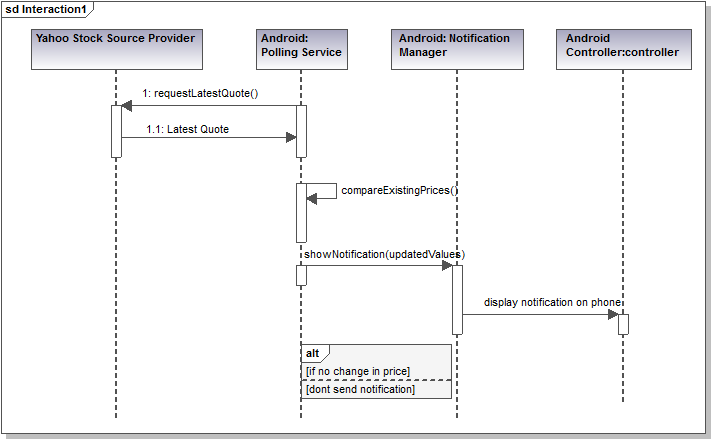

    :label:`anotify` Sell Stocks via Android Client

When the user starts the Pitfail Application for the first time, a background
service is started with it which is not bounded to the application. This is a
Polling service which polls the Web Server periodically. On receiving the
request from the service, the server executes the Stock updates Servlet which
collects information on any change in the price of all the stocks the user
owns. If the margin of change is equal to more than 1 dollar, the corresponding
updates are sent to the polling service. The Polling service then sends those
messages to the Android Notification manager. The Notification manager (Figure
:ref:`anotify`) then display new notifications as Stock updates for the user.
If there is a previous notification which is not yet viewed by the user, the
previous notification is updated and there is just one latest notification
available for the user to view.

FaceBook Operations:
====================

Facebook interface currently supports 4 operations:

1. Buy Stocks.
   
2. Sell stocks.
   
3. View Portfolio.
   
4. View Leaderboard.

If a player wants to access PitFail via Facebook, he or she can post the
request on PitFail's wall in the following format:

    Username: Operation(Buy/Sell):[volume]:[Ticker]

Arguments in square brackets are optional. For example, View portfolio and view
leaderboard operations do not take volume and ticker as arguments. 

The request posted on the wall needs to be processed. To process this request :

1.This request should be listened to and FB app should be notified of the wall post

2.The wall post should be read and parsed.

3.The request should  invoke appropriate module from server to get the operation done

4.The player should be notified of the status of the request (successful/failed)

The operations takes place partly at Facebook client side and partly at server side. 

Here is a description in detail:

FaceBook Client:
----------------

Facebook client includes mainly two operations:

1. FBListener -- FBListener listens to our facebook page pitfail and notifies
   the app controller of any incoming request (a wall post) to be processed.
   
2. ParseMessage -- ParseMessage parses user's wall post to multiple token ,
   checks if the message follows the required syntax and decides if the message
   is good enough to be processed. Figure :ref:`fbparse`
   
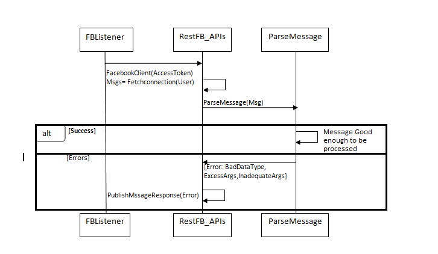
    
    :label:`fbparse`

FBListener listens to the wall post of our account and notifies pitFail FB app
of any new wall post.  We use RestFB APIs  that access Facebook account of
PitFail using the unique access token provided by FaceBook.  API
fetchConnection(User) reads the new wall post and passes it to ParseMessage
module. ParseMessage processes the wall post, extracts the information required
to process the request. It also checks for the right number of arguments and
the data type (e.g. Volume has to be a number, a request to view portfolio does
not take more than two arguments).

If the message is good enough to be processed (no errors), client controller
calls appropriate functions from the server, otherwise the player is notified
of the error by commenting on player's wall post. 

Server Operations:
------------------

Now once the message is retrieved and parsed at the client side, the server
functions are invoked with the parsed tokens as arguments. 

Before processing any request, we always check if the username that is
requesting this operation is valid or not. Therefore before invoking any other
method client invokes EnsureUser method to enusure the authenticity of the
user. 

Ensure User:
............

Facebook interface of PitFail does not (for now) support registration.  The
player has to be already registered to the system to play the game via FB
interface. Figure :ref:`fbensure`

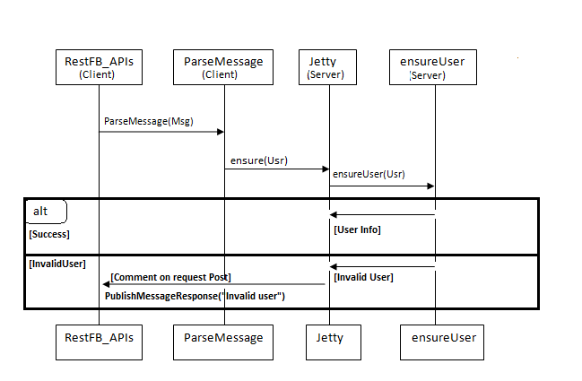
    
    :label:`fbensure`

ensureUser ensures the existence of a user before the user's request tries to
access portfolio. If the user exists, the request is processed further
otherwise the player is notified of the error occurred by posting a comment on
his wall post.

Once the user is checked for his/her authenticity, we can proceed further with
the actual operation requested by the user. Below are the operations user can
execute.

Buy Stock:
..........

for all the operations below, once the ensureUser confirms the authenticity of
the user, FaceBook client invokes a Java servlet on Jetty server. The main task
handled by this java servlet is to accept arguments from Facebook client and
invoke appropriate scala mothods to perform task requested by facebook client
Here the servlet is: FBBuyServlet(Username) Figure :ref:`fbbuy`
  
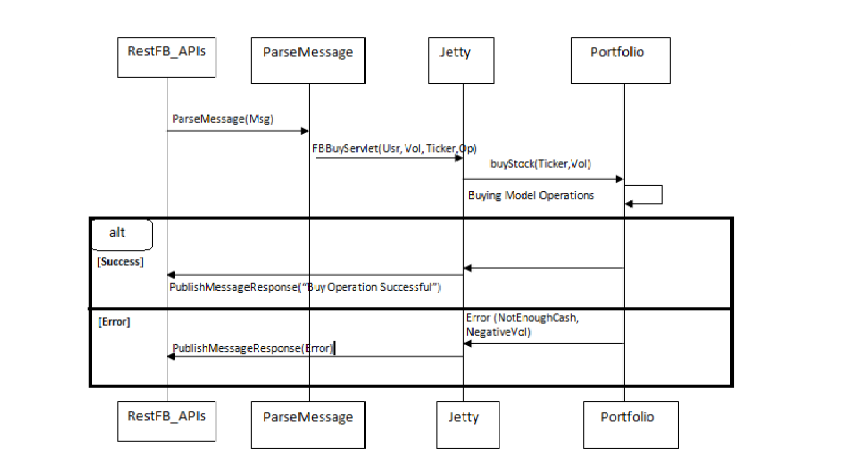
    
    :label:`fbbuy`

Sell Stock:
...........

In sell stock , FBSellServlet() is the Java servlet that accepts arguments from
Facebook client and invokes scala  method to sell stocks. Figure :ref:`fbsell`
 
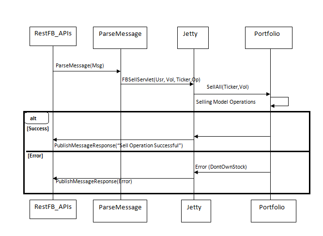
    
    :label:`fbsell`

View Portfolio:
...............

Before processing any request , we make sure (by invoking ensureUser) that the
username exists. Therefore there is no failure flow (alternate flow) for
portfolio view. We will invoke this funtion only if the ensureUser confirms
that the user exists. Figure :ref:`fbport`

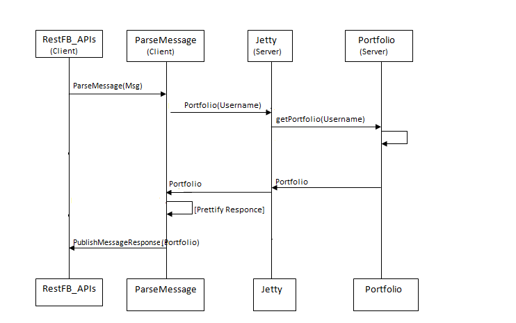
    
    :label:`fbport`

Once client receives response (portfolio for the username) from server, client
prettifies the response make it look better as FaceBook wall post. 

View Leaderboard:
.................

Apart from the leagues created by different users, we have a global league.
Players playing via facebook can view the leaders of global league by using
operation - view leaderboard.

Here too, we dont have a alternate (failure) flow, as this method will be
invoked only once ensureUser confirms that the username exists. Figure
:ref:`fbleader`

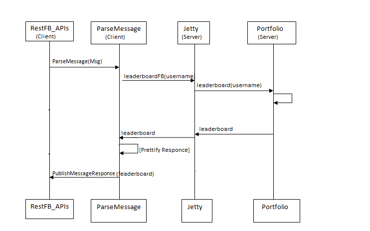
    
    :label:`fbleader`

